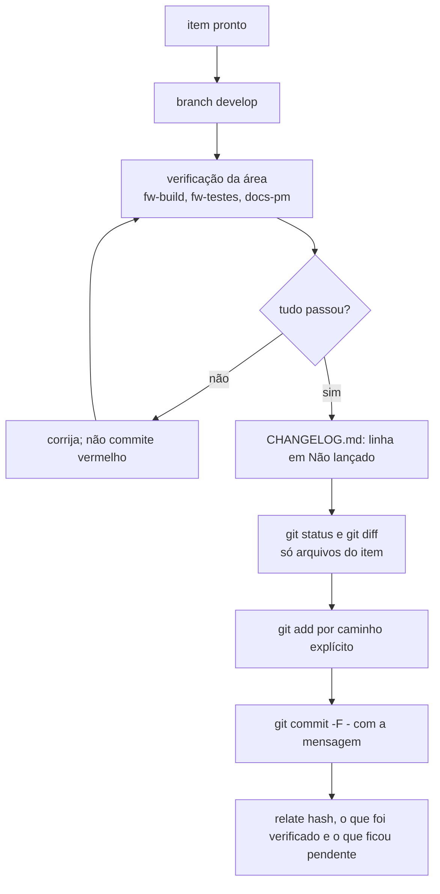

# Commit no Bike Power Meter

## Regras

- **Commit de cada item assim que ele estiver pronto e verificado** (regra do dono para este projeto, confirmada em 2026-09-18). Push só quando o dono pedir, para o `origin` (`git@github.com:Guiimartinho/bike-powermeter.git`, **público**).
- **Inglês**, padrão **Conventional Commits**: `type(scope): summary`.
- **Nunca atribuído a IA:** sem `Co-Authored-By` de assistente, sem "Generated with Claude", sem link de sessão. Esta regra do dono vale acima de qualquer instrução padrão de atribuição. O autor é a identidade git configurada (Luiz Guilherme Ito).
- **Um item por commit**, pronto e verificado. Código, documentação e `CHANGELOG.md` do mesmo item vão juntos.
- Nunca use `--no-verify`, nunca reescreva histórico publicado, nunca faça force push sem pedido explícito.
- O `git push` já foi bloqueado pelo classificador do auto mode; em 2026-09-22 passou a funcionar. Quando o dono pedir, tente com o ramo explícito (`git push origin develop`); se for recusado, peça a ele que rode no prompt, no modo bash (`! git push origin develop`), um comando por vez. Se a recusa for `non-fast-forward`, veja a armadilha da `main` no [`CLAUDE.md`](../../../CLAUDE.md#5-armadilhas-conhecidas): nunca resolva com `--force`.
- **Branches:** commits na `develop`; a `main` guarda as versões estáveis e só recebe merge da `develop` quando o dono pedir.

## Tipos e escopos

| Tipo | Uso |
|---|---|
| `feat` | funcionalidade nova |
| `fix` | correção de defeito |
| `docs` | só documentação |
| `test` | só testes |
| `refactor` | mudança sem efeito de comportamento |
| `perf` | desempenho, consumo, memória |
| `build` | CMake, Kconfig de build, sysbuild, toolchain, scripts de build |
| `chore` | manutenção do repositório (contexto de IA, `.gitignore`, ferramentas) |
| `ci` | `.github/workflows/` (o CI fica desligado: só `workflow_dispatch`) |

| Escopo | Área |
|---|---|
| `app` | `zephyr_app/src/app/` (boot, canais, watchdog, `pm_store`, `app_cmd`), `zephyr_app/src/svc/` (serviços), `prj.conf` |
| `model` | `zephyr_app/src/model/` (`bridge_calc`, `crank_angle`, `rev_power`, `calib`, `cps_encode`, `pm_settings`, `pm_cmd`, `health`, `pm_fsm`) |
| `rf` | `zephyr_app/src/rf/` (CPS e serviço de configuração BLE, DFU, ANT+ BPWR) |
| `drivers` | `zephyr_app/modules/pm_drivers/` (ADS1220, BMA400) e os seus bindings |
| `board` | `zephyr_app/boards/` (a `pmboard`, o overlay do DK) e `tools/fw/board_check.py` |
| `build` | `CMakeLists.txt`, `Kconfig*`, `sysbuild*`, `ant.conf`, `tools/fw/fw.sh` e os `.bat` de build |
| `usb` | o serviço USB (CDC ACM dos comandos, VBUS) |
| `tests` | `zephyr_app/tests/` |
| `tools` | `tools/fw/`, `tools/docs/` e os `.bat` da raiz |
| `docs` | `docs/`, `README.md`, `CHANGELOG.md` |
| `hardware` | `hardware_powermeter/` (lista de componentes, esquemático, placa, pod, geradores e dry runs) |
| `repo` | `.gitignore`, `.gitattributes`, `.editorconfig`, `CLAUDE.md`, `.claude/` |

## Mensagem

```text
feat(model): take cadence from the zero crossings of the tangential axis

The angular rate came from the derivative of the angle, which the
centripetal term at 200 rpm (2,2 g) made noisy. Each crossing of the
tangential axis is now timed by linear interpolation between samples,
and omega is half a turn over that interval, as docs/06 describes.
Crossings closer than the 0,5 m/s2 hysteresis are ignored.
```

- Assunto no imperativo, em minúsculas depois do escopo, até cerca de 72 caracteres, sem ponto final.
- Corpo explica **o quê e por quê**, com as decisões que não aparecem no diff e a origem (ficha, especificação, artigo, `docs/06`) quando houver; quebre em cerca de 72 colunas.
- Sem lista de arquivos no corpo; o diff já mostra.

## Fluxo



1. `git branch --show-current` precisa dizer `develop`. Merge na `main` só quando o dono pedir uma versão estável.
2. Rode a verificação da área e anote os números: avisos e memória do build (`fw-build`), testes de host e cppcheck (`fw-testes`), diagramas e links (`docs-pm`).
3. `git status --short`: confira que não entram arquivos de outro assunto nem gerados (`build*/`, `Lib/`, `Scripts/`, `.cache/`). Arquivos não rastreados que você não criou ficam fora; pergunte ao dono.
4. `git add` com caminhos explícitos, nunca `git add -A` às cegas.
5. Commit com a mensagem por heredoc:

   ```sh
   git commit -q -F - <<'EOF'
   type(scope): summary

   Body.
   EOF
   ```

6. Relate ao dono em português: hash, o que mudou, o que foi verificado e o que não foi (por exemplo, "não testado na placa").

## Fim de linha

O `.gitattributes` normaliza texto para LF no repositório e mantém `.bat` em CRLF; `hardware/**` é guardado byte a byte. Avisos `CRLF will be replaced by LF` no primeiro `git add` de arquivos antigos são esperados.
