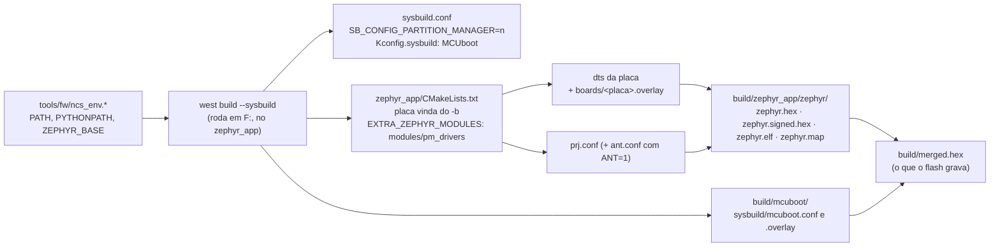

# Compilar, gravar e monitorar o firmware

Tudo parte da raiz do repositório. O firmware é o `zephyr_app/`; não existe código herdado neste projeto (o par dele, o ciclocomputador em `F:\1.Projects\32.gnss_bike_computer`, é só referência de arquitetura).

## Ambiente verificado

| Item | Valor |
|---|---|
| SDK | nRF Connect SDK v3.3.0 em `C:\ncs\v3.3.0` (Zephyr 4.3.99) |
| Toolchain | `C:\ncs\toolchains\936afb6332` (Zephyr SDK 0.17.0, GCC 12.2.0, CMake 4.2.1, west 1.5.0, Python 3.12.4) |
| Alvo padrão | `nrf54lm20dk/nrf54lm20a/cpuapp` (`tools/fw/fw.sh:33` e os `.bat`), com `zephyr_app/boards/nrf54lm20dk_nrf54lm20a_cpuapp.overlay` e `.conf`: os periféricos do pod em pinos livres do DK, para as placas de avaliação |
| Placa do projeto | `BOARD=pmboard/nrf54lm20a/cpuapp`, em `zephyr_app/boards/pm/pmboard/` mais `boards/pmboard_nrf54lm20a_cpuapp.conf`; use outra `BUILD_DIR` (`zephyr_app/build_custom`). **Existe como alvo que compila: nenhuma placa foi fabricada** |
| ANT+ | `ANT=1` com o add-on `sdk-ant` em `C:\ncs\sdk-ant` e `zephyr_app/modules/ant_ncs33_compat`; em outra pasta (`zephyr_app/build_ant`), porque trocar o `ANT` pede `pristine` |
| Gravação | `nrfutil device` 2.17.5 do toolchain, pelo J-Link OB do DK |
| Debug | SEGGER J-Link V8.76, V8.96 e V9.24a em `C:\Program Files\SEGGER` |

O `tools/fw/ncs_env.sh` (Git Bash) e o `tools/fw/ncs_env.bat` (cmd) montam o ambiente a partir do `environment.json` do toolchain. O `.sh` descobre o toolchain pelo `C:\ncs\toolchains\toolchains.json`; o `.bat` usa `NCS_TOOLCHAIN=936afb6332`. Para trocar de versão, defina `NCS_VERSION` e `NCS_TOOLCHAIN` antes.

## Comandos

| Tarefa | Git Bash (assistente) | cmd / duplo clique |
|---|---|---|
| Build incremental | `bash tools/fw/fw.sh build` | `build.bat` |
| Build do zero | `bash tools/fw/fw.sh build pristine` | `build.bat pristine` |
| Build da placa do projeto | `BOARD=pmboard/nrf54lm20a/cpuapp BUILD_DIR=zephyr_app/build_custom bash tools/fw/fw.sh build` | — |
| Build com ANT+ | `ANT=1 BUILD_DIR=zephyr_app/build_ant bash tools/fw/fw.sh build` | `set ANT=1` antes do `build.bat` |
| Conferir o mapa de pinos da placa | `python tools/fw/board_check.py` | — |
| Gravar apagando tudo | `bash tools/fw/fw.sh flash` | `flash.bat` |
| Gravar mantendo settings/bonds | `bash tools/fw/fw.sh flash keep` | `flash.bat keep` |
| Desbloquear chip protegido | `bash tools/fw/fw.sh recover` | `recover.bat` |
| Listar placas | `bash tools/fw/fw.sh devices` | `nrfutil device list` |
| Memória e maiores símbolos | `bash tools/fw/fw.sh size` | — |
| Console serial | — | `serial.bat COMx` (115200) |

Variáveis úteis: `BUILD_DIR` (outra pasta de build), `BOARD` (outro alvo; a família do `nrfutil` vem dela, ou de `FAMILY`), `ANT=1` (build com o add-on `sdk-ant`; troque só com `pristine` ou em outra `BUILD_DIR`), `NRF_SERIAL` (escolhe o J-Link quando há mais de um), `NOPAUSE=1` (os `.bat` não esperam tecla).

Antes de dizer que terminou, os **três** builds precisam passar sem aviso: o DK, a placa do projeto e o `ANT=1`. Uma mudança de devicetree ou de Kconfig que compila no DK pode não compilar na placa (os nós e os apelidos são outros), e uma de rádio pode não compilar com o ANT.

## Como o build funciona

- **Sysbuild** é o fluxo padrão do NCS; `--no-sysbuild` ainda funciona para imagem única, mas está depreciado.
- **Partition Manager desligado** em `zephyr_app/sysbuild.conf`: ele está depreciado no NCS 3.3. O layout vem do devicetree, e é **do projeto**, não o do fabricante: MCUboot com 96 KB em `0x0`, `slot0` em `0x18000` e `slot1` em `0xFA000` com 904 KB cada, `storage_partition` de 36 KB em `0x1DC000`. Os três devicetrees (a placa própria, o overlay do DK e `sysbuild/mcuboot.overlay`) repetem os mesmos nós e têm de concordar.
- A placa vem do `-b`: `BOARD` no `fw.sh` e nos `.bat` tem o padrão `nrf54lm20dk/nrf54lm20a/cpuapp`. O Zephyr aplica sozinho o `boards/<placa>.overlay` com o nome dela (`/` vira `_`), por exemplo `boards/nrf54lm20dk_nrf54lm20a_cpuapp.overlay`; com outro nome ele é ignorado sem aviso.
- A placa do projeto mora fora da árvore do Zephyr, e é o `-DBOARD_ROOT` que a faz ser achada: o `fw.sh` passa `-DBOARD_ROOT` e `-Dmcuboot_BOARD_ROOT` apontando para `zephyr_app`, porque a imagem do MCUboot é construída à parte pelo sysbuild.
- Os drivers próprios (ADS1220 e BMA400) moram em `zephyr_app/modules/pm_drivers`, que entra por `EXTRA_ZEPHYR_MODULES` no `CMakeLists.txt`. É por isso que o CMake avisa `No SOURCES given to Zephyr library` para `drivers__adc` e `drivers__sensor`: a biblioteca da árvore fica vazia. Esses dois avisos e o da chave de desenvolvimento do MCUboot são esperados; **aviso de compilador é que tem de ser zero**.
- O MCUboot entra por `zephyr_app/Kconfig.sysbuild`, com a recuperação serial pelo USB CDC ACM (`sysbuild/mcuboot.conf` e `.overlay`): sem botão, ele espera 1 s a cada partida. O `fw.sh` grava o `merged.hex` quando existe e, senão, o `zephyr.hex`.

## Conferir o resultado

Números de referência (build de 2026-09-27, NCS v3.3.0; `docs/03-ambiente-build.md`):

| Alvo | FLASH da aplicação | RAM | MCUboot |
|---|---|---|---|
| nRF54LM20 DK | 290.308 B de 925.696 B do slot (31,4 %) | 119.404 B de 511 KB | 89.204 B de 96 KB (92,9 %) |
| placa `pmboard` | 289.596 B | 119.196 B | idem |
| DK com `ANT=1` | 325.588 B | 124.068 B | idem |

- **Avisos esperados: 0** nos três builds. Com `ANT=1`, os únicos são o do símbolo depreciado `SOC_SERIES_NRF54LX` que o módulo de compatibilidade religa e um `unused variable` dentro do `ant_bpwr.c` do próprio add-on, que não é do projeto. Qualquer outro é defeito seu: corrija.
- O MCUboot está a cerca de 93 % dos seus 96 KB: um Kconfig a mais no bootloader pode estourá-lo. Depois de mexer em `sysbuild/mcuboot.conf`, confira o tamanho em `build/mcuboot/zephyr/zephyr.map` e o `CONFIG_FLASH_LOAD_OFFSET=0x0` em `build/mcuboot/zephyr/.config`.
- Maiores consumidores de RAM (`fw.sh size` no DK): os pools de buffers do Bluetooth (`net_buf_data_pkt_pool` 9,9 KB, `hci_rx_pool` 6,6 KB, `sdc_mempool` 5 KB, `acl_tx_pool` 3 KB), o heap do sistema (8 KB, `CONFIG_HEAP_MEM_POOL_SIZE`), as pilhas do mcumgr (4,6 KB) e da recepção do BT (4 KB), as seis pilhas dos serviços (de 2 a 3 KB cada), as caixas de entrada do `compute` (3,3 KB) e do `sample` (2,3 KB) e o `buf32` de 2 KB do settings. Confira com `bash tools/fw/fw.sh size` depois de mexer em buffers estáticos.
- Reporte números exatos ("FLASH 290.308 B, 0 avisos"), nunca "compilou".

## Gravar e ver o log

1. Ligue o nRF54LM20 DK pela USB do interface MCU (J-Link) e confira com `bash tools/fw/fw.sh devices`: precisa aparecer um dispositivo com o trait `jlink`. O `fw.sh` deduz a família do `nrfutil` (`nrf54l`) da `BOARD`.
2. `bash tools/fw/fw.sh flash`. O padrão `ERASE_ALL` apaga também a `storage_partition` (bonds e a configuração do medidor, o bloco `pm/blob`); use `flash keep` para preservá-los.
3. Console, 115200 baud, com o backend UART do log (`CONFIG_LOG_BACKEND_UART=y`):
   - **nRF54LM20 DK:** `zephyr,console` no `uart20` (TX P1.16, RX P1.17), pela VCOM0 do J-Link.
   - **placa `pmboard`:** `zephyr,console` no `uart20` (TX P1.00, RX P1.31), em dois pads de teste sob o envase; não há conector no pod.
4. Nada disso substitui teste em placa: **nada neste projeto rodou em hardware**, nem no DK com as placas de avaliação. O alvo da placa do projeto compila, mas a placa não existe fisicamente.

## Problemas comuns

| Sintoma | Causa e solução |
|---|---|
| `ValueError: path is on mount 'F:', start on mount 'C:'` | o west rodou com o diretório atual em `C:` e o projeto em `F:`; rode de dentro do `zephyr_app` (os scripts já fazem isso) |
| `include could not find requested file: .../936afb6332/cmake/toolchain/zephyr/generic.cmake` | a variável de ambiente `TOOLCHAIN_ROOT` está definida; o Zephyr a usa como raiz das definições de toolchain. Não a defina (os scripts usam `NCS_TOOLCHAIN_DIR`) |
| `Build directory ... is for application ...` ou cache de outro caminho | a pasta de build veio de outro caminho ou de outro SDK; `-p auto` refaz do zero, ou use `build pristine` |
| `.config` ou tamanho que não batem com a mudança | o build incremental guarda símbolos Kconfig antigos; antes de afirmar algo sobre `.config`, devicetree ou memória, compile com `build pristine` |
| `fatal error: opening dependency file ... No such file or directory` com aviso de `CMAKE_OBJECT_PATH_MAX` | caminho longo demais (passa de 250 caracteres nos objetos, por exemplo numa pasta temporária do usuário); compile dentro do repositório (`zephyr_app/build` ou `build/`) |
| aviso `SB_CONFIG_PARTITION_MANAGER is enabled` | faltou o `zephyr_app/sysbuild.conf` |
| `region 'FLASH' overflowed` na imagem do MCUboot | o bootloader passou dos 96 KB (a recuperação serial pelo USB já ocupa 93 %); tire o Kconfig que entrou ou cresça o `boot_partition` nos três devicetrees, descontando dos slots |
| o MCUboot sai com `FLASH_LOAD_OFFSET` 0x18000 e o aparelho não parte | o `sysbuild/mcuboot.overlay` substitui o `app.overlay` do MCUboot, que é quem diz `zephyr,code-partition = &boot_partition`; a linha tem de estar no overlay do projeto |
| `Undefined initialization levels used` no link | a prioridade de um `DEVICE_DT_INST_DEFINE` não é um literal (uma expressão como `CONFIG_SPI_INIT_PRIORITY + 1`); use um símbolo Kconfig próprio, como `PM_ADC_ADS1220_INIT_PRIORITY` |
| `isn't valid YAML` num binding de `modules/pm_drivers/dts/bindings` | uma `description:` em texto simples com `: ` ou `[`; ponha entre aspas ou em bloco `\|` |
| tipos conflitantes em `ant_evt_t` ou `log_const_ant_bpwr` duplicado com `ANT=1` | com os cabeçalhos dos perfis do `sdk-ant`, não inclua `ant_init.h`, e o módulo de log do projeto não pode se chamar `ant_bpwr` (o do add-on já existe): é `rf_ant` |
| `nrfutil` grava no dispositivo errado ou reclama de vários | há um ST-LINK e outras seriais nesta máquina; os scripts filtram `--traits jlink`, ou defina `NRF_SERIAL` |
| gravação falha por proteção | `recover` apaga tudo e libera o APPROTECT; depois grave de novo |
| `JLink.exe` abre a ferramenta do Java | o `JLink.exe` do PATH é do Eclipse Adoptium; use `C:\Program Files\SEGGER\JLink_V924a\JLink.exe` |
| pino se comportando como outro periférico no DK | um nó do DK ocupa o pino; o overlay do DK usa `spi22` no P3 e `i2c23` em P1.29/P1.03 justamente porque estão livres. Confira o `zephyr.dts` gerado e o mapa de `docs/02-hardware.md` |
| pino errado ou apelido faltando na placa do projeto | `python tools/fw/board_check.py` confere o devicetree da `pmboard` contra a tabela de pinos de `docs/02-hardware.md` e contra as regras do nRF54LM20A (SCL e SCK em pinos de clock, P1.01 e P1.02 são NFC); rode antes do build |

Depois de compilar: testes de host, cobertura e análise estática na skill `fw-testes`.
