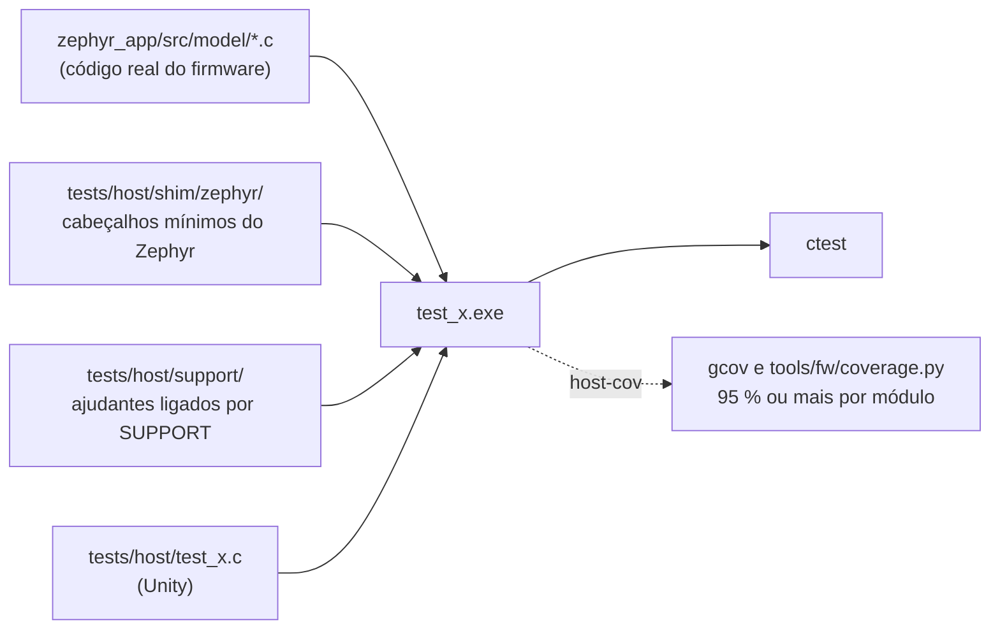

# Testes de host, cobertura e análise estática

## Rodar

```sh
bash tools/fw/host_tests.sh              # configura, compila e roda todos
bash tools/fw/host_tests.sh -R calib     # só os conjuntos que casam com o filtro
bash tools/fw/host_tests.sh coverage     # compila com --coverage, roda tudo e mede a cobertura
```

Por baixo, em `zephyr_app/tests/host/`: `cmake --preset host-tests`, `cmake --build --preset host-tests`, `ctest --preset host-tests` (e o preset `host-cov` para a cobertura, em `build/host-cov`).

- Compilador: GCC do PC (MinGW-w64 15.2 em `C:\ProgramData\mingw64\mingw64\bin`), CMake 4.x e Ninja do pip. No Git Bash do assistente ele não está no `PATH`: `export PATH="/c/ProgramData/mingw64/mingw64/bin:$PATH"` antes. **Não** rode no mesmo shell em que fez `source tools/fw/ncs_env.sh`: o ambiente do NCS troca o `cmake` e o `PATH`.
- O Unity v2.6.1 vem por `FetchContent` com SHA-256 fixo (download único para `build/host-tests/_deps`).
- Um conjunto sozinho: `zephyr_app/tests/host/build/host-tests/test_calib.exe` mostra arquivo, linha e mensagem de cada falha.
- Estado em 2026-09-27: 9 conjuntos, 135 casos, todos os módulos do modelo acima de 95 %. Reporte o número exato ("9 de 9 conjuntos, 135 casos, o módulo mais baixo em 97,1 %"), nunca "os testes passam".

## Cobertura

`host_tests.sh coverage` apaga os `.gcda` velhos, compila com `--coverage`, roda o CTest e chama `tools/fw/coverage.py`, que roda o `gcov` sobre cada objeto de `src/model`, soma as linhas executadas contra as executáveis e imprime uma linha por módulo com as linhas que faltaram. Ele falha (código 1) se **qualquer módulo** de `zephyr_app/src/model` ficar abaixo de 95 %, que é a regra do `CLAUDE.md`: os testes não estão prontos enquanto um módulo estiver abaixo.

- Linha que falta é um comportamento sem teste, não um número a subir: leia o `.gcov` (em `build/host-cov`), veja o que aquela linha decide e escreva o caso que a exercita pelo comportamento.
- Código de defesa que não tem como ser alcançado pela API (um `default` de `switch` sobre um `enum` fechado) é candidato a sair, não a ganhar teste artificial.

## Como funciona



- Os módulos do modelo são C puro: dependem de `<stdint.h>`, `<string.h>` e `<math.h>`, e nenhum de kernel, log, SPI, BLE ou arquivo. Foi uma decisão: tudo o que decide fica em `src/model` e é testável no PC; os serviços em `src/svc` só ligam os módulos ao hardware e aos canais.
- `tests/host/shim/zephyr/` guarda os cabeçalhos mínimos do Zephyr que um módulo venha a precisar (hoje nenhum). Se um módulo novo pedir `k_uptime_get()` ou log, prefira passar o tempo como parâmetro e devolver o resultado, como `pm_fsm` e `crank_angle` fazem; um shim é o segundo caminho.
- As mesmas flags de aviso do firmware (`-Wall -Wextra -Wno-unused-parameter`) mais `-Werror`.

## Os conjuntos

| Conjunto | Módulos | O que garante |
|---|---|---|
| `test_bridge_calc` | `bridge_calc` | código para torque com zero, inclinação e temperatura; saturação; validade |
| `test_crank_angle` | `crank_angle` | ω pelos cruzamentos do eixo tangencial, θ, volta no ponto baixo, repouso, saltos descartados |
| `test_rev_power` | `rev_power` | integração da volta, TE, PS, acumuladores e unidades do rádio, conservação de energia |
| `test_calib` | `calib`, `bridge_calc` | zero com estabilidade, inclinação por mínimos quadrados com resíduo, ajuste de temperatura |
| `test_cps_encode` | `cps_encode` | os bytes do CPS 1.1: Measurement, Feature, Control Point, Vector |
| `test_pm_settings` | `pm_settings`, `bridge_calc` | limites, bloco versionado com CRC, chaves de texto, bloco corrompido |
| `test_health` | `health` | cada regra de saúde de `docs/06-medicao-e-calibracao.md` |
| `test_pm_fsm` | `pm_fsm` | cada transição da máquina do sistema e as recusadas |
| `test_pm_cmd` | `pm_cmd` | cada comando `$...`, cada `$NAK`, estouro de linha, o montador de linhas |

## Oráculo: a especificação

Não há firmware herdado: a referência de cada módulo é `docs/06-medicao-e-calibracao.md` (fórmulas, constantes, regras) e, para o rádio, a especificação do Cycling Power Service 1.1 e as páginas do perfil ANT+. Um teste de fidelidade:

1. Anota no comentário do topo a regra, o limite ou a constante e de onde vem (`docs/06`, seção; a página da especificação).
2. Calcula o valor esperado à mão ou com uma fórmula independente no próprio teste, nunca copiando o cálculo do módulo.
3. Usa números da vida: um pedivela de 172,5 mm, cadência entre 40 e 120 rpm, torque de 10 a 60 N·m, o termo centrípeto a 200 rpm.
4. Quando o módulo diverge de propósito do que a documentação dizia, o teste documenta a diferença no nome e no comentário, e a documentação muda junto.

## Escrever um conjunto

1. Crie `zephyr_app/tests/host/test_<módulo>.c` com `setUp`, `tearDown`, funções `static void test_<comportamento>(void)` e um `main` com `UNITY_BEGIN`, `RUN_TEST` e `UNITY_END`.
2. Registre em `zephyr_app/tests/host/CMakeLists.txt`: `pm_add_test(test_<módulo> SOURCES model/<módulo>.c [SUPPORT <ajudante>.c])`. O `coverage.py` só conta os objetos de `src/model`: um módulo novo entra na conta sozinho.
3. Nomeie cada teste pelo comportamento garantido, como frase: `test_sleep_request_from_any_awake_state_but_not_from_dfu`.
4. Teste números concretos e bordas: limites, primeira amostra, relógio parado, virada de `uint32_t`, entradas fora de faixa, divisão por zero, bloco com CRC errado.
5. Floats com `TEST_ASSERT_FLOAT_WITHIN(tolerância, esperado, obtido)`; justifique a tolerância no comentário quando não for óbvia.
6. Rode `host_tests.sh coverage` no fim: o módulo tem de passar dos 95 %.

## Testes de mutação

Um teste só vale se falhar quando o comportamento some:

1. Copie o arquivo original para o scratchpad.
2. Quebre o comportamento (mude um limite, inverta uma condição, apague uma linha).
3. Rode `bash tools/fw/host_tests.sh -R <conjunto>`: precisa falhar. Se passar, o teste está fraco; melhore o teste.
4. Restaure o arquivo e confirme que tudo volta a passar. Nunca deixe uma mutação no código: confira `git status` e `git diff` no fim.
5. **Automatizando por script**: no Windows, um `bash` chamado de Python ou do `cmd` é o `bash.exe` do `System32`, o lançador do WSL, que o projeto não usa (e tudo "morre" porque nada roda). Chame `cmake --build --preset host-tests` e `ctest --preset host-tests -R ...` direto em `zephyr_app/tests/host`, confira que o conjunto passa antes da primeira mutação e que o filtro achou algo, e ponha o horário do arquivo mutado no futuro (`os.utime`), porque o Ninja não recompila um arquivo com o mesmo horário do objeto.

## cppcheck

```sh
cppcheck --enable=warning,style,performance,portability --std=c11 --inline-suppr --quiet \
  --suppress=missingIncludeSystem --suppress=missingInclude --suppress=unusedFunction \
  "-DDT_NODE_HAS_STATUS(n,s)=1" "-DDT_NODE_HAS_STATUS_OKAY(n)=1" "-DDT_ALIAS(a)=a" \
  -I zephyr_app/include -I zephyr_app/modules/pm_drivers/include zephyr_app/src zephyr_app/modules/pm_drivers
```

- `syntaxError` em `ble_*.c` vem das macros do Zephyr (`BT_GATT_*`) sem os headers: falso positivo. Nos serviços, os `#if DT_...` pedem as três definições `-D` acima; sem a `DT_NODE_HAS_STATUS_OKAY` o cppcheck para no `motion_svc.c` com `failed to evaluate #if condition` e não analisa o arquivo, o que **parece** um arquivo limpo e não é.
- Achados que já apareceram e são reais: `duplicateAssignExpression` (duas variáveis recebendo a mesma expressão), `compareValueOutOfTypeRangeError` (compare `strtoll` como `long long`), membro de união sem uso, `constParameterCallback` (callback com parâmetro que poderia ser `const`: supressão inline com o motivo, porque a assinatura é da API), `variableScope`. Corrija o que for seu; supressão só inline, `// cppcheck-suppress <id>`, com o motivo na linha de cima.

## Antes de dizer que passou

- Rode de novo depois da última edição; não confie em resultado antigo.
- Firmware também: os três builds da skill `fw-build` sem aviso.
- Diga o que não foi testado: nada disto substitui teste na placa, e os serviços, os drivers e o rádio (`src/svc`, `modules/pm_drivers`, `src/rf`) só têm o build como verificação.
