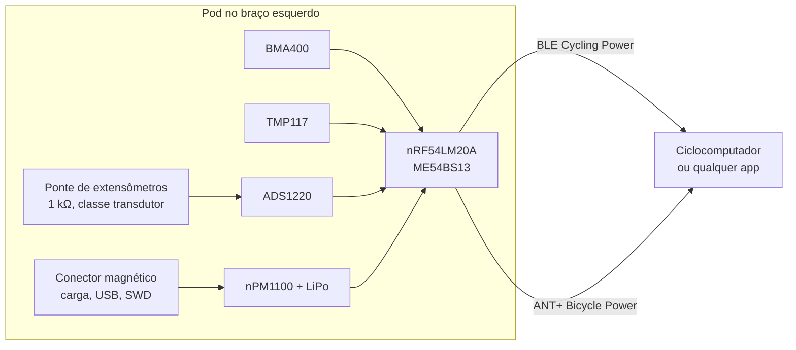
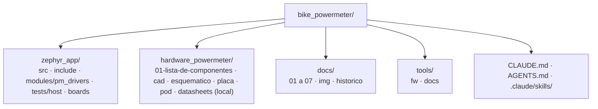

# Bike Power Meter

**Medidor de potência para bicicleta, aberto do extensômetro ao pod, par do [GNSS Bike Computer](https://github.com/Guiimartinho/gnss-bike-computer)**

Módulo colado no braço do pedivela que mede o torque com uma ponte de extensômetros de classe transdutor, a cadência com um acelerômetro, e envia a potência por BLE (Cycling Power Service) e ANT+ (Bicycle Power). Firmware em Zephyr sobre o nRF54LM20A, placa e pod gerados por script e conferidos por dry run, como no ciclocomputador.

> [!WARNING]
> Nenhum código foi escrito, nenhuma placa foi desenhada e nada foi montado. O que existe é a estrutura do repositório e a lista de componentes fechada por datasheet (2026-09-27).

## Índice

- [Visão geral](#visão-geral)
- [Componentes](#componentes)
- [Início rápido](#início-rápido)
- [Estrutura](#estrutura)
- [Documentação](#documentação)
- [Estado e próximos passos](#estado-e-próximos-passos)
- [Créditos e licença](#créditos-e-licença)

## Visão geral

## Componentes

| Bloco | Peça | Por quê |
|---|---|---|
| Sensor | Extensômetros Micro-Measurements classe transdutor, 1 kΩ, S-T-C 13 | Ponte completa, corrente de excitação baixa, compensação para alumínio |
| Conversor | TI ADS1220 | 0,26 µV RMS com ganho 128 a 175 SPS, 585 µA medindo, referência ratiométrica, 3,5 × 3,5 mm |
| Cadência | Bosch BMA400 | 850 nA a 25 Hz, driver no Zephyr |
| Temperatura | TI TMP117 | ±0,1 °C, 3,5 µA |
| MCU e rádio | MinewSemi ME54BS13 (nRF54LM20A) | O mesmo do ciclocomputador: BLE, ANT+, USB |
| Carga e 3,0 V | Nordic nPM1100 | Carregador e buck numa peça, 800 nA |
| Bateria | LiPo de 100 a 150 mAh, MAX17048 | Cerca de 100 h a 1 mA |
| Conector | Magnético de 6 pinos pogo | 5 V, USB e SWD num cabo só |

Lista completa, com o datasheet e os números de cada peça: [`hardware_powermeter/01-lista-de-componentes.md`](hardware_powermeter/01-lista-de-componentes.md).

## Início rápido

Pré-requisitos e comandos são os do ciclocomputador ([`docs/03-ambiente-build.md`](docs/03-ambiente-build.md)): NCS v3.3.0 em `C:\ncs`, scripts em `tools/fw/`, `ANT=1` para o add-on `sdk-ant`, testes de host por `bash tools/fw/host_tests.sh`. Ainda não há `zephyr_app/CMakeLists.txt`: o firmware começa na fase 2 do roteiro.

## Estrutura

## Documentação

| Assunto | Documento |
|---|---|
| O que é, decisão, fases | [docs/01-visao-geral.md](docs/01-visao-geral.md) |
| Componentes fechados por datasheet | [hardware_powermeter/01-lista-de-componentes.md](hardware_powermeter/01-lista-de-componentes.md) |
| Hardware, ambiente, firmware, protocolos, medição | [docs/README.md](docs/README.md) |
| Histórico | [CHANGELOG.md](CHANGELOG.md) |

## Estado e próximos passos

1. Bancada: braço usado, extensômetros, ADS1220 em placa de avaliação, nRF54LM20 DK, massas de 5 a 20 kg.
2. Firmware: serviços, servidor BLE Cycling Power, perfil ANT+ `ant_bpwr`, testes de host.
3. Prova de estrada contra um medidor de referência, até ±2 %.
4. Placa e pod próprios pela cadeia de CAD e dry run.
5. Fase 2: eixo de pedal.

## Créditos e licença

Projeto de Luiz Guilherme Ito. Referências abertas: o como fazer de Keith Wakeham (2013) e os projetos `stevejarvis/powermeter` e `gsoros/ESPM`. Licença a definir pelo dono; o material do ANT+ (perfis, código sob a ANT+ Shared Source License) nunca entra no repositório.
