<div align="center">

# Bike Power Meter

**Medidor de potência para bicicleta, aberto do extensômetro ao pod: torque por ponte de classe transdutor colada no braço do pedivela, cadência por acelerômetro, potência por BLE e ANT+. Par do [GNSS Bike Computer](https://github.com/Guiimartinho/gnss-bike-computer).**


</div>

Um módulo colado na face interna do braço esquerdo do pedivela. A ponte de extensômetros mede a **deformação do próprio braço**, que é o elemento elástico; o conversor lê a ponte em 24 bits, o acelerômetro dá o ângulo e a cadência, e o rádio publica potência, cadência e equilíbrio como qualquer medidor comercial — em **BLE Cycling Power** e **ANT+ Bicycle Power**, para o ciclocomputador do projeto ou para qualquer aplicativo.

O firmware é **obra original** em C puro sobre Zephyr, não um port. A placa, o pod e todos os desenhos são **gerados por programa** a partir dos documentos de [`hardware_powermeter/`](hardware_powermeter/README.md), pela mesma ideia do ciclocomputador: um gerador, um dry run, e nenhum número que não venha de uma ficha ou de uma medida.

> [!WARNING]
> **Nada foi fabricado, impresso, soldado nem colado, e o firmware nunca rodou.** Não existe placa física, nenhum extensômetro foi colado num pedivela, nenhum componente passou por bancada e nenhuma linha de código foi vista funcionando: tudo o que está escrito abaixo foi verificado no PC. As medidas do braço do pedivela são **lugares reservados** — ninguém mediu o braço. O estado de cada área está em [docs/07-status.md](docs/07-status.md).

## Índice

- [Visão geral](#visão-geral)
- [O aparelho](#o-aparelho)
- [Como a potência sai da deformação](#como-a-potência-sai-da-deformação)
- [Componentes](#componentes)
- [Funcionalidades](#funcionalidades)
- [Início rápido](#início-rápido)
- [Estrutura](#estrutura)
- [Documentação](#documentação)
- [Estado e próximos passos](#estado-e-próximos-passos)
- [Créditos e licença](#créditos-e-licença)

## Visão geral

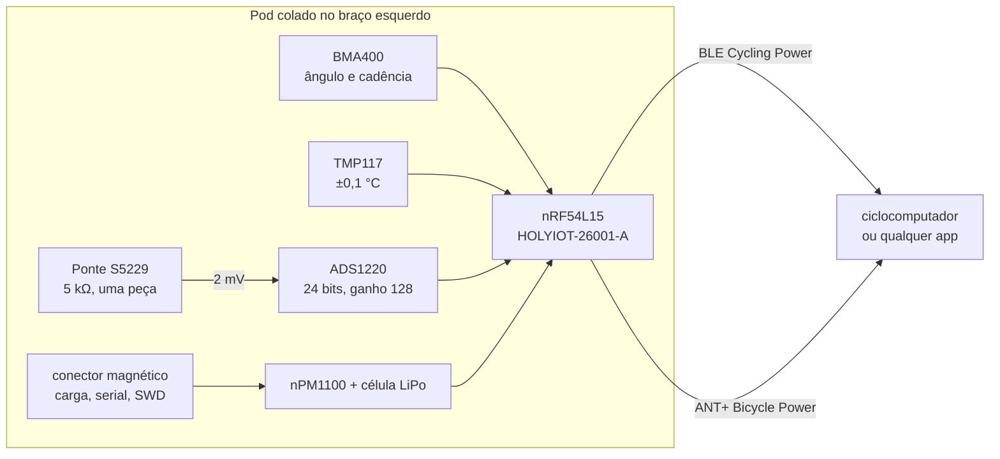

## O aparelho

<div align="center">

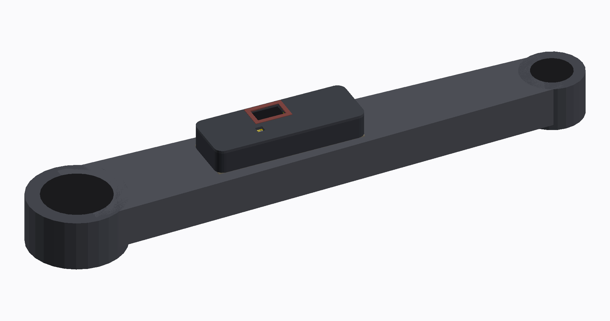

*O pod no braço do pedivela. O braço é um lugar reservado, desenhado da classe (170 mm entre eixos) até o do dono ser medido; o pod, a placa e a ponte são a geometria real do projeto.*

</div>

### O produto, peça por peça

| | |
|---|---|
| 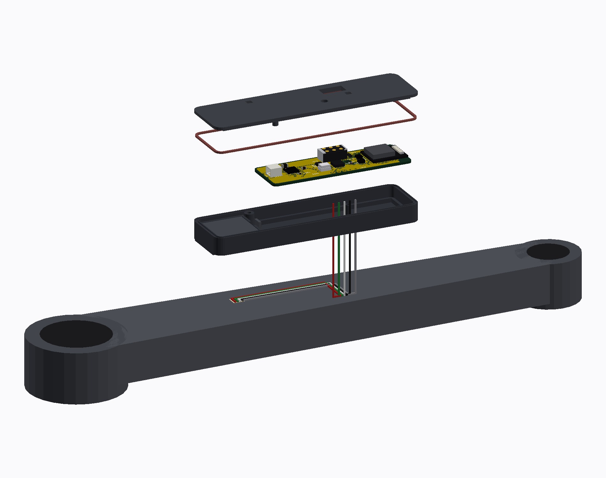 | 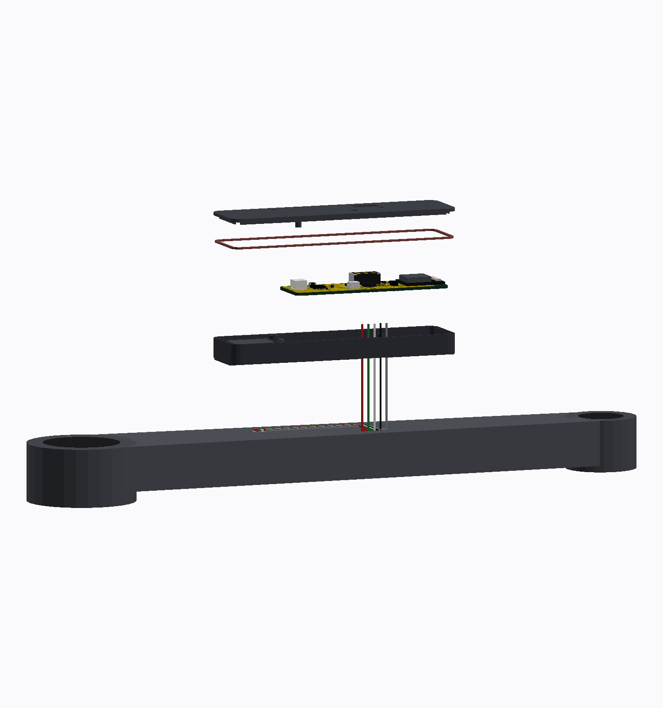 |
| *A pilha inteira: tampa, anel O, placa, célula e concha* | *De lado: 7,7 mm do fundo ao topo da tampa* |
| 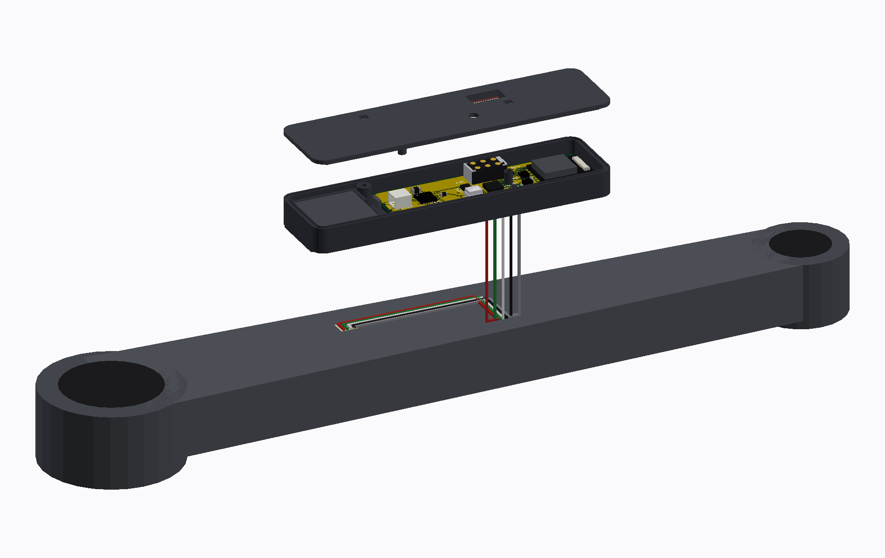 | 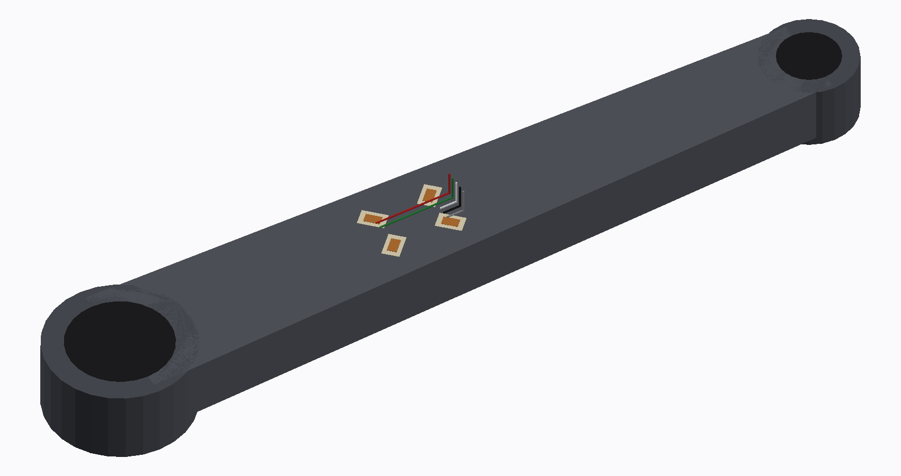 |
| *Aberto: a ponte fica no **braço**, não no pod, e cinco fios sobem por um rasgo no fundo* | *A ponte S5229 colada na face interna do braço* |

### O pod

| | |
|---|---|
| 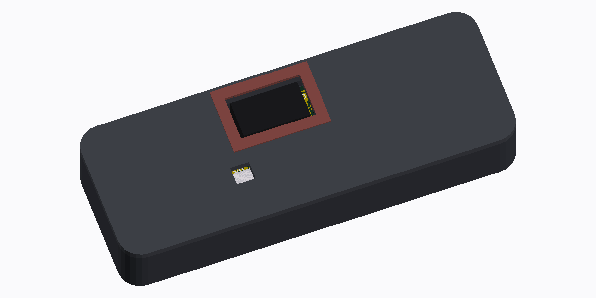 | 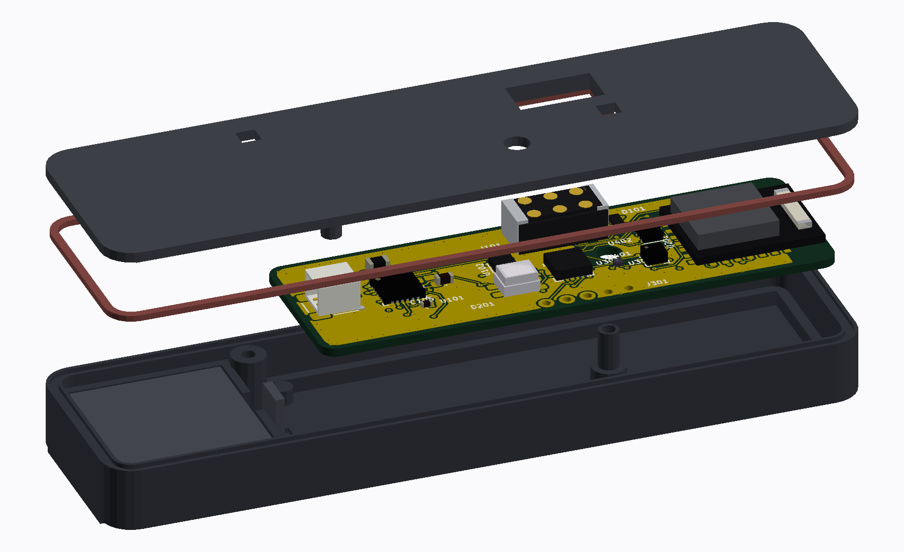 |
| *Fechado: 73,5 × 20,0 × 7,7 mm, 14,3 g estimados* | *Explodido: concha, célula, placa, anel O e tampa* |
| 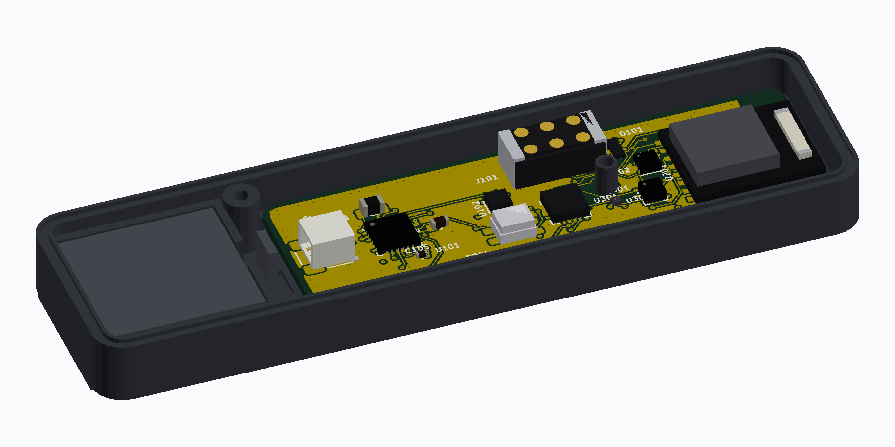 | 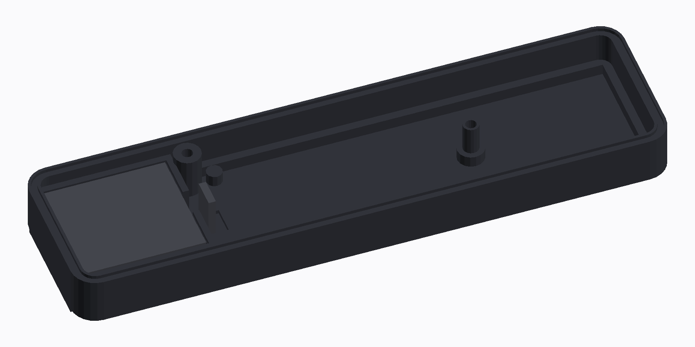 |
| *Aberto, com a placa assentada* | *A célula no berço, no passo em que ela entra* |
| 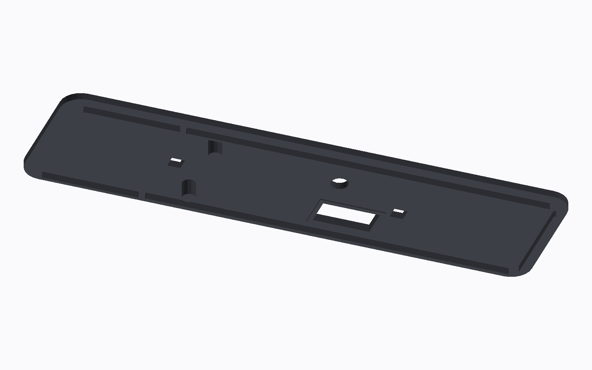 | 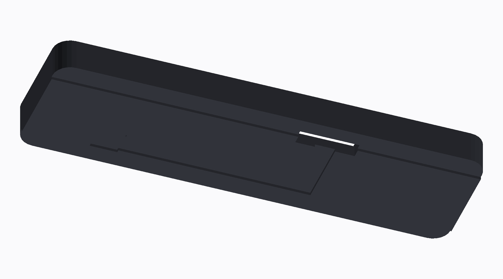 |
| *A tampa por dentro: sulco do anel O, dedos da placa e o ressalto que comprime a junta da porta* | *Por baixo: a base de colagem de 14 mm, o relevo de 0,5, o rasgo dos fios, o bolso do extensômetro e a canaleta do feixe* |

### A placa

| | |
|---|---|
| 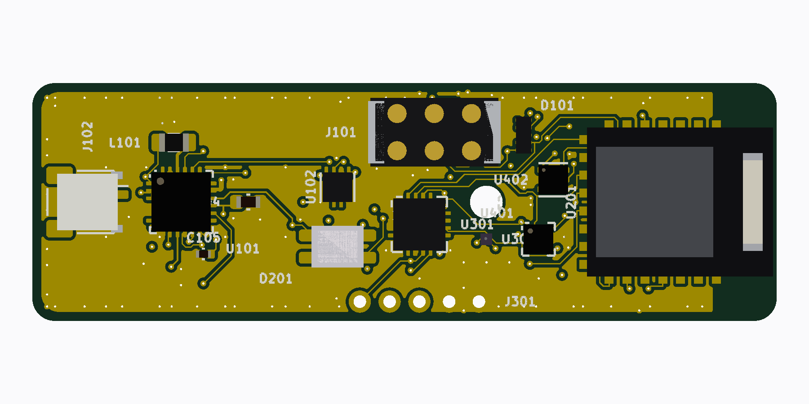 | 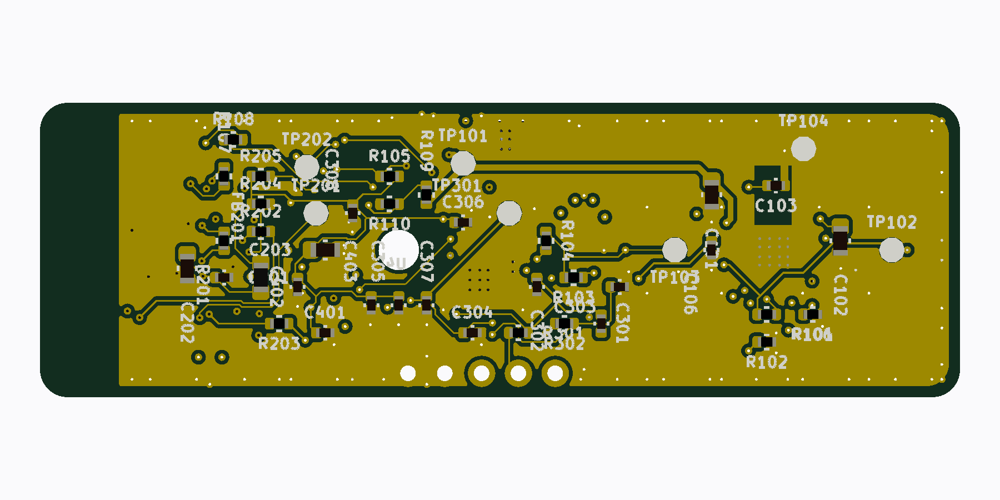 |
| *A placa, 50 × 16 mm em 4 camadas, 58 peças* | *O verso: pads de teste e o que não precisa ser alcançado, sobre o fundo rebaixado do pod* |
| 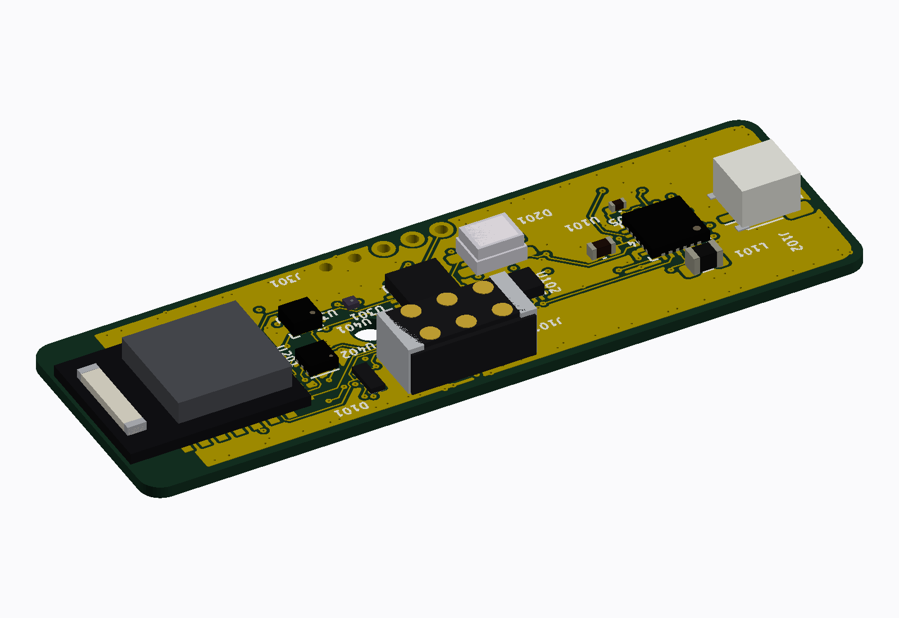 | 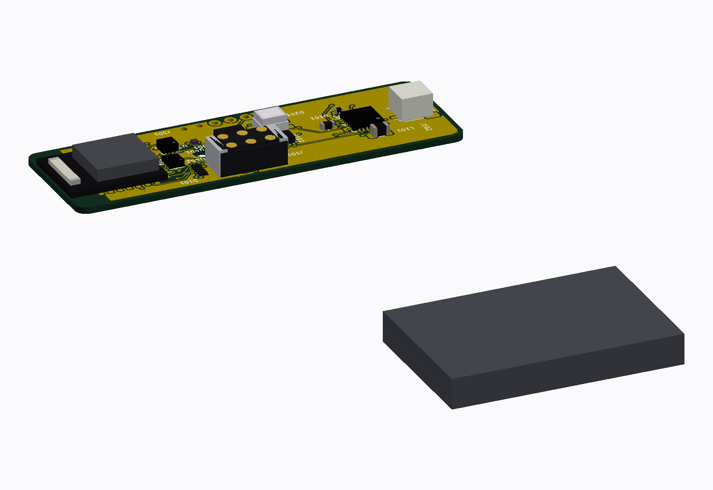 |
| *Em ângulo, com o corpo real de cada peça* | *O mapa de montagem, peça a peça* |

O envelope de referência veio de **fotogrametria** sobre as fotos de imprensa de um medidor da classe, porque nenhum fabricante publica as medidas: 37 a 39 mm de comprimento, 18 a 22 de largura e 9 a 13 de altura, com a escala aferida por dois caminhos independentes ([docs/01](docs/01-visao-geral.md)). É contra esse número que o pod é medido.

## Como a potência sai da deformação

O que quase todo texto sobre medidores esconde: **o sensor não mede força, mede o quanto o braço entorta.**

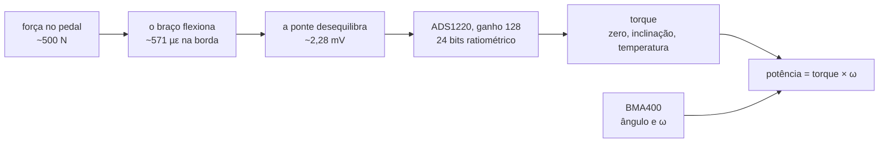

Duas coisas foram **medidas e corrigidas** aqui, e as duas mudam o aparelho:

- **o padrão de extensômetro especificado estava errado.** A lista pedia padrão de cisalhamento a 45°, que é padrão de torquímetro de eixo; o braço do pedivela é uma viga em balanço. Na mesma seção, a grade a 45° lê 52 µε e a grade axial na borda lê 459 µε: **8,9 vezes mais** ([docs/06](docs/06-medicao-e-calibracao.md));
- **o braço Shimano é oco.** Com parede de 3 mm o momento de inércia cai de 9.333 para 7.504 mm⁴ e a deformação sobe de 459 para **571 µε**, 24 % a mais.

A ponte é **uma peça só**, não quatro colagens: o padrão S5229 do databook de classe transdutor, `N2K-13-S5229A-50C/DG/E3`, 5 kΩ ±5 %, matriz de 4,0 × 3,7 mm, ponte de Poisson já balanceada de fábrica. O código `13` é a autocompensação para alumínio; **sem ele escrito no pedido o fabricante embarca o `06`, que é o de aço**.

## Componentes

| Bloco | Peça | Por quê |
|---|---|---|
| Ponte | Micro-Measurements `N2K-13-S5229A-50C/DG/E3` | ponte completa numa colagem só, 5 kΩ (0,6 mA em vez de 3,0), balanceada de fábrica, autocompensada para alumínio |
| Conversor | TI ADS1220 | 0,26 µV RMS com ganho 128, 585 µA medindo, referência **ratiométrica** (a excitação é a referência, então a tensão da célula sai da conta) |
| Cadência e ângulo | Bosch BMA400 | 850 nA a 25 Hz; driver próprio, porque o `bosch,bma4xx` da árvore usa o mapa do BMA422 |
| Temperatura | TI TMP117 | ±0,1 °C para o ajuste do zero e da inclinação |
| MCU e rádio | **HOLYIOT-26001-A** (nRF54L15), antena cerâmica | 10,0 × 12,5 mm contra 16,5 × 12,0 do ME54BS13: o módulo era **26 % da área da placa**, mais que as 37 peças pequenas somadas, e é a única alavanca de tamanho que move alguma coisa. Custa o USB, que este SoC não tem ([09](hardware_powermeter/09-modulo-de-radio.md)) |
| Carga e 3,0 V | Nordic nPM1100 | carregador e buck numa peça, 800 nA |
| Excitação | TI TPS22916 | desliga a ponte entre amostras; é ela que faz os 5 kΩ valerem a pena |
| Bateria | LiPo de bolsa classe **`401123`** (4,0 × 11 × 23 mm, ≥ 78 mAh, dois fios, proteção integrada) | a 0,68 mA — ponte de 5 kΩ com o conversor em duty-cycle — são **114 h**, contra as 50 h do requisito. A premissa anterior, de 2,5 mm de espessura, não existe: naquele volume a célula vale ~49 mAh. Nenhuma loja foi alcançada: o envelope é **requisito de compra** |
| Conector | magnético de 6 contatos, **desenhado aqui** | carga, serial e SWD num cabo só, sem tampa de borracha para perder. Contatos chatos de ouro no aparelho e molas no cabo, para o pod poder ser vedado ([06](hardware_powermeter/06-conectores-e-pontos-de-teste.md#j101--conector-magnético)) |

Lista completa, com a ficha e o código de compra de cada peça: [`hardware_powermeter/01-lista-de-componentes.md`](hardware_powermeter/01-lista-de-componentes.md).

## Funcionalidades

| Funcionalidade | Estado |
|---|---|
| Torque por ponte, com zero, inclinação e ajuste de temperatura | modelo escrito e testado no PC (18 casos, 50 de 50 linhas) |
| Ângulo e cadência pelos cruzamentos de zero do eixo tangencial | modelo escrito e testado (18 casos, 113 de 113 linhas) |
| Potência, equilíbrio e eficiência por volta | modelo escrito e testado (12 casos, 80 de 80 linhas) |
| Calibração: zero, inclinação por mínimos quadrados, massa conhecida | modelo escrito e testado (18 casos, 135 de 135 linhas) |
| BLE Cycling Power (Measurement, Feature, Control Point, Vector) | compila; os bytes vêm do modelo testado; nunca visto por um cliente |
| Serviço de configuração por BLE, com **escrita cifrada obrigatória** | compila; nunca emparelhado |
| ANT+ Bicycle Power (páginas 1, 16, 18, 80, 81) | compila com `ANT=1`; nenhum canal aberto de verdade |
| Atualização por BLE (mcumgr + MCUboot) e recuperação serial pela **UART** do conector magnético | compila; recusa pedalando ou com bateria fraca |
| Placa e pod gerados por programa, com dry run | placa colocada; pod fecha **16 de 16** regras, com vedação por anel O, parafusos, retenção e dreno |

## Início rápido

**Pré-requisitos** (Windows): nRF Connect SDK v3.3.0 em `C:\ncs` com o toolchain `936afb6332`, SEGGER J-Link e um nRF54LM20 DK. Para o ANT, o add-on `sdk-ant` em `C:\ncs\sdk-ant`, depois de aceitar o acordo ANT+. Para os testes de host, MinGW-w64 GCC, CMake e Ninja. Para o CAD, KiCad 8 em `D:\KiCAD`. Detalhes em [docs/03-ambiente-build.md](docs/03-ambiente-build.md).

```sh
# Git Bash, na raiz do repositório
bash tools/fw/fw.sh build            # compila para o nRF54LM20 DK (sysbuild + MCUboot)
BOARD=pmboard/nrf54l15/cpuapp BUILD_DIR=zephyr_app/build_custom bash tools/fw/fw.sh build
ANT=1 BUILD_DIR=zephyr_app/build_ant bash tools/fw/fw.sh build   # com a pilha ANT+
bash tools/fw/host_tests.sh          # 9 conjuntos, 134 casos
bash tools/fw/host_tests.sh coverage # e falha abaixo de 95 % em qualquer módulo
python tools/fw/board_check.py       # confere o devicetree contra o silício, docs/02 e o esquemático
python tools/docs/mermaid_check.py   # valida os diagramas da documentação
python tools/verificar_tudo.py       # a verificação inteira, três vezes
```

A cadeia de CAD, com o intérprete certo de cada etapa (o `fill_zones.py` **só** roda com o Python do KiCad), está em [`hardware_powermeter/cad/README.md`](hardware_powermeter/cad/README.md#a-cadeia).

O CI está **desligado**: a verificação é local.

## Estrutura

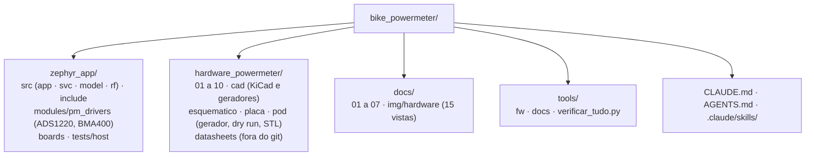

## Documentação

| Documento | Assunto |
|---|---|
| [01 · Visão geral](docs/01-visao-geral.md) | o que é, o envelope da classe por fotogrametria, as fases |
| [02 · Hardware](docs/02-hardware.md) | blocos da placa, pinos do módulo, orçamento de consumo, pod |
| [03 · Ambiente e build](docs/03-ambiente-build.md) | NCS v3.3.0, os três alvos, scripts, gravação |
| [04 · Arquitetura do firmware](docs/04-arquitetura-firmware.md) | os seis serviços, threads, pilhas, máquinas de estado |
| [05 · Protocolos](docs/05-protocolos.md) | BLE Cycling Power, ANT+ Bicycle Power, serviço de configuração com os UUID |
| [06 · Medição e calibração](docs/06-medicao-e-calibracao.md) | da deformação ao torque, flexão × cisalhamento, zero, inclinação, temperatura, saúde |
| [07 · Status](docs/07-status.md) | o que existe, o que foi verificado e como, o que falta |
| [Hardware](hardware_powermeter/README.md) | o esquemático, a placa, o pod, os dry runs e o que falta antes de fabricar |
| [CAD](hardware_powermeter/cad/README.md) | os geradores, as regras e as armadilhas medidas |
| [Pod](hardware_powermeter/pod/README.md) | o gerador do invólucro, as 32 regras do dry run e o que é decisão do desenho |
| [Módulo de rádio](hardware_powermeter/09-modulo-de-radio.md) | o HOLYIOT-26001-A: por que entrou, o que o nRF54L15 muda, pinagem, mecânica, a antena |
| [A classe medida](hardware_powermeter/12-comparacao-com-a-classe.md) | o 4iiii Precision 3+ e o U2e V4 contra o nosso, e o que custaria chegar ao alvo de envelope |
| [CHANGELOG](CHANGELOG.md) | histórico de mudanças |

## Estado e próximos passos

- **Feito em 2026-09-27:** a documentação de requisitos, arquitetura, protocolos e método de medição com as referências; a lista de componentes fechada por ficha; os nove módulos do modelo escritos e testados no PC (134 casos, 100 % das linhas, doze mutações mortas); o firmware embarcado inteiro compilando com **zero avisos** nos três alvos; o esquemático, a placa e o pod gerados por programa com os dois dry runs.
- **Feito em 2026-09-28:** a ponte fechada numa peça só (S5229 de 5 kΩ) com a designação de compra dos braços do dono; a correção do padrão de extensômetro (flexão, não cisalhamento: 8,9 vezes mais sinal); o roteador passou a ser julgado pelo **DRC do KiCad** em vez da própria contabilidade; três defeitos mecânicos do pod medidos e corrigidos, e o dry run fechou **12 de 12**.
- **Falta antes de fabricar:** fechar o roteamento, medir o pedivela do dono (quatro números), escolher a célula, fechar o conector magnético e conferir o empilhamento com o fabricante. A lista está em [`hardware_powermeter/README.md`](hardware_powermeter/README.md#antes-de-mandar-fabricar).
- **Depois:** bancada com massas de 5 a 20 kg contra o braço instrumentado, prova de estrada contra um medidor de referência até ±2 %, e a fase 2 no eixo de pedal.

## Créditos e licença

Projeto de Luiz Guilherme Ito. As referências técnicas — notas de aplicação dos fabricantes, databooks de extensometria, normas e artigos — estão citadas nos documentos que as usam, principalmente em [`docs/06-medicao-e-calibracao.md`](docs/06-medicao-e-calibracao.md) e [`hardware_powermeter/01-lista-de-componentes.md`](hardware_powermeter/01-lista-de-componentes.md).

Licença **CC BY-NC 4.0** ([`LICENSE`](LICENSE)), a mesma do GNSS Bike Computer: copiar, estudar, modificar e redistribuir com atribuição, **sem uso comercial**. Não é licença aprovada pela Open Source Initiative, que não admite restrição de uso, e foi escolhida por isso. O firmware deste projeto é obra original, não um port.

O material do ANT+ — perfis de dispositivo, código sob a ANT+ Shared Source License, chave de rede — **nunca entra neste repositório**: o ANT+ Adopter Agreement proíbe redistribuir. O que existe aqui é código próprio chamando a API do add-on. As fichas dos fabricantes ficam fora do git.
