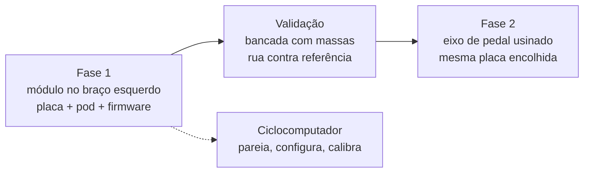

# Visão geral

O Bike Power Meter é um medidor de potência para bicicleta de código aberto, par do [GNSS Bike Computer](https://github.com/Guiimartinho/gnss-bike-computer): mesma base de firmware (Zephyr, nRF Connect SDK v3.3.0, nRF54LM20A, BLE e ANT+), mesma cadeia de CAD gerada por script e conferida por dry run, e o ciclocomputador como banco de teste e como configurador.

**Nesta página:** [O que mede](#o-que-mede) · [Decisão](#decisão) · [Fases](#fases) · [A classe de produto](#a-classe-de-produto) · [Estado](#estado)

## O que mede

Potência é torque vezes velocidade angular. O torque vem de uma ponte de extensômetros colada na peça que transmite a força; a velocidade angular vem de um acelerômetro, pelo giro do vetor gravidade. O módulo amostra a ponte dezenas de vezes por volta, faz a média da volta e envia a potência por BLE (Cycling Power Service) e ANT+ (Bicycle Power).

| Grandeza | Como |
|---|---|
| Torque | Ponte completa de extensômetros de 5 kΩ, excitação chaveada de 3,0 V, conversor ADS1220 com ganho 128 e referência ratiométrica |
| Cadência e ângulo | BMA400 |
| Temperatura da ponte | TMP117, curva de compensação levantada uma vez |
| Potência | Média do torque na volta × velocidade angular; um lado × 2 na fase 1 |
| Calibração | Zero sem carga (auto-zero) e inclinação por massa pendurada com o braço na horizontal |

## Decisão

Fase 1 é um **módulo no braço esquerdo do pedivela que já existe**, o formato mais comum entre os produtos comerciais dessa classe: sem usinagem, aproveitando tudo do ciclocomputador. O pedal (eixo usinado com a eletrônica dentro) é a fase 2, com a mesma placa encolhida e o mesmo firmware.

A lista fechada de componentes, com o datasheet de cada peça, está em [`../hardware_powermeter/01-lista-de-componentes.md`](../hardware_powermeter/01-lista-de-componentes.md).

## Fases

1. Braço usado, extensômetros, ADS1220 em placa de avaliação e o nRF54LM20 DK: bancada com massas de 5 a 20 kg, linearidade, histerese e deriva.
2. Firmware em Zephyr com a estrutura do ciclocomputador: serviços de amostragem, cadência, cálculo, rádio, energia e USB; servidor BLE Cycling Power escrito no projeto; ANT+ pelo perfil `ant_bpwr` do add-on, fora do repositório.
3. Prova no rolo e na rua contra um medidor de referência, por semanas, até ±2 %.
4. Placa própria, pod impresso e envasado, conector magnético de carga, USB e SWD.
5. Fase 2: eixo de pedal.

## A classe de produto

Os números que um módulo de braço comercial publica hoje, e que este projeto toma como piso: 20 g com bateria, cerca de 50 h de uso contínuo por carga, ±1,5 a ±2,5 % de precisão, 0 a 2000 W, 10 a 200 rpm, ANT+ e BLE, IPX7. Nenhum fabricante publica as dimensões do módulo; as deste projeto saem dos componentes e da medida do braço, em [`02-hardware.md`](02-hardware.md).

## Estado

2026-09-27: estrutura do repositório criada, componentes fechados por datasheet, nenhum código escrito, nenhuma placa desenhada, nada montado. Licença a definir pelo dono (o ciclocomputador é CC BY-NC 4.0 por derivar do stravaV10; este projeto não deriva de nada).
