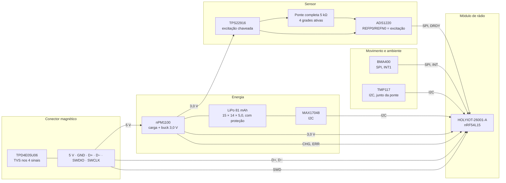

# Hardware: requisitos, blocos e o pod

O que o módulo tem de cumprir, o que cada bloco faz e o tamanho que o pod pode ter. A lista de peças com os datasheets está em [`../hardware_powermeter/01-lista-de-componentes.md`](../hardware_powermeter/01-lista-de-componentes.md).

**Nesta página:** [Requisitos](#requisitos) · [Blocos e trilhos](#blocos-e-trilhos) · [Orçamento de consumo](#orçamento-de-consumo) · [Pinos do módulo](#pinos-do-módulo) · [Placa](#placa) · [Pod](#pod) · [Conector magnético](#conector-magnético)

## Requisitos

| Requisito | Valor | De onde vem |
|---|---|---|
| Massa do módulo com bateria | ≤ 20 g | o piso da classe de produto ([01](01-visao-geral.md#a-classe-de-produto)) |
| Envelope do pod | **38 × 20 × 10 mm**, nas três medidas, com prioridade para o comprimento. O dono pediu em 2026-09-27 que o aparelho montado fique perto do da classe, e a medida por fotogrametria ([01](01-visao-geral.md#o-envelope-da-classe-medido-por-fotogrametria)) mostrou que a classe faz isso em 37 a 39 mm de comprimento, não nos 60 que este projeto perseguia. O limite duro continua sendo a largura da face interna do braço esquerdo e a folga até o quadro, **medidas no pedivela do dono antes de fechar a placa** | medido na foto de imprensa do fabricante, com o braço de 170 mm como régua e o passo dos contatos de carga como conferência; ninguém publica os números |
| Precisão | ±2 % contra referência na fase 1; ±1,5 % como meta da fase 2 | classe de produto; [06](06-medicao-e-calibracao.md#orçamento-de-erro) |
| Faixas | 0 a 2000 W; 10 a 200 rpm; −10 a +50 °C | classe de produto; temperatura pelo mais restrito dos componentes (LiPo) |
| Autonomia | ≥ 50 h pedalando por carga; ≥ 6 meses parado | classe de produto; [orçamento](#orçamento-de-consumo) |
| Amostragem | ponte a 175 amostras/s com ganho 128; acelerômetro a 100 Hz | ADS1220 (SBAS501D), BMA400 |
| Rádio | BLE Cycling Power Service 1.1 e ANT+ Bicycle Power, ao mesmo tempo | [05](05-protocolos.md) |
| Configuração | comprimento do pedivela, zero, inclinação, curva de temperatura, lado e identificação, gravados por BLE | [05](05-protocolos.md#serviço-de-configuração) |
| Atualização | por BLE (mcumgr sobre MCUboot) e por USB (recuperação serial do MCUboot) | [04](04-arquitetura-firmware.md#atualização) |
| Carga e dados | conector magnético de 6 pinos: 5 V, GND, D+, D−, SWDIO, SWCLK. **Decisão do dono em 2026-09-27**, mantida mesmo com a placa encolhendo: o produto da classe usa só dois contatos e faz dados apenas por rádio, e aqui as seis vias ficam, porque o USB e o SWD pelo cabo são o que torna o aparelho gravável e depurável sem abrir o pod | [conector](#conector-magnético) |
| Proteção | IPX7: pod envasado, junta na face do conector | classe de produto |
| Placa | 4 camadas, 0,8 mm, área livre da antena do módulo pelas regras do fabricante | [placa](#placa) |

## Blocos e trilhos

| Trilho | Origem | Quem usa | Observação |
|---|---|---|---|
| `VBAT` | célula | nPM1100, MAX17048 | célula com proteção própria |
| `VBUS` | conector | nPM1100 | 4,1 a 6,7 V de operação, 20 V absoluto (PS v1.5) |
| `3V0` | buck do nPM1100 | módulo, ADS1220 (AVDD e DVDD), BMA400, TMP117, TVS | 150 mA disponíveis; o módulo transmite com dezenas de mA |
| `3V0_EXC` | TPS22916 a partir de `3V0` | ponte e REFP0 do ADS1220 | ligado enquanto o conversor converte (`Active`, `Calibrating` e as rajadas de `Idle`), desligado no resto; a mesma tensão na referência faz a medição ratiométrica (SBAA532A, 3.1) |

## Orçamento de consumo

Estimativas de projeto a partir dos datasheets; nenhuma medida ainda.

| Estado | Bloco | Corrente | Base |
|---|---|---|---|
| Pedalando | ponte de **5 kΩ** a 3,0 V, ligada durante toda a conversão | 0,6 mA | 3,0 V / 5 kΩ; o filtro digital do ADS1220 integra a conversão inteira (SBAS501D, 8.3.6), então não existe janela de excitação menor que a própria conversão |
| Pedalando | ADS1220 modo normal, ganho 128 | 0,59 mA | 510 + 75 µA (SBAS501D) |
| Pedalando | BMA400 modo normal, OSR 0 | 0,004 mA | 3,5 µA |
| Pedalando | TMP117 a 1 Hz | 0,004 mA | 3,5 µA |
| Pedalando | nRF54L15 com BLE a 1 Hz e ANT+ a 4 Hz | 0,3 mA | estimativa de projeto; medir no DK |
| Pedalando | MAX17048 | 0,003 mA | 3 µA em hibernate |
| **Pedalando, total** | | **≈ 1,5 mA** em conversão contínua, **0,68 mA** com o conversor em duty-cycle | a célula que cabe no pod é 15 × 14 × 5,0 e vale **~81 mAh**: 54 h contínuo, **119 h em duty-cycle**, que é o modo decidido. Com a ponte de 1 kΩ eram 3,9 mA e 20 h |
| Parado | BMA400 a 100 Hz, ADS1220 em power-down entre rajadas de 8 amostras a cada 10 s, MCU em System ON dormindo, nPM1100 | ≈ 20 µA | 3,5 + 0,4 + a média das rajadas + ~10 + 0,8 µA |
| Dormindo (10 min parado) | BMA400 em low-power a 25 Hz com a interrupção de despertar, ADS1220 em power-down, rádio anunciando a cada 2 s | ≈ 15 µA | 0,85 + 0,4 + ~10 + 0,8 µA |
| Guardado | ship mode do nPM1100 | 0,46 µA | PS v1.5 |

O maior consumidor pedalando é a ponte, e a primeira versão desta tabela a contava ligada 15 % do tempo. Isso está errado: a 175 amostras/s em conversão contínua o conversor integra a conversão inteira (SBAS501D, 8.3.6 e 8.4.2.2), e a chave interna dele (PSW, 8.3.9) fecha no START e só abre no POWERDOWN; a ponte fica ligada enquanto se mede. Com a ponte de 1 kΩ isso dava 3,9 mA e 38 h, abaixo do requisito.

**Decidido pelo dono em 2026-09-27: extensômetros de classe transdutor de 5 kΩ.** A ponte cai de 3,0 para 0,6 mA, o total pedalando de 3,9 para 1,5 mA, e o requisito de 50 h passa a fechar com folga até numa célula de 100 mAh. O ruído não paga por isso: o ruído térmico de 5 kΩ numa banda de 10 Hz é 0,03 µV, contra os 0,26 µV RMS do próprio conversor com ganho 128 a 175 amostras/s. A decisão também é o que mantém o pod pequeno, porque as outras duas saídas ou não bastavam ou cresciam o aparelho:

| Saída recusada | Por quê |
|---|---|
| Modo duty-cycle do ADS1220 (MODE 01) com a excitação chaveada em volta de cada conversão | daria 1,8 mA, pior que os 1,5, e custa resolução: o filtro passa a ter o ruído do modo normal a 1 kSPS. Fica como reserva se o padrão de 5 kΩ não existir |
| Célula de 200 mAh | daria 51 h com a ponte de 1 kΩ, no limite, e **cresce o pod**, que já está acima do alvo em comprimento e altura ([Pod](#pod)) |

**O que falta confirmar, e é o risco desta decisão:** que exista **ponte completa de flexão numa peça só** em 5 kΩ. O catálogo da Micro-Measurements trata "padrões de ponte completa" e "padrões de alta resistência, de 350 Ω a 20 kΩ" como **duas famílias separadas**, o que já é sinal de que a interseção pode não existir; as páginas de padrão são carregadas por script e não abriram desta máquina em 2026-09-28, então isso se confirma com o fornecedor.

**A combinação que esta tabela não tinha, e que decide o produto:**

| Ponte | Modo | Ponte | ADS1220 | Rádio | **Total** | Com 81 mAh |
|---|---|---|---|---|---|---|
| 5 kΩ | contínuo | 0,600 | 0,585 | 0,300 | **1,50 mA** | **54 h** |
| **5 kΩ** | **duty-cycle 30 %** | **0,180** | **0,190** | 0,300 | **0,68 mA** | **119 h** |
| 1 kΩ | duty-cycle 30 % | 0,900 | 0,190 | 0,300 | 1,40 mA | 58 h |
| 1 kΩ | contínuo | 3,000 | 0,585 | 0,300 | 3,90 mA | 21 h |

**Decidido pelo dono em 2026-09-28: modo duty-cycle com a ponte de 5 kΩ.** A versão anterior desta página tinha os dois números do modo duty-cycle soltos — o conversor cai de 0,585 para 0,190 mA, e a ponte fica ligada 30 % do tempo porque o `PSW` que a alimenta abre junto (SBAS501D 8.3.9) — mas **nunca multiplicou os dois com a ponte de 5 kΩ**: a tabela só testava duty-cycle com 1 kΩ, de quando a ponte ainda era 1 kΩ. Juntos, eles cortam **55 % do consumo**, sem trocar uma peça e sem um milímetro a mais.

O preço é ruído: o filtro passa a ter o ruído do modo normal a 1 kSPS, cerca do dobro. Isso era proibitivo com o padrão de cisalhamento, que dá 0,31 mV, e é **folgado com o de flexão**, que dá 2,76 mV ([06](06-medicao-e-calibracao.md#cisalhamento-ou-flexão-o-padrão-especificado-está-errado)) — a relação sinal-ruído continua ordens de grandeza acima do necessário.

O modo está ligado no devicetree das duas placas (`duty-cycle;` no nó `ads1220`) e é o driver próprio que escreve `MODE = 01` no `CONFIG1`. **Não foi medido em bancada**: os 0,68 mA vêm da ficha do conversor, não de um amperímetro.

Só 350 Ω é que aperta: nem com duty-cycle fecha as 50 h na célula que cabe, e subir de capacidade engorda a célula, que é o que fixa a altura do pod — hoje 10,0 mm com 4,0 de célula. Nesse caso é melhor voltar aos quatro extensômetros separados de 5 kΩ e pagar o alinhamento.

O firmware já faz o que dá sem mudar peça: fora de `Active` e `Calibrating` o conversor fica em power-down e a excitação desligada, com uma rajada de 8 amostras a cada 10 s em `Idle` para o auto-zero e a saúde ([04](04-arquitetura-firmware.md#serviços)).

## Pinos do módulo

Regras do **nRF54L15** que valem aqui: o `SCL` de um TWIM e o `SCK` de um
SPIM precisam de pino com capacidade de clock, e a tabela desses pinos não
está neste repositório — os arquivos da própria Nordic no NCS estão, e é
deles que sai cada pino de barramento abaixo
([`../hardware_powermeter/09`](../hardware_powermeter/09-modulo-de-radio.md#o-mapa-de-pinos-do-projeto)).
Os blocos seriais seguem os portos: `spi00` no P2, e os blocos `20`, `21` e
`22` no P1 — e esses três são **o mesmo periférico** em três endereços, cada
um servindo como `i2c`, `spi` **ou** `uart`, um de cada vez.

O módulo é o **HOLYIOT-26001-A** e traz 30 dos 34 GPIO do SoC: `P0.00` a
`P0.04`, `P1.02` a `P1.15` e `P2.00` a `P2.10`. O projeto usa 20, e sobram
**nove** que existem de verdade nesta placa: `P0.00` a `P0.04`, `P1.03`,
`P2.00`, `P2.09` e `P2.10`, três deles com clock (`P0.03`, `P1.03`,
`P2.00`). `P0.05`, `P0.06` e `P1.00` estão livres **no SoC** e não têm pad
no módulo; `P1.01` e `P1.02` são os pads da antena NFC. O
`tools/fw/board_check.py` imprime as duas listas separadas desde
2026-09-28: antes ele juntava as duas e convidava a escolher um pino que
não dá para usar.

| Sinal | Pino do SoC | Pad do módulo | Vai para | No DK |
|---|---|---|---|---|
| `SPI00 SCK` | P2.01 (clock) | 10 | ADS1220 SCLK e BMA400 SCK | P3.03 (`spi22`) |
| `SPI00 MOSI` | P2.02 | 30 | ADS1220 DIN e BMA400 SDI | P3.00 |
| `SPI00 MISO` | P2.04 | 16 | ADS1220 DOUT/DRDY e BMA400 SDO | P3.01 |
| `ADC_CS` | P2.05 | 8 | ADS1220 CS | P3.02 |
| `ADC_DRDY` | P2.03 | 29 | ADS1220 DRDY (entrada, borda de descida) | P3.06 |
| `IMU_CS` | P2.07 | 28 | BMA400 CSB | P3.05 |
| `IMU_INT1` | P2.08 | 11 | BMA400 INT1 (entrada, ativo alto) | P3.04 |
| `I2C22 SCL` | P1.11 (clock) | 34 | TMP117 SCL, MAX17048 SCL | P1.11 |
| `I2C22 SDA` | P1.12 | 33 | TMP117 SDA, MAX17048 SDA | P1.12 |
| `EXC_EN` | P2.06 | 27 | TPS22916 ON (saída, alto liga a excitação) | P2.06 |
| `CHG_N` | P1.09 | 22 | nPM1100 CHG (dreno aberto, baixo carregando), pull-up | P1.09 |
| `ERR_N` | P1.08 | 12 | nPM1100 ERR (dreno aberto, baixo em erro), pull-up | P1.08 |
| `SHPACT` | P1.15 | 19 | nPM1100 SHPACT (alto por 200 ms com o cabo fora: ship mode; sai com o cabo) | P1.15 |
| `GAUGE_ALRT` | P1.07 | 13 | MAX17048 ALRT (dreno aberto), pull-up | P1.07 |
| `VBUS_SENSE` | P1.06 | 14 | divisor 1 M / 470 k no `VBUS`: é assim que o aparelho sabe que o cabo entrou | P1.06 |
| `LED_R`, `LED_G`, `LED_B` | P1.10, P1.13, P1.14 | 35, 21, 20 | LED RGB por resistor, ativo baixo | LEDs 0, 1 e 2 do DK |
| `UART20 TX`, `RX` | P1.04, P1.05 | 18, 17 | conector magnético, pelo TPD4E05U06: console, comandos e recuperação do MCUboot | VCOM0 do DK |
| `SWDIO`, `SWDCLK` | pads 4 e 5 | 4, 5 | conector magnético (100 Ω em série) e Tag-Connect TC2030 | |
| `NRESET` | pad 1 | 1 | só o Tag-Connect TC2030: o conector magnético tem seis contatos e não leva o reset | |

> [!IMPORTANT]
> **Não há USB.** O `usbhs` não existe no nRF54L15, e por isso não há pino
> `VBUS` no módulo: o pad 9 é o `P2.00`, um GPIO comum que os 5 V do cabo
> destruiriam. Os dois contatos do conector magnético que levavam `D+` e
> `D−` levam agora `TX` e `RX`, e eles **continuam chegando ao nPM1100**,
> que lê essas duas linhas sozinho para escolher entre 500 mA e 100 e não
> se importa com o que fala nelas.

Os aliases que o firmware usa são `bridge-adc`, `bridge-excitation`, `imu0`, `temp0`, `fuel-gauge0`, `charger-status`, `charger-error`, `ship-activate`, `led-r`, `led-g`, `led-b` e `watchdog0`, e um alias que não existe deixa aquele bloco fora. Ship mode: o nPM1100 entra com `SHPACT` alto por 200 ms sem cabo (PS v1.5, 3.5) e só sai com o cabo, porque `SHPHLD` fica só no pull-up e o pod não tem botão; é o estado de fábrica e de guarda longa (460 nA), pedido pelo comando `$SHIP`. O `$SLEEP` é outra coisa: o SoC em System OFF com o BMA400 acordando pelo `IMU_INT1`. Configuração por pino do nPM1100 (PS v1.5): `VOUTBSET0` e `VOUTBSET1` altos dão 3,0 V (tabela da seção 6.3.1); `VTERMSET` alto dá 4,2 V na opção padrão (tabela 12); `ISET` no `AVSS` deixa a detecção da porta decidir 100 ou 500 mA (tabela 10); `MODE` baixo é o modo automático do buck; sem termistor no pack, `NTC` leva 10 kΩ ao `AVSS` (6.2.5); `ICHG` de 6,8 kΩ dá cerca de 75 mA (equação da 6.2.4), 0,5 C de uma célula de 150 mAh.

## Placa

| Item | Valor |
|---|---|
| Camadas | 4: `F.Cu`, `In1.Cu` terra, `In2.Cu` alimentação, `B.Cu` |
| Espessura | 0,8 mm |
| Contorno | derivado das peças e do pod; alvo 48 × 16 mm |
| Antena | **cerâmica**, na ponta do módulo virada para a borda da placa. O guia de montagem do fabricante classifica a antena passando para fora da borda como a melhor posição, o canto como boa e o meio da placa como a pior, e pede que ela fique **sem plano de terra embaixo**. Não há mais recorte vazado na placa: aquilo era o que a antena de traço do ME54BS13 pedia ([09](../hardware_powermeter/09-modulo-de-radio.md#a-antena-manda-no-layout)) |
| Analógico | ponte e ADS1220 num canto, longe do buck e do módulo; filtro RC nas entradas e na referência como o datasheet do ADS1220 pede; retorno de terra da ponte direto ao AVSS |
| Montagem | tudo de um lado, para o pod ser raso; o módulo é a peça mais alta (2,4 mm) |

### Orientação do acelerômetro

Este é um requisito **da placa sobre o firmware**. Como o pod é colado na face interna do braço, o plano da placa é o plano de rotação do pedivela, e daí saem três exigências:

| Papel | Onde tem de apontar | Por quê |
|---|---|---|
| Lateral | normal à placa, para fora da face que leva o ponto do pino 1 | é o eixo ao longo do eixo central; lê perto de zero sempre, e é o que sobra |
| Radial | ao longo do braço, positivo **para fora**, do eixo central para o pedal | é o radial de [06](06-medicao-e-calibracao.md#ângulo-e-cadência), onde entra o termo centrípeto `ω²r` |
| Tangencial | atravessado ao braço, no plano de rotação | os cruzamentos de zero dele dão `ω` |

A convenção de sinais é a da seção 8.2 da ficha BST-BMA400-DS000-14: X e Y no plano do encapsulamento, Z saindo da face de cima, e aceleração na direção indicada dá leitura positiva.

**Medido em 2026-09-27**, lendo a tabela de orientação da ficha contra o canto do pino 1 do footprint (`Package_LGA:LGA-12_2x2mm_P0.5mm`) e a rotação do `U401` na placa: o **Y** do encapsulamento fica ao longo do braço e o **X** atravessado, e o `+Y` aponta para a ponta da placa que fica do lado do eixo central. Daí os valores do firmware: `CONFIG_PM_IMU_AXIS_RADIAL = 1` (Y), `CONFIG_PM_IMU_AXIS_TANGENTIAL = 0` (X) e `CONFIG_PM_IMU_RADIAL_SIGN = -1`, que é o que faz o radial crescer para fora. Antes dessa medida os três eram palpite, e o palpite estava **invertido**.

Os dois lados não podem se mover sozinhos: a regra `IM1` do dry run da placa mede a orientação do `U401` e reprova enquanto a placa e esses símbolos discordarem. Trocar radial por tangencial mete o termo centrípeto dentro da cadência e a potência sai errada sem nenhum sinal de erro, e é por isso que isto é verificação automática e não comentário. É a mesma regra da orientação de modelo STEP: mede-se no desenho do fabricante, nunca se conclui por intuição.

## Pod

O pod é desenhado em volta da placa e da célula pela mesma ideia do case do ciclocomputador: um gerador e um dry run próprio, em [`hardware_powermeter/07-pod.md`](../hardware_powermeter/07-pod.md). A célula fica **sob** a placa: ao lado dela o comprimento cresce muito mais do que a altura economiza.

O primeiro desenho fechou em 65,4 × 19,4 × 10,5 mm, acima do alvo em comprimento e altura, e o caminho de volta às três medidas sai das decisões de 2026-09-27:

| Onde | De | Para | Como |
|---|---|---|---|
| Espessura da célula | 5,0 mm | ~~2,5 mm~~ ~~4,0 mm~~ **5,0 mm** | **esta linha estava errada e foi refeita duas vezes**: em 2026-09-28, porque em 23 × 11 × 2,5 uma LiPo de bolsa vale cerca de 49 mAh e não 100; e em 2026-09-30, quando a célula saiu de baixo da placa e passou a ficar AO LADO dela, o que mudou o envelope de 23 × 11 × 4,0 para **15 × 14 × 5,0 (≥ 81 mAh)**. A 0,68 mA ela dá **119 h** |
| Teto sobre a placa | 3,2 mm | 2,7 mm | quem obrigava os 3,2 era o conector da célula; a célula passa a ser soldada por fio, que num pod envasado é mais robusto que conector |
| **Altura total** | **10,5 mm** | **10,0 mm** | com a célula de 4,0 mm de verdade, é o alvo, exatamente |
| Comprimento da placa | 60 mm | cerca de 55 mm | passivos baixos na face de trás **fora da sombra da célula**: ela cobre 23 a 25 mm dos 60, e os outros 35 ficam sobre o fundo do pod. Um passivo 0402 pede 0,6 mm de vão, contra os 2,5 da célula, então não custa altura |
| **Comprimento total** | **65,4 mm** | **cerca de 60 mm** | a placa menor, mais as paredes e a folga; o canal dos fios da célula na ponta deixa de existir, porque os fios saem pelo rebaixo do fundo |

A largura já está dentro, e a troca do módulo em 2026-09-28 a levou de 19,4 para 19,0. O custo assumido é montagem nas duas faces, mais cara de fabricar, e a face de trás deixa de ser plana: ela passa a ser plana **sob a sombra da célula**, e é assim que as regras do dry run medem.

### A célula saiu de baixo da placa (2026-09-30)

Decisão do dono: **a célula passa a ficar ao lado da placa**, não sob ela, para o aparelho ficar mais baixo. Ela sai da pilha de altura e entra na de comprimento, e a tabela acima deixa de valer nas três linhas que dependiam disso.

| | Antes (célula embaixo) | Agora (célula ao lado) |
|---|---|---|
| Pod | 55,7 × 19,0 × **10,0** | 74,5 × 21,0 × **7,2** |
| Pilha da altura | fundo 1,0 + célula 4,0 + ar 0,5 + placa 0,8 + teto 2,7 + tampa 1,0 | fundo 1,0 + **ar do verso 1,5** + placa 0,8 + teto 2,7 + tampa 1,0 |
| Célula | 23 × 11 × 4,0 = 1.012 mm³ ≈ 78 mAh | **15 × 14 × 5,0 = 1.050 mm³ ≈ 81 mAh** |
| Face de trás | plana sob a sombra da célula, 1,0 mm fora dela | **1,5 mm de ponta a ponta**: não há mais sombra |
| `cola + pod` contra a folga do quadro | 10,5 contra 10,0 ✗ | **7,5 contra 10,0 ✓** |

A célula muda de forma porque muda o que ela custa: embaixo, ela tinha de ser comprida e estreita para caber entre os ressaltos; ao lado, quanto mais larga e mais grossa, menos comprimento toma. Os 5,0 mm de espessura são de graça — a pilha da placa já reserva 5,0 no mesmo espaço.

**O que não fechou:** o pod tem 21,0 mm de largura e a face interna de um braço da classe tem 20,0, então ele sobra 0,5 mm de cada lado. A área de colagem cabe, o relevo livra a concordância e a folga do quadro passa; o que excede é só a silhueta. Fechar isso pede placa de 15 mm em vez de 16 (que custa roteamento) ou aceitar a sobra. A `PD17` reprova com o número até você decidir.

## Conector magnético

Seis pinos pogo, ímã com polaridade, passo de 2,0 a 2,5 mm, 1 A por pino, banho de ouro, face plana vedada por junta e envasada por trás. O cabo termina em USB-A (5 V, GND, D+, D−) e numa saída SWD de 10 vias (Cortex Debug) para o J-Link. Proteção: TPD4E05U06 nos quatro sinais, 100 Ω em série no SWD, e o VBUS entra no nPM1100, que é entrada; nada sai do pod pelos pinos sem cabo. O fornecedor é escolhido com o desenho do footprint, que entra na cadeia de CAD como as outras peças, com o corpo 3D medido.

**Arranjo dos contatos: duas fileiras de três, não fila única.** Seis contatos a 2,5 mm em fila ocupam 12,5 mm num comprimento de placa que agora é de 33; em 2 × 3 a mesma peça cabe em cerca de 5 × 7,5 mm. Como nenhum fornecedor foi escolhido ainda, o arranjo é escolha do projeto e vira requisito de compra.

**Altura mínima do corpo: 3,2 mm**, requisito que saiu do desenho do pod e não do circuito. O conector atravessa a tampa e a face dele fica num poço, abaixo do topo, para não bater na perna do ciclista; se o corpo for mais baixo que a soma do teto com a espessura da tampa, a face fica abaixo da superfície de baixo dela e a cabeça magnética do cabo não alcança. A regra `PD3` do dry run do pod mede as três condições juntas ([`hardware_powermeter/07`](../hardware_powermeter/07-pod.md#o-conector-magnético-na-tampa)). Leve esse número junto do passo e da corrente na hora de escolher a peça.
