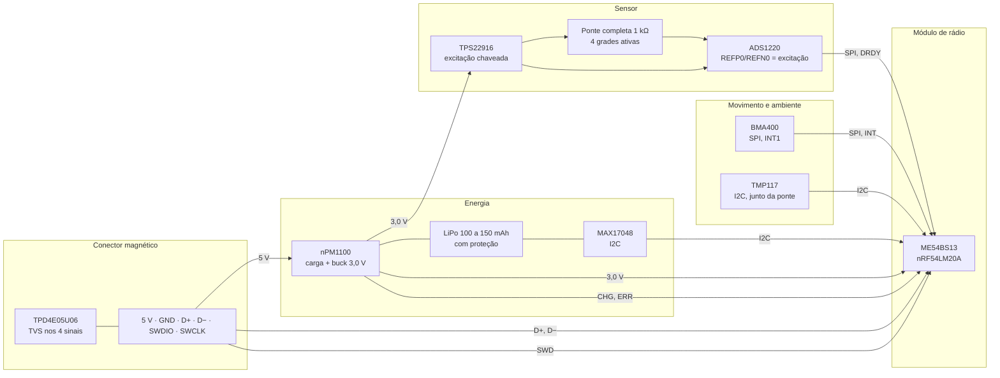

# Hardware: requisitos, blocos e o pod

O que o módulo tem de cumprir, o que cada bloco faz e o tamanho que o pod pode ter. A lista de peças com os datasheets está em [`../hardware_powermeter/01-lista-de-componentes.md`](../hardware_powermeter/01-lista-de-componentes.md).

**Nesta página:** [Requisitos](#requisitos) · [Blocos e trilhos](#blocos-e-trilhos) · [Orçamento de consumo](#orçamento-de-consumo) · [Pinos do módulo](#pinos-do-módulo) · [Placa](#placa) · [Pod](#pod) · [Conector magnético](#conector-magnético)

## Requisitos

| Requisito | Valor | De onde vem |
|---|---|---|
| Massa do módulo com bateria | ≤ 20 g | o piso da classe de produto ([01](01-visao-geral.md#a-classe-de-produto)) |
| Envelope do pod | 60 × 20 × 8,5 mm, alvo; o limite duro é a largura da face interna do braço esquerdo e a folga até o quadro, **medidas no pedivela do dono antes de fechar a placa** | nenhum fabricante publica dimensões; o envelope sai da célula, da placa e da parede do pod |
| Precisão | ±2 % contra referência na fase 1; ±1,5 % como meta da fase 2 | classe de produto; [06](06-medicao-e-calibracao.md#orçamento-de-erro) |
| Faixas | 0 a 2000 W; 10 a 200 rpm; −10 a +50 °C | classe de produto; temperatura pelo mais restrito dos componentes (LiPo) |
| Autonomia | ≥ 50 h pedalando por carga; ≥ 6 meses parado | classe de produto; [orçamento](#orçamento-de-consumo) |
| Amostragem | ponte a 175 amostras/s com ganho 128; acelerômetro a 100 Hz | ADS1220 (SBAS501D), BMA400 |
| Rádio | BLE Cycling Power Service 1.1 e ANT+ Bicycle Power, ao mesmo tempo | [05](05-protocolos.md) |
| Configuração | comprimento do pedivela, zero, inclinação, curva de temperatura, lado e identificação, gravados por BLE | [05](05-protocolos.md#serviço-de-configuração) |
| Atualização | por BLE (mcumgr sobre MCUboot) e por USB (recuperação serial do MCUboot) | [04](04-arquitetura-firmware.md#atualização) |
| Carga e dados | conector magnético de 6 pinos: 5 V, GND, D+, D−, SWDIO, SWCLK | [conector](#conector-magnético) |
| Proteção | IPX7: pod envasado, junta na face do conector | classe de produto |
| Placa | 4 camadas, 0,8 mm, área livre da antena do módulo pelas regras do fabricante | [placa](#placa) |

## Blocos e trilhos

| Trilho | Origem | Quem usa | Observação |
|---|---|---|---|
| `VBAT` | célula | nPM1100, MAX17048 | célula com proteção própria |
| `VBUS` | conector | nPM1100 | 4,1 a 6,7 V de operação, 20 V absoluto (PS v1.5) |
| `3V0` | buck do nPM1100 | módulo, ADS1220 (AVDD e DVDD), BMA400, TMP117, TVS | 150 mA disponíveis; o módulo transmite com dezenas de mA |
| `3V0_EXC` | TPS22916 a partir de `3V0` | ponte e REFP0 do ADS1220 | ligado enquanto o conversor converte (`Active`, `Calibrating` e as rajadas de `Idle`), desligado no resto; a mesma tensão na referência faz a medição ratiométrica (SBAA532A, 3.1) |

## Orçamento de consumo

Estimativas de projeto a partir dos datasheets; nenhuma medida ainda.

| Estado | Bloco | Corrente | Base |
|---|---|---|---|
| Pedalando | ponte de 1 kΩ a 3,0 V, ligada durante toda a conversão | 3,0 mA | 3,0 V / 1 kΩ; o filtro digital do ADS1220 integra a conversão inteira (SBAS501D, 8.3.6), então não existe janela de excitação menor que a própria conversão |
| Pedalando | ADS1220 modo normal, ganho 128 | 0,59 mA | 510 + 75 µA (SBAS501D) |
| Pedalando | BMA400 modo normal, OSR 0 | 0,004 mA | 3,5 µA |
| Pedalando | TMP117 a 1 Hz | 0,004 mA | 3,5 µA |
| Pedalando | nRF54LM20A com BLE a 1 Hz e ANT+ a 4 Hz | 0,3 mA | estimativa de projeto; medir no DK |
| Pedalando | MAX17048 | 0,003 mA | 3 µA em hibernate |
| **Pedalando, total** | | **≈ 3,9 mA** | 100 mAh dão cerca de 25 h; 150 mAh, 38 h: **abaixo das 50 h do requisito** |
| Parado | BMA400 a 100 Hz, ADS1220 em power-down entre rajadas de 8 amostras a cada 10 s, MCU em System ON dormindo, nPM1100 | ≈ 20 µA | 3,5 + 0,4 + a média das rajadas + ~10 + 0,8 µA |
| Dormindo (10 min parado) | BMA400 em low-power a 25 Hz com a interrupção de despertar, ADS1220 em power-down, rádio anunciando a cada 2 s | ≈ 15 µA | 0,85 + 0,4 + ~10 + 0,8 µA |
| Guardado | ship mode do nPM1100 | 0,46 µA | PS v1.5 |

O maior consumidor pedalando é a ponte, e a primeira versão desta tabela a contava ligada 15 % do tempo. Isso está errado: a 175 amostras/s em conversão contínua o conversor integra a conversão inteira (SBAS501D, 8.3.6 e 8.4.2.2), e a chave interna dele (PSW, 8.3.9) fecha no START e só abre no POWERDOWN; a ponte fica ligada enquanto se mede. Com a ponte de 1 kΩ o requisito de 50 h não fecha, e a decisão é do dono, entre:

| Saída | Efeito | O que confirmar |
|---|---|---|
| Extensômetros de classe transdutor de **5 kΩ** no lugar de 1 kΩ | ponte a 0,6 mA; total pedalando ≈ 1,5 mA; 150 mAh dão cerca de 100 h | o padrão de cisalhamento a 45° na resistência de 5 kΩ no catálogo da Micro-Measurements (a classe transdutor vai de 350 Ω a 20 kΩ, [01](../hardware_powermeter/01-lista-de-componentes.md#extensômetros)); o ruído térmico de 5 kΩ em 10 Hz é 0,03 µV, abaixo dos 0,26 µV do conversor |
| Modo duty-cycle do ADS1220 (MODE 01) a 250 amostras/s efetivas, com a excitação chaveada pelo firmware em volta de cada conversão | ponte ligada cerca de 30 % do tempo; total ≈ 1,8 mA | a temporização entre o DRDY e a conversão seguinte, na bancada; o filtro perde resolução (ruído do modo normal a 1 kSPS) |
| Célula de 200 mAh | 51 h com a ponte de 1 kΩ | o volume no pod ([Pod](#pod)) e a massa de 20 g |

O firmware já faz o que dá sem mudar peça: fora de `Active` e `Calibrating` o conversor fica em power-down e a excitação desligada, com uma rajada de 8 amostras a cada 10 s em `Idle` para o auto-zero e a saúde ([04](04-arquitetura-firmware.md#serviços)).

## Pinos do módulo

Regras do nRF54LM20A que valem aqui como no ciclocomputador: SCL do TWIM e SCK do SPIM em pinos de clock (P0.03, P0.04, P0.06, P0.07, P1.03, P1.04, P1.07, P1.13, P1.14, P1.17, P1.18, P1.23, P1.24, P2.01, P2.06, P3.03 e P3.04, tabela 79 da ficha do SoC); P1.01 e P1.02 saem do reset como NFC; o bloco serial `spi00` fica no porto P2 e os blocos 20 a 24 nos portos P1 e P3. Os pads do módulo são os da ficha do ME54BS13 V1.0.0 (páginas 6 a 9), a mesma tabela `PADS_ME54BS13` do ciclocomputador. A alocação abaixo vale para o esquemático ([`../hardware_powermeter/cad/`](../hardware_powermeter/cad/README.md)), para a placa própria do firmware e para os testes; no nRF54LM20 DK os mesmos sinais vão para pinos livres dos conectores do kit (coluna da direita).

| Sinal | Pino do SoC | Pad do módulo | Vai para | No DK |
|---|---|---|---|---|
| `SPI00 SCK` | P2.01 (clock) | E9 | ADS1220 SCLK e BMA400 SCK | P3.03 (`spi22`) |
| `SPI00 MOSI` | P2.02 | D9 | ADS1220 DIN e BMA400 SDI | P3.00 |
| `SPI00 MISO` | P2.04 | C8 | ADS1220 DOUT/DRDY e BMA400 SDO | P3.01 |
| `ADC_CS` | P2.05 | D8 | ADS1220 CS | P3.02 |
| `ADC_DRDY` | P2.03 | C9 | ADS1220 DRDY (entrada, borda de descida) | P3.06 |
| `IMU_CS` | P2.07 | E8 | BMA400 CSB | P3.05 |
| `IMU_INT1` | P2.08 | F8 | BMA400 INT1 (entrada, ativo alto) | P3.04 |
| `I2C23 SDA` | P1.29 | B9 | TMP117 SDA, MAX17048 SDA | P1.29 |
| `I2C23 SCL` | P1.03 (clock) | B8 | TMP117 SCL, MAX17048 SCL | P1.03 |
| `EXC_EN` | P1.10 | E3 | TPS22916 ON (saída, alto liga a excitação) | P1.10 |
| `CHG_N` | P1.11 | F5 | nPM1100 CHG (dreno aberto, baixo carregando), pull-up | P1.11 |
| `ERR_N` | P1.12 | F4 | nPM1100 ERR (dreno aberto, baixo em erro), pull-up | P1.12 |
| `SHPACT` | P1.25 | E5 | nPM1100 SHPACT (alto por 200 ms com o cabo fora: ship mode; sai com o cabo) | P1.25 |
| `GAUGE_ALRT` | P1.22 | E4 | MAX17048 ALRT (dreno aberto), pull-up | P1.22 |
| `LED_R`, `LED_G`, `LED_B` | P1.06, P1.08, P1.09 | A6, C6, D6 | LED RGB por resistor, ativo baixo | LEDs 0, 1 e 2 do DK |
| `UART20 TX`, `RX` | P1.00, P1.31 | A7, B7 | console em dois pontos de teste | VCOM0 do DK |
| `USB D−`, `USB D+` | pads 7 e 8 do módulo | 7, 8 | conector magnético, pelo TPD4E05U06; o nPM1100 lê D+ e D− para detectar a porta | USB-C do DK |
| `VBUS` | pad 9 | 9 | 5 V do conector, depois do nPM1100 (o pad é o detector de USB do SoC) | |
| `SWDIO`, `SWDCLK`, `RESET` | pads 5, 6 e 4 | 5, 6, 4 | conector magnético (100 Ω em série) e Tag-Connect TC2030 | |

Os aliases que o firmware usa são `bridge-adc`, `bridge-excitation`, `imu0`, `temp0`, `fuel-gauge0`, `charger-status`, `charger-error`, `ship-activate`, `led-r`, `led-g`, `led-b` e `watchdog0`, e um alias que não existe deixa aquele bloco fora. Ship mode: o nPM1100 entra com `SHPACT` alto por 200 ms sem cabo (PS v1.5, 3.5) e só sai com o cabo, porque `SHPHLD` fica só no pull-up e o pod não tem botão; é o estado de fábrica e de guarda longa (460 nA), pedido pelo comando `$SHIP`. O `$SLEEP` é outra coisa: o SoC em System OFF com o BMA400 acordando pelo `IMU_INT1`. Configuração por pino do nPM1100 (PS v1.5): `VOUTBSET0` e `VOUTBSET1` altos dão 3,0 V (tabela da seção 6.3.1); `VTERMSET` alto dá 4,2 V na opção padrão (tabela 12); `ISET` no `AVSS` deixa a detecção da porta decidir 100 ou 500 mA (tabela 10); `MODE` baixo é o modo automático do buck; sem termistor no pack, `NTC` leva 10 kΩ ao `AVSS` (6.2.5); `ICHG` de 6,8 kΩ dá cerca de 75 mA (equação da 6.2.4), 0,5 C de uma célula de 150 mAh.

## Placa

| Item | Valor |
|---|---|
| Camadas | 4: `F.Cu`, `In1.Cu` terra, `In2.Cu` alimentação, `B.Cu` |
| Espessura | 0,8 mm |
| Contorno | derivado das peças e do pod; alvo 48 × 16 mm |
| Antena | o lado de RF do módulo virado para a borda; 0,5 mm livres em volta do corpo; nenhum cobre nem peça a 4 mm do lado da antena na mesma camada; plano de terra contínuo sob a parte não-RF; via de terra junto de cada pad de terra do módulo (datasheet ME54BS13 v1.0.0, 7.1 a 7.3) |
| Analógico | ponte e ADS1220 num canto, longe do buck e do módulo; filtro RC nas entradas e na referência como o datasheet do ADS1220 pede; retorno de terra da ponte direto ao AVSS |
| Montagem | tudo de um lado, para o pod ser raso; o módulo é a peça mais alta (2,4 mm) |

## Pod

O pod é desenhado em volta da placa e da célula pela mesma ideia do case do ciclocomputador: um gerador e um dry run próprio. Pilha de altura, de baixo para cima: cola de fixação ao braço (0,5 mm), fundo do pod (1,0), célula (4,0), placa (0,8) com o módulo (2,4), tampa (1,0): 9,7 mm. O alvo de 8,5 mm exige a célula ao lado da placa, não sob ela: 60 × 20 mm de área comportam célula de 30 × 20 e placa de 48 × 16 lado a lado só com a placa de 28 mm. A decisão entre os dois arranjos é do dry run, com a medida do braço.

## Conector magnético

Seis pinos pogo, ímã com polaridade, passo de 2,0 a 2,5 mm, 1 A por pino, banho de ouro, face plana vedada por junta e envasada por trás. O cabo termina em USB-A (5 V, GND, D+, D−) e numa saída SWD de 10 vias (Cortex Debug) para o J-Link. Proteção: TPD4E05U06 nos quatro sinais, 100 Ω em série no SWD, e o VBUS entra no nPM1100, que é entrada; nada sai do pod pelos pinos sem cabo. O fornecedor é escolhido com o desenho do footprint, que entra na cadeia de CAD como as outras peças, com o corpo 3D medido.
