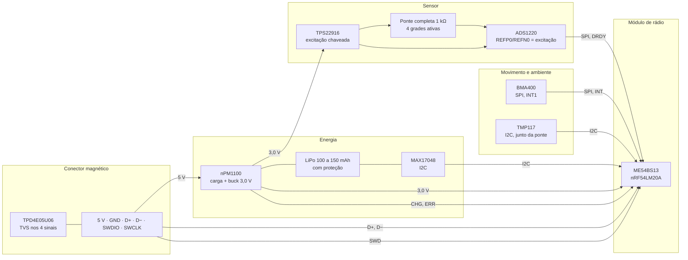

# Hardware: requisitos, blocos e o pod

O que o módulo tem de cumprir, o que cada bloco faz e o tamanho que o pod pode ter. A lista de peças com os datasheets está em [`../hardware_powermeter/01-lista-de-componentes.md`](../hardware_powermeter/01-lista-de-componentes.md).

**Nesta página:** [Requisitos](#requisitos) · [Blocos e trilhos](#blocos-e-trilhos) · [Orçamento de consumo](#orçamento-de-consumo) · [Pinos do módulo](#pinos-do-módulo) · [Placa](#placa) · [Pod](#pod) · [Conector magnético](#conector-magnético)

## Requisitos

| Requisito | Valor | De onde vem |
|---|---|---|
| Massa do módulo com bateria | ≤ 20 g | o piso da classe de produto ([01](01-visao-geral.md#a-classe-de-produto)) |
| Envelope do pod | 60 × 20 × 8,5 mm, alvo; o limite duro é a largura da face interna do braço esquerdo e a folga até o quadro, **medidas no pedivela do dono antes de fechar a placa** | nenhum fabricante publica dimensões; o envelope sai da célula, da placa e da parede do pod |
| Precisão | ±2 % contra referência na fase 1; ±1,5 % como meta da fase 2 | classe de produto; [06](06-medicao-e-calibracao.md#orçamento-de-erro) |
| Faixas | 0 a 2000 W; 10 a 200 rpm; −10 a +50 °C | classe de produto; temperatura pelo mais restrito dos componentes (LiPo) |
| Autonomia | ≥ 50 h pedalando por carga; ≥ 6 meses parado | classe de produto; [orçamento](#orçamento-de-consumo) |
| Amostragem | ponte a 175 amostras/s com ganho 128; acelerômetro a 100 Hz | ADS1220 (SBAS501D), BMA400 |
| Rádio | BLE Cycling Power Service 1.1 e ANT+ Bicycle Power, ao mesmo tempo | [05](05-protocolos.md) |
| Configuração | comprimento do pedivela, zero, inclinação, curva de temperatura, lado e identificação, gravados por BLE | [05](05-protocolos.md#serviço-de-configuração) |
| Atualização | por BLE (mcumgr sobre MCUboot) e por USB (recuperação serial do MCUboot) | [04](04-arquitetura-firmware.md#atualização) |
| Carga e dados | conector magnético de 6 pinos: 5 V, GND, D+, D−, SWDIO, SWCLK | [conector](#conector-magnético) |
| Proteção | IPX7: pod envasado, junta na face do conector | classe de produto |
| Placa | 4 camadas, 0,8 mm, área livre da antena do módulo pelas regras do fabricante | [placa](#placa) |

## Blocos e trilhos

| Trilho | Origem | Quem usa | Observação |
|---|---|---|---|
| `VBAT` | célula | nPM1100, MAX17048 | célula com proteção própria |
| `VBUS` | conector | nPM1100 | 4,1 a 6,7 V de operação, 20 V absoluto (PS v1.5) |
| `3V0` | buck do nPM1100 | módulo, ADS1220 (AVDD e DVDD), BMA400, TMP117, TVS | 150 mA disponíveis; o módulo transmite com dezenas de mA |
| `3V0_EXC` | TPS22916 a partir de `3V0` | ponte e REFP0 do ADS1220 | ligado só na janela da amostra; a mesma tensão na referência faz a medição ratiométrica (SBAA532A, 3.1) |

## Orçamento de consumo

Estimativas de projeto a partir dos datasheets; nenhuma medida ainda.

| Estado | Bloco | Corrente | Base |
|---|---|---|---|
| Pedalando | ponte de 1 kΩ a 3,0 V, ligada 15 % do tempo | 0,45 mA | 3 mA × 0,15 |
| Pedalando | ADS1220 modo normal, ganho 128 | 0,59 mA | 510 + 75 µA (SBAS501D) |
| Pedalando | BMA400 modo normal, OSR 0 | 0,004 mA | 3,5 µA |
| Pedalando | TMP117 a 1 Hz | 0,004 mA | 3,5 µA |
| Pedalando | nRF54LM20A com BLE a 1 Hz e ANT+ a 4 Hz | 0,3 mA | estimativa de projeto; medir no DK |
| Pedalando | MAX17048 | 0,003 mA | 3 µA em hibernate |
| **Pedalando, total** | | **≈ 1,35 mA** | 100 mAh dão cerca de 74 h; 150 mAh, 110 h |
| Parado | BMA400 em low-power a 25 Hz, ADS1220 em power-down, MCU em System ON dormindo, nPM1100 | ≈ 15 µA | 0,85 + 0,4 + ~10 + 0,8 µA |
| Guardado | ship mode do nPM1100 | 0,46 µA | PS v1.5 |

O maior consumidor pedalando é o conversor mais a ponte. A janela de excitação de 15 % é o que o ADS1220 permite a 175 amostras/s: a ponte precisa estar ligada e estável antes de cada conversão, e o firmware a liga com o comando de início e a desliga no DRDY ([06](06-medicao-e-calibracao.md#amostragem)).

## Pinos do módulo

Regras do nRF54LM20A que valem aqui como no ciclocomputador: SCL do TWIM e SCK do SPIM em pinos de clock; P1.01 e P1.02 saem do reset como NFC. A alocação definitiva sai com o esquemático ([`../hardware_powermeter/cad/`](../hardware_powermeter/cad/README.md)); os aliases que o firmware usa são `bridge-adc`, `bridge-excitation`, `imu0`, `temp0`, `fuel-gauge0`, `charger-status` e `led0`, e um alias que não existe deixa aquele bloco fora.

## Placa

| Item | Valor |
|---|---|
| Camadas | 4: `F.Cu`, `In1.Cu` terra, `In2.Cu` alimentação, `B.Cu` |
| Espessura | 0,8 mm |
| Contorno | derivado das peças e do pod; alvo 48 × 16 mm |
| Antena | o lado de RF do módulo virado para a borda; 0,5 mm livres em volta do corpo; nenhum cobre nem peça a 4 mm do lado da antena na mesma camada; plano de terra contínuo sob a parte não-RF; via de terra junto de cada pad de terra do módulo (datasheet ME54BS13 v1.0.0, 7.1 a 7.3) |
| Analógico | ponte e ADS1220 num canto, longe do buck e do módulo; filtro RC nas entradas e na referência como o datasheet do ADS1220 pede; retorno de terra da ponte direto ao AVSS |
| Montagem | tudo de um lado, para o pod ser raso; o módulo é a peça mais alta (2,4 mm) |

## Pod

O pod é desenhado em volta da placa e da célula pela mesma ideia do case do ciclocomputador: um gerador e um dry run próprio. Pilha de altura, de baixo para cima: cola de fixação ao braço (0,5 mm), fundo do pod (1,0), célula (4,0), placa (0,8) com o módulo (2,4), tampa (1,0): 9,7 mm. O alvo de 8,5 mm exige a célula ao lado da placa, não sob ela: 60 × 20 mm de área comportam célula de 30 × 20 e placa de 48 × 16 lado a lado só com a placa de 28 mm. A decisão entre os dois arranjos é do dry run, com a medida do braço.

## Conector magnético

Seis pinos pogo, ímã com polaridade, passo de 2,0 a 2,5 mm, 1 A por pino, banho de ouro, face plana vedada por junta e envasada por trás. O cabo termina em USB-A (5 V, GND, D+, D−) e numa saída SWD de 10 vias (Cortex Debug) para o J-Link. Proteção: TPD4E05U06 nos quatro sinais, 100 Ω em série no SWD, e o VBUS entra no nPM1100, que é entrada; nada sai do pod pelos pinos sem cabo. O fornecedor é escolhido com o desenho do footprint, que entra na cadeia de CAD como as outras peças, com o corpo 3D medido.
