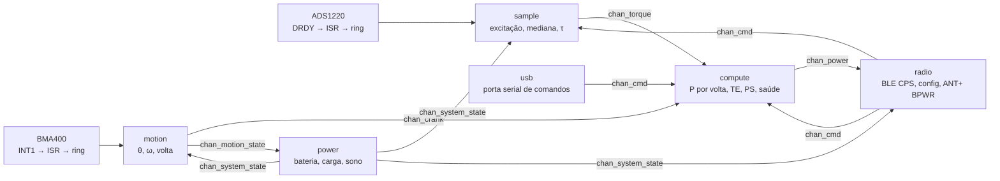
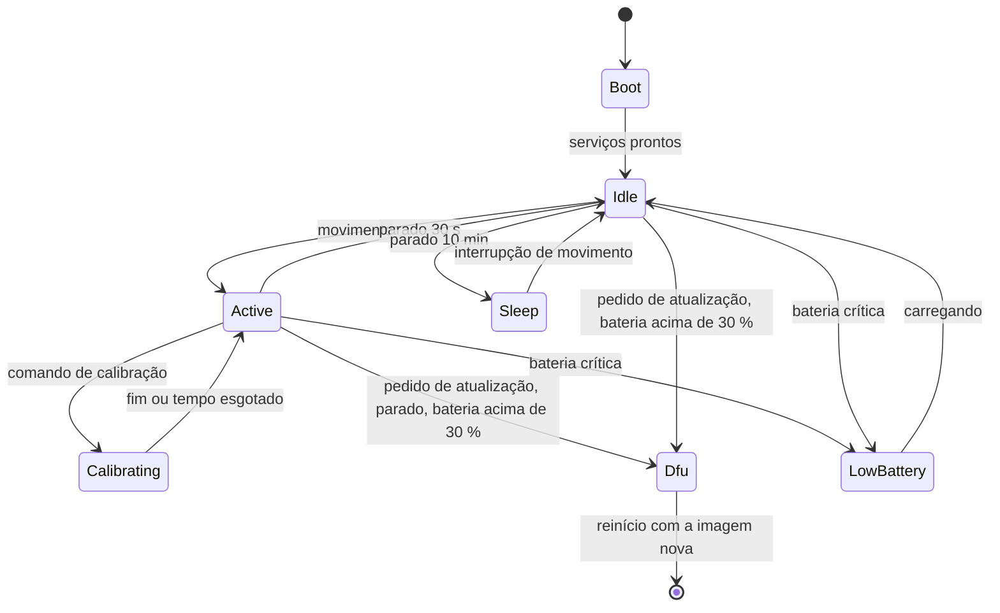

# Arquitetura do firmware

A mesma base do ciclocomputador, com menos peças: serviços com thread própria e caixa de entrada, eventos no zbus, a máquina do sistema em C puro no modelo (`pm_fsm`, executada pelo serviço `power`, que traduz o estado em ações), um canal de watchdog por thread, lógica pura em `src/model/` testada no PC. Nada roda em placa ainda.

**Nesta página:** [Serviços](#serviços) · [Eventos](#eventos) · [Máquina do sistema](#máquina-do-sistema) · [Modelo](#modelo) · [Drivers](#drivers) · [Atualização](#atualização) · [Pilhas e prioridades](#pilhas-e-prioridades) · [Testes e cobertura](#testes-e-cobertura)

## Serviços

| Serviço | Thread | O que faz | Dorme em |
|---|---|---|---|
| `sample` | prioridade 4 | em `Active` e `Calibrating` liga a excitação, põe o ADS1220 em conversão contínua e, a cada DRDY (a ISR só deixa uma mensagem na caixa de entrada), lê o código pelo SPI, aplica a mediana de três e a calibração e publica `chan_torque` a 175 Hz; lê o TMP117 a 1 Hz (`chan_temp`) e o monitor da referência no início de cada período (`chan_excitation`); em `Idle` faz uma rajada de 8 conversões a cada `CONFIG_PM_IDLE_BURST_PERIOD_MS` para o auto-zero e a saúde, com o conversor em power-down e a excitação desligada entre elas; nos outros estados tudo fica desligado | caixa de entrada, 50 ms em contínuo |
| `motion` | 5 | o driver próprio do BMA400 dispara o trigger de dados prontos no INT1 (a ISR dá um semáforo à thread do driver, que dá outro à do serviço); a thread lê os três eixos pela API de sensor, escolhe o radial e o tangencial por `CONFIG_PM_IMU_AXIS_*` (um fato da placa no braço, a confirmar no pod) e o sinal pelo `tangential_sign` da configuração, roda `crank_update()` e publica `chan_crank` por amostra e `chan_motion_state` quando ω passa de zero a algo ou volta a zero; em `Sleep` põe o sensor em low-power com a interrupção de despertar armada, que também acorda o SoC do System OFF | semáforo, 20 ms |
| `compute` | 5 | a cada torque usa o ω da última amostra do acelerômetro (`Δθ = ω·Δt`) e alimenta `rev_power_feed()`; fecha a volta no evento do ponto baixo e publica `chan_power` e `chan_vector` (16 bins de torque por ângulo); a 1 Hz publica o estado (`rev_power_status`, zero depois de 3 s sem volta) e `chan_health`; executa as calibrações de [06](06-medicao-e-calibracao.md#calibração) a pedido (`$ZERO`, `$SLOPE`, `$TEMP`, o control point, a página do ANT+), coletando as amostras da ponte e respondendo em `chan_cmd_result`; revisa o zero sozinho a cada 30 s parado, dentro do passo configurado | caixa de entrada, 1 s |
| `radio` | 6 | sobe o ANT (com `ANT=1`) antes do Bluetooth, anuncia como `PM-XXXX` (os dois últimos bytes do endereço) com o CPS e o BAS; leva `chan_power` à Measurement do CPS e às páginas 16 e 18 do ANT+, `chan_vector` ao Vector, `chan_battery` ao BAS e `chan_health` ao estado do serviço de configuração; responde em `chan_cmd_result` pela origem do comando (linha `$ACK`/`$NAK` no serviço de configuração, indicação do control point, resposta de calibração do ANT+); o control point roda na thread de recepção do BT e só decide, publica e responde; em `Sleep` anuncia a cada 2 s | caixa de entrada, 1 s |
| `power` | 9 | roda a máquina `pm_fsm` com os eventos da caixa de entrada (movimento, cabo, comandos, atualização) e o seu `tick` de 1 s, e publica `chan_system_state`; a cada 10 s lê o MAX17048 (API de fuel gauge) e os pinos CHG e ERR do nPM1100 e publica `chan_battery`; crítico a 2 % sem carga; `$SLEEP` põe o SoC em System OFF depois de publicar `Sleep` (o `motion` arma o despertar), `$SHIP` levanta o SHPACT por 300 ms com o cabo fora; `$DFU` é o pedido de atualização à máquina | caixa de entrada, 1 s |
| `usb` | 8 | porta serial de comandos (CDC ACM, as mesmas linhas do serviço de configuração), com a ISR só movendo bytes para um ring; publica `chan_vbus` pelos eventos do stack USB, que é como o `power` sabe do cabo | caixa de entrada, 100 ms |

Regras que valem para todos: ISR não processa; sem alocação depois do boot; cada serviço só publica nos seus canais e nunca chama outro serviço; toda espera tem tempo máximo abaixo do watchdog de 4 s.

## Eventos

| Canal | Mensagem | Quem publica | Quem ouve |
|---|---|---|---|
| `chan_torque` | `{uptime_ms, torque_mnm, code, excitation_ok}` | sample | compute |
| `chan_crank` | `{uptime_ms, angle_mrad, omega_mrad_s, revolution, stationary}` | motion | compute |
| `chan_motion_state` | `{moving}` | motion | power, radio |
| `chan_power` | `{uptime_1024, power_w, cadence_rpm, torque_acc_1_32nm, energy_kj, rev_count, last_event_1024, te_pct, ps_pct, balance_pct, flags}` | compute | radio, usb |
| `chan_cmd` | `{id, arg[]}`: zero, calibrar inclinação com massa m, gravar configuração, ler configuração, entrar em DFU, dormir | radio, usb | compute, sample, power |
| `chan_system_state` | `{state}` da máquina do sistema | power | todos |
| `chan_battery` | `{soc_pct, mv, charging, fault}` | power | radio |
| `chan_health` | `{flags, temp_c, code, zero, ref_mv}` (os flags de [06](06-medicao-e-calibracao.md#saúde-do-sensor)) | compute | radio |
| `chan_temp`, `chan_excitation` | temperatura da ponte a 1 Hz; monitor da referência em mV | sample | compute |
| `chan_vector` | `{rev_count, last_event_1024, first_angle_deg, torque_1_32[16]}` | compute | radio |
| `chan_cmd_result` | `{id, source, err, value, text[48]}`: a resposta de um comando, pela origem | compute, power, app | radio, usb |
| `chan_vbus` | `{present}` | usb | power |
| `chan_settings` | a configuração em vigor mudou (`struct pm_settings`) | app (`pm_store`) | todos |
| `chan_dfu` | `{phase, percent}` | radio | power |

## Máquina do sistema

Em `Sleep` o conversor fica em power-down (0,4 µA), o BMA400 em low-power a 25 Hz com a interrupção de atividade, o rádio anuncia a cada 2 s e a thread `sample` não roda. Uma atualização nunca começa pedalando nem com bateria fraca, como no ciclocomputador. A máquina é `pm_fsm`: os eventos são `READY`, `MOTION`, `STILL`, `WAKE` (a interrupção do acelerômetro em `Sleep`), `CAL_REQUEST`, `CAL_DONE`, `DFU_REQUEST`, `BATTERY_CRITICAL` e `CHARGING`; os temporizadores (30 s, 10 min e os 60 s de uma calibração que não termina) correm no `pm_fsm_tick()` do serviço `power`. `Calibrating` só entra com o pedivela parado, de `Active` ou de `Idle`, e movimento durante a calibração a anula (volta a `Active`); `Dfu` aceita de `Idle`, de `Sleep` e de `Active` parado, sempre com 30 % de bateria; `LowBattery` sai de qualquer estado que mede e só volta a `Idle` quando carrega.

## Modelo

Lógica pura, sem tipos do Zephyr, em `src/model/`, um módulo por assunto, cada um com o seu conjunto de testes:

| Módulo | Faz | Testes |
|---|---|---|
| `bridge_calc` | código → torque com zero, inclinação e temperatura; saturação; validade | contra valores calculados à mão e contra a fórmula de [06](06-medicao-e-calibracao.md#da-ponte-ao-torque) |
| `crank_angle` | θ e ω a partir de `(a_t, a_r)`, volta, repouso | trajetórias sintéticas com cadência constante e variável, com o termo centrípeto |
| `rev_power` | integração da volta, TE, PS, acumuladores, unidades do rádio | voltas sintéticas com torque senoidal; conservação de energia |
| `calib` | zero com estabilidade, inclinação por mínimos quadrados, resíduo e histerese, ajuste de temperatura | conjuntos com ruído e com ponte aberta |
| `cps_encode` | os bytes do CPS: Measurement com máscara de conteúdo, Feature, Control Point (pedido e resposta), Vector | bytes esperados da especificação 1.1 |
| `pm_settings` | estrutura de configuração, limites, bloco versionado com CRC, chaves de texto | valores fora de faixa, bloco corrompido ou de outra versão |
| `pm_cmd` | as linhas `$CMD,...`, as respostas `$ACK` e `$NAK`, o montador de linhas | cada comando, cada recusa, estouro de linha |
| `health` | flags de saúde a partir dos sinais | cada regra de [06](06-medicao-e-calibracao.md#saúde-do-sensor) |
| `pm_fsm` | a máquina do sistema | cada transição e as recusadas |
| `pm_wire` | leitura e escrita little-endian (só cabeçalho) | pelos dois módulos que o usam |

## Drivers

| Peça | Driver | Onde |
|---|---|---|
| ADS1220 | próprio, API do módulo (`ads1220_start`, `ads1220_read`, DRDY por GPIO) | `zephyr_app/modules/pm_drivers/drivers/adc/ads1220` |
| BMA400 | próprio, API de sensor com trigger no INT1: o `bosch,bma4xx` da árvore usa o mapa de registradores do BMA422 (dados em `0x12`, configuração em `0x40`), não o do BMA400 (dados em `0x04`, configuração em `0x19`); ele reconhece o chip ID `0x90` com um aviso e não o opera | `zephyr_app/modules/pm_drivers/drivers/sensor/bma400` |
| TMP117 | Zephyr `ti,tmp11x` | árvore do Zephyr |
| MAX17048 | Zephyr `maxim,max17048` (fuel gauge) | árvore do Zephyr |
| nPM1100 | pinos: CHG e ERR como GPIO de entrada; sem barramento | devicetree |
| TPS22916 | GPIO de saída (`bridge-excitation`) | devicetree |

## Atualização

MCUboot pelo sysbuild, como no ciclocomputador: mcumgr SMP sobre BLE (`src/rf/dfu.c` com os hooks do mcumgr) para a atualização pelo celular ou pelo ciclocomputador. O hook de cada bloco recusa a atualização com o pedivela girando ou com a bateria abaixo de 30 % sem cabo, e o progresso vai em `chan_dfu`. A imagem nova é confirmada quando o serviço `radio` sobe (os serviços partiram e o rádio respondeu: a imagem funciona); confirmar só depois de uma volta válida, como a primeira versão desta página dizia, deixaria uma atualização feita em casa reverter no reinício seguinte se ninguém pedalasse. A recuperação serial do MCUboot pelo USB fica para quando o DK estiver na bancada: o CDC ACM dentro do MCUboot no nRF54LM20A ainda não foi compilado aqui.

## Pilhas e prioridades

Medidas com `CONFIG_STACK_USAGE` em 2026-09-27 (os quadros das funções do projeto; as chamadas ao Zephyr, o `snprintf` com float do picolibc, cerca de 500 B, e o empilhamento de exceção com FPU, 200 B, somados por cima):

| Thread | Maiores quadros medidos | Cadeia estimada | Pilha |
|---|---|---|---|
| `sample` | `sample_thread` 184 B (rajada inclusa), `drdy_isr` 80 | ≈ 0,9 KB (SPI, I2C, publicação) | 2048 B |
| `motion` | `motion_thread` 248 B (amostra inclusa), `crank_update` 64 | ≈ 1,2 KB | 2560 B |
| `compute` | `compute_thread` 336 B (calibrações inclusas), `rev_power_close` 72 | ≈ 1,4 KB (respostas com float) | 3072 B |
| `radio` | `radio_thread` 264 B, `cp_request` 104, `ble_cps_notify_vector` 104 | ≈ 2 KB (`bt_enable` e a carga dos bonds) | 3072 B |
| `power` | `power_thread` 112 B, `publish_state` 56 | ≈ 1,5 KB (fuel gauge, `LOG_PANIC` do desligamento) | 3072 B |
| `usb` | `usb_thread` 184 B, `app_cmd_handle` 248, `pm_cmd_parse` 360 | ≈ 1,8 KB (respostas com float) | 3072 B |
| thread RX do BT | `write_cmd` → `app_cmd_handle` 248 → `pm_cmd_parse` 360, `read_cfg` 168 | ≈ 1,5 KB sobre o uso do stack | `CONFIG_BT_RX_STACK_SIZE` 4096 |
| thread do driver BMA400 | `bma400_thread` (leitura de estado pelo SPI) | ≈ 0,5 KB | 1536 B |

Toda pilha fica com pelo menos 1 KB de folga sobre a cadeia estimada; a confirmação com `CONFIG_THREAD_ANALYZER` na placa é o próximo passo. Prioridades como na tabela dos serviços; `sample` acima de tudo porque perder uma amostra desloca a integral da volta.

## Testes e cobertura

`bash tools/fw/host_tests.sh` compila cada módulo de `src/model/` com o GCC do PC e roda o Unity pelo CTest, como no ciclocomputador. A cobertura de linhas é medida com `gcov` (o `host_tests.sh coverage` compila com `--coverage`, roda os testes e chama `tools/fw/coverage.py`, que lê os `.gcov` e falha abaixo de **95 %** em qualquer módulo do modelo). Testes de mutação antes de dar um módulo por pronto: o comportamento é quebrado de propósito e o conjunto tem de cair.
