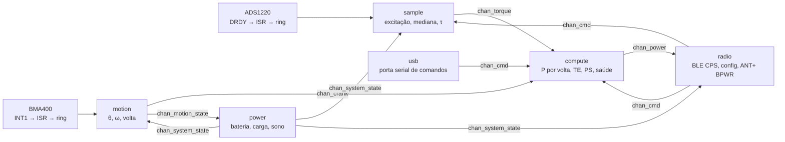
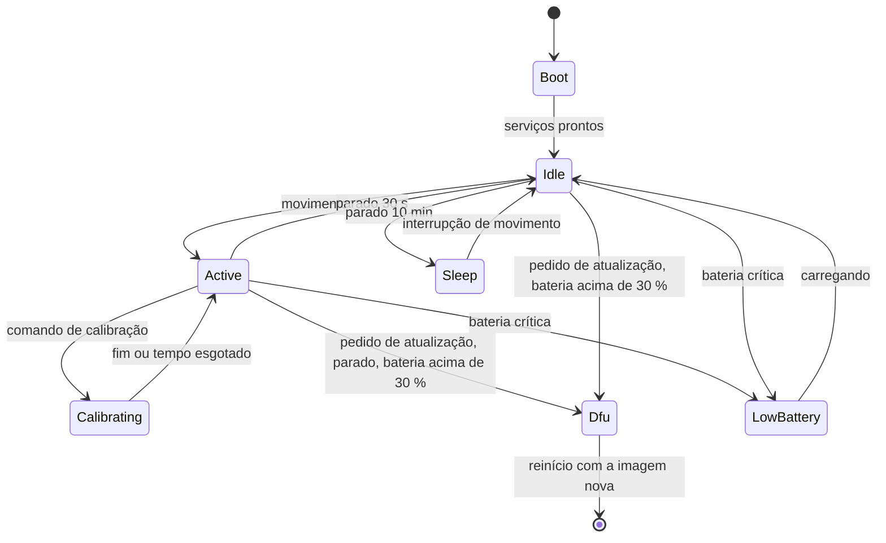

# Arquitetura do firmware

A mesma base do ciclocomputador, com menos peças: serviços com thread própria e caixa de entrada, eventos no zbus, máquinas de estado no SMF, um canal de watchdog por thread, lógica pura em `src/model/` testada no PC. Nada roda em placa ainda.

**Nesta página:** [Serviços](#serviços) · [Eventos](#eventos) · [Máquina do sistema](#máquina-do-sistema) · [Modelo](#modelo) · [Drivers](#drivers) · [Atualização](#atualização) · [Pilhas e prioridades](#pilhas-e-prioridades) · [Testes e cobertura](#testes-e-cobertura)

## Serviços

| Serviço | Thread | O que faz | Dorme em |
|---|---|---|---|
| `sample` | prioridade 4 | liga a excitação, dispara a conversão, recebe o DRDY pela ISR (que só copia o código para um ring e acorda a thread), aplica mediana e a calibração, publica `chan_torque` a 175 Hz | semáforo do ring, 1 s de tick |
| `motion` | 5 | lê o BMA400 pela API de sensor no INT1, estima θ e ω, detecta a volta e o repouso, publica `chan_crank` (por amostra) e `chan_motion_state` (parado, pedalando) | trigger do sensor |
| `compute` | 5 | casa torque e ângulo pelo carimbo, integra a volta, publica `chan_power` a cada volta e um resumo a 1 Hz; executa calibrações a pedido e as verificações de saúde | caixa de entrada |
| `radio` | 6 | BLE: anúncio, conexão, CPS (Measurement, Feature, Location, Control Point, Vector), DIS, BAS, serviço de configuração; ANT+: perfil BPWR do add-on, com o callback de calibração; converte pedidos em `chan_cmd` | caixa de entrada |
| `power` | 9 | MAX17048, pinos CHG e ERR do nPM1100, política de sono (parado > 30 s: conversor em power-down, IMU em low-power com interrupção de movimento, rádio anunciando devagar), bateria fraca e crítica | caixa de entrada, 1 s |
| `usb` | 8 | porta serial de comandos (os mesmos do serviço de configuração, em texto) quando há cabo | caixa de entrada |

Regras que valem para todos: ISR não processa; sem alocação depois do boot; cada serviço só publica nos seus canais e nunca chama outro serviço; toda espera tem tempo máximo abaixo do watchdog de 4 s.

## Eventos

| Canal | Mensagem | Quem publica | Quem ouve |
|---|---|---|---|
| `chan_torque` | `{uptime_ms, torque_mnm, code, excitation_ok}` | sample | compute |
| `chan_crank` | `{uptime_ms, angle_mrad, omega_mrad_s, revolution, stationary}` | motion | compute |
| `chan_motion_state` | `{moving}` | motion | power, radio |
| `chan_power` | `{uptime_1024, power_w, cadence_rpm, torque_acc_1_32nm, energy_kj, rev_count, last_event_1024, te_pct, ps_pct, balance_pct, flags}` | compute | radio, usb |
| `chan_cmd` | `{id, arg[]}`: zero, calibrar inclinação com massa m, gravar configuração, ler configuração, entrar em DFU, dormir | radio, usb | compute, sample, power |
| `chan_system_state` | `{state}` da máquina do sistema | power | todos |
| `chan_battery` | `{soc_pct, mv, charging, fault}` | power | radio |
| `chan_health` | `{flags}` (ponte aberta, excitação, IMU parado, temperatura, zero deslocado) | compute | radio |

## Máquina do sistema

Em `Sleep` o conversor fica em power-down (0,4 µA), o BMA400 em low-power a 25 Hz com a interrupção de atividade, o rádio anuncia a cada 2 s e a thread `sample` não roda. Uma atualização nunca começa pedalando nem com bateria fraca, como no ciclocomputador.

## Modelo

Lógica pura, sem tipos do Zephyr, em `src/model/`, um módulo por assunto, cada um com o seu conjunto de testes:

| Módulo | Faz | Testes |
|---|---|---|
| `bridge_calc` | código → torque com zero, inclinação e temperatura; saturação; validade | contra valores calculados à mão e contra a fórmula de [06](06-medicao-e-calibracao.md#da-ponte-ao-torque) |
| `crank_angle` | θ e ω a partir de `(a_t, a_r)`, volta, repouso | trajetórias sintéticas com cadência constante e variável, com o termo centrípeto |
| `rev_power` | integração da volta, TE, PS, acumuladores, unidades do rádio | voltas sintéticas com torque senoidal; conservação de energia |
| `calib` | zero com estabilidade, inclinação por mínimos quadrados, resíduo e histerese, ajuste de temperatura | conjuntos com ruído e com ponte aberta |
| `cps_encode` | codificação e decodificação das características do CPS e do Control Point | bytes esperados da especificação |
| `pm_settings` | estrutura de configuração, limites, versão, serialização | valores fora de faixa, migração de versão |
| `health` | flags de saúde a partir dos sinais | cada regra de [06](06-medicao-e-calibracao.md#saúde-do-sensor) |
| `pm_fsm` | a máquina do sistema | cada transição e as recusadas |

## Drivers

| Peça | Driver | Onde |
|---|---|---|
| ADS1220 | próprio, API do módulo (`ads1220_start`, `ads1220_read`, DRDY por GPIO) | `zephyr_app/modules/pm_drivers/drivers/adc/ads1220` |
| BMA400 | Zephyr `bosch,bma4xx` (reconhece o chip; o aviso "tested for BMA422/BMA400" é esperado) | árvore do Zephyr |
| TMP117 | Zephyr `ti,tmp11x` | árvore do Zephyr |
| MAX17048 | Zephyr `maxim,max17048` (fuel gauge) | árvore do Zephyr |
| nPM1100 | pinos: CHG e ERR como GPIO de entrada; sem barramento | devicetree |
| TPS22916 | GPIO de saída (`bridge-excitation`) | devicetree |

## Atualização

MCUboot pelo sysbuild, como no ciclocomputador: mcumgr SMP sobre BLE para a atualização pelo celular ou pelo ciclocomputador, e a recuperação serial do MCUboot sobre USB CDC no conector magnético para o cabo. O serviço `radio` recusa a atualização pedalando ou com bateria abaixo de 30 %, e confirma a imagem nova só depois de o serviço `sample` produzir uma volta válida.

## Pilhas e prioridades

Valores de partida, a medir com `CONFIG_STACK_USAGE` antes de fechar: `sample` 1536 B, `motion` 2048 B (atan2 e a API de sensor), `compute` 3072 B (mínimos quadrados em float), `radio` 2048 B mais a thread RX do BT, `power` 1536 B, `usb` 2048 B, `main` 2048 B. Prioridades como na tabela dos serviços; `sample` acima de tudo porque perder uma amostra desloca a integral da volta.

## Testes e cobertura

`bash tools/fw/host_tests.sh` compila cada módulo de `src/model/` com o GCC do PC e roda o Unity pelo CTest, como no ciclocomputador. A cobertura de linhas é medida com `gcov` (o `host_tests.sh coverage` compila com `--coverage`, roda os testes e chama `tools/fw/coverage.py`, que lê os `.gcov` e falha abaixo de **95 %** em qualquer módulo do modelo). Testes de mutação antes de dar um módulo por pronto: o comportamento é quebrado de propósito e o conjunto tem de cair.
