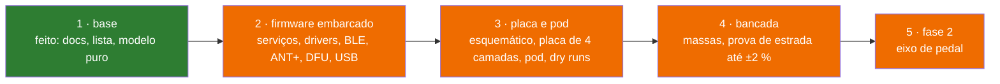

# Status

O que existe, o que foi verificado e como, e o que falta. Nada rodou em placa: não existe placa, protótipo nem bancada; toda verificação até aqui é no PC.

**Nesta página:** [Resumo](#resumo) · [Modelo](#modelo) · [Firmware embarcado](#firmware-embarcado) · [Hardware](#hardware) · [Decisões](#decisões) · [Em aberto](#em-aberto)

## Resumo

| Data | O que |
|---|---|
| 2026-09-27 | estrutura do repositório, documentação de requisitos, arquitetura, protocolos e método de medição com referências; lista de componentes fechada por datasheet |
| 2026-09-27 | os nove módulos do modelo escritos e testados no PC: 133 casos, 100 % das linhas, doze mutações mortas |

## Modelo

Lógica pura, sem tipos do Zephyr, em `zephyr_app/src/model/`, um módulo por assunto, cada um com o seu conjunto de testes em `zephyr_app/tests/host/`. A cobertura é medida por linha com o gcov (`bash tools/fw/host_tests.sh coverage`, que falha abaixo de 95 % em qualquer módulo):

| Módulo | Faz | Testes | Estado (2026-09-27) |
|---|---|---|---|
| `bridge_calc` | código → torque com zero, inclinação e temperatura; mediana de 3; saturação; validade | 18 casos: valores calculados à mão e a fórmula de [06](06-medicao-e-calibracao.md#da-ponte-ao-torque) | feito, 50 de 50 linhas |
| `crank_angle` | θ e ω a partir de `(a_t, a_r)`: ω pelos cruzamentos de zero do eixo tangencial, interpolados entre amostras; θ pelo `atan2` com o termo centrípeto removido; volta no ponto baixo; sentido; repouso | 18 casos: trajetórias sintéticas a 30, 60, 90 e 120 rpm, pedalada para trás, eixo espelhado, salto impossível, ruído entre cruzamentos, parada sem cruzamento, repouso | feito, 113 de 113 linhas |
| `rev_power` | integração da volta, TE, PS, acumuladores e unidades do rádio | 12 casos: voltas com torque constante e senoidal, trabalho negativo, volta curta ou longa, saturação, viradas dos acumuladores | feito, 80 de 80 linhas |
| `calib` | zero com estabilidade, inclinação por mínimos quadrados, resíduo e histerese, torque de uma massa, ajuste de temperatura | 18 casos: conjuntos com ruído, ponte aberta, fora de faixa, faixa de temperatura curta | feito, 135 de 135 linhas |
| `cps_encode` | os bytes do CPS: Measurement com máscara de conteúdo, Feature, Control Point (pedido e resposta), Vector | 20 casos: bytes esperados da especificação 1.1, comprimentos errados, opcode desconhecido, buffer curto | feito, 129 de 129 linhas |
| `pm_settings` | estrutura de configuração, limites, bloco de 60 bytes com versão e CRC-16, chaves de texto de `$CFG` | 14 casos: cada limite, bloco byte a byte, ida e volta, CRC e versão errados, cada chave, valores ruins | feito, 306 de 306 linhas |
| `pm_cmd` | as linhas `$CMD,...`, `$ACK` e `$NAK`, o montador de linhas | 9 casos: cada comando, cada recusa, terminadores, estouro de linha | feito, 144 de 144 linhas |
| `health` | flags de saúde a partir dos sinais | 12 casos: cada regra de [06](06-medicao-e-calibracao.md#saúde-do-sensor) no limite e no tempo | feito, 69 de 69 linhas |
| `pm_fsm` | a máquina do sistema | 12 casos: cada transição, cada recusa, os três temporizadores | feito, 126 de 126 linhas |

Mutações mortas pelos testes em 2026-09-27: termo centrípeto removido, sentido sempre para a frente, limite de ruído dos cruzamentos, lado único sem dobrar, limite de ruído do zero, faixa de temperatura, zero fora de faixa aceito, torque sem a origem no pedivela, comprimento do pedido só "maior ou igual", CRC ignorado, limite da ponte aberta estrito, DFU sem olhar a bateria. Uma sobreviveu por ser equivalente no que se observa (o sexto campo de uma linha de comando: com `>` no lugar de `>=` o campo escreve fora da tabela, mas a linha é recusada do mesmo jeito).

O estimador de ângulo mudou do que a primeira versão de [04](04-arquitetura-firmware.md) descrevia (ω pela derivada de θ numa janela de 8 amostras): a derivada do `atan2` carregava o erro do termo centrípeto para dentro de ω, e a 100 Hz o teste sintético dava 4 voltas em 10 s a 90 rpm; os cruzamentos de zero de `a_t` acontecem no alto e no baixo da pedalada independentemente do termo centrípeto, e a interpolação entre as duas amostras em volta do cruzamento tira o erro de quantização (±3 % a 90 rpm sem ela). O método está em [06](06-medicao-e-calibracao.md#ângulo-e-cadência).

## Firmware embarcado

A fazer, na ordem de [04](04-arquitetura-firmware.md): base (`main`, canais, watchdog, settings), drivers próprios (ADS1220; e o BMA400, porque o `bosch,bma4xx` da árvore do Zephyr usa o mapa de registradores do BMA422, com os dados em `0x12` e a configuração em `0x40`, e o BMA400 tem outro, com os dados em `0x04` e a configuração em `0x19`: o driver reconhece o chip ID `0x90` com um aviso e não o opera), serviços (`sample`, `motion`, `compute`, `radio`, `power`, `usb`), BLE (CPS, DIS, BAS, serviço de configuração), ANT+ (`ant_bpwr` do add-on, com `ANT=1`), MCUboot com mcumgr por BLE e recuperação serial pelo USB, build sem aviso no nRF54LM20 DK.

## Hardware

A fazer: `parts.py`, `nets.py`, blocos e folhas do esquemático (mesmo padrão do ciclocomputador: uma folha por bloco funcional, caixas tracejadas, símbolos de alimentação, rótulos, papel medido), placa de 4 camadas com o recorte da antena do módulo, footprints com corpo 3D medido, dry run da placa, pod com dry run e STL.

## Decisões

| Data | Decisão |
|---|---|
| 2026-09-27 | fase 1 no braço esquerdo, ADS1220, nPM1100, TPS22916 na excitação, conector magnético de 6 pinos, ME54BS13, repositório par do ciclocomputador |
| 2026-09-27 | o bloco de configuração é binário versionado com CRC-16 (não CBOR); a máquina do sistema mora no modelo (`pm_fsm`), não no SMF, para que cada transição seja um teste de host |
| 2026-09-27 | o esquemático segue o padrão do ciclocomputador (pedido do dono nesse dia) |

## Em aberto

- O pedivela (modelo, seção do braço, folga até o quadro): sem ele o pod não tem medida final.
- O medidor de referência da prova de estrada.
- O fornecedor do conector magnético de 6 pinos, com o desenho do footprint.
- O AD4130-8 (datasheet inacessível desta máquina) fica fora da lista.
- O ME54BS13 não tem STEP público: o corpo 3D é o `.wrl` desenhado das cotas da ficha, como no ciclocomputador.
