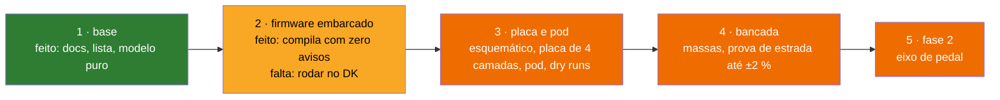

# Status

O que existe, o que foi verificado e como, e o que falta. Nada rodou em placa: não existe placa, protótipo nem bancada; toda verificação até aqui é no PC.

**Nesta página:** [Resumo](#resumo) · [Modelo](#modelo) · [Firmware embarcado](#firmware-embarcado) · [Hardware](#hardware) · [Decisões](#decisões) · [Em aberto](#em-aberto)

## Resumo

| Data | O que |
|---|---|
| 2026-09-27 | estrutura do repositório, documentação de requisitos, arquitetura, protocolos e método de medição com referências; lista de componentes fechada por datasheet |
| 2026-09-27 | os nove módulos do modelo escritos e testados no PC: 134 casos, 100 % das linhas, doze mutações mortas |
| 2026-09-27 | o firmware embarcado inteiro escrito e compilando com zero avisos no nRF54LM20 DK e com `ANT=1`; nunca executado |
| 2026-09-27 | o esquemático, a placa e o pod gerados por programa, com os dois dry runs |
| 2026-09-28 | a ponte fechada numa peça só (S5229 de 5 kΩ) e a designação de compra dos braços do dono; o roteador passou a ser julgado pelo DRC do KiCad e não pela própria contabilidade |
| 2026-09-28 | a case ganhou vedação por anel O, dois parafusos, retenção da célula e da placa e dreno no conector, com uma regra medindo cada uma; o dry run foi de 12 para **16 regras, todas cumpridas** |
| 2026-09-28 | o módulo passou a ser o **HOLYIOT-26001-A** (nRF54L15): placa de 51 × 16 para **47 × 14**, pod para **55,7 × 19,0 × 10,0**, firmware sem USB, mapa de pinos refeito com os pinos da própria Nordic |

## Modelo

Lógica pura, sem tipos do Zephyr, em `zephyr_app/src/model/`, um módulo por assunto, cada um com o seu conjunto de testes em `zephyr_app/tests/host/`. A cobertura é medida por linha com o gcov (`bash tools/fw/host_tests.sh coverage`, que falha abaixo de 95 % em qualquer módulo). **Remedida em 2026-09-28: 1.162 de 1.162 linhas, 100 % em todos os nove módulos.** Ela tinha caído para 305 de 306 em `pm_settings` sem ninguém notar — a guarda de string vazia do `parse_long` não tinha teste, e sem ela `$CFG,radius,` leria como um zero perfeitamente válido:

| Módulo | Faz | Testes | Estado (2026-09-27) |
|---|---|---|---|
| `bridge_calc` | código → torque com zero, inclinação e temperatura; mediana de 3; saturação; validade | 18 casos: valores calculados à mão e a fórmula de [06](06-medicao-e-calibracao.md#da-ponte-ao-torque) | feito, 50 de 50 linhas |
| `crank_angle` | θ e ω a partir de `(a_t, a_r)`: ω pelos cruzamentos de zero do eixo tangencial, interpolados entre amostras; θ pelo `atan2` com o termo centrípeto removido; volta no ponto baixo; sentido; repouso | 18 casos: trajetórias sintéticas a 30, 60, 90 e 120 rpm, pedalada para trás, eixo espelhado, salto impossível, ruído entre cruzamentos, parada sem cruzamento, repouso | feito, 113 de 113 linhas |
| `rev_power` | integração da volta, TE, PS, acumuladores e unidades do rádio | 12 casos: voltas com torque constante e senoidal, trabalho negativo, volta curta ou longa, saturação, viradas dos acumuladores | feito, 80 de 80 linhas |
| `calib` | zero com estabilidade, inclinação por mínimos quadrados, resíduo e histerese, torque de uma massa, ajuste de temperatura | 18 casos: conjuntos com ruído, ponte aberta, fora de faixa, faixa de temperatura curta | feito, 135 de 135 linhas |
| `cps_encode` | os bytes do CPS: Measurement com máscara de conteúdo, Feature, Control Point (pedido e resposta), Vector | 20 casos: bytes esperados da especificação 1.1, comprimentos errados, opcode desconhecido, buffer curto | feito, 129 de 129 linhas |
| `pm_settings` | estrutura de configuração, limites, bloco de 60 bytes com versão e CRC-16, chaves de texto de `$CFG` | 14 casos: cada limite, bloco byte a byte, ida e volta, CRC e versão errados, cada chave, valores ruins, **valor vazio numa chave inteira** | feito, 306 de 306 linhas |
| `pm_cmd` | as linhas `$CMD,...`, `$ACK` e `$NAK`, o montador de linhas | 9 casos: cada comando, cada recusa, terminadores, estouro de linha | feito, 144 de 144 linhas |
| `health` | flags de saúde a partir dos sinais | 12 casos: cada regra de [06](06-medicao-e-calibracao.md#saúde-do-sensor) no limite e no tempo | feito, 69 de 69 linhas |
| `pm_fsm` | a máquina do sistema | 12 casos: cada transição, cada recusa, os três temporizadores | feito, 136 de 136 linhas |

Mutações mortas pelos testes em 2026-09-27: termo centrípeto removido, sentido sempre para a frente, limite de ruído dos cruzamentos, lado único sem dobrar, limite de ruído do zero, faixa de temperatura, zero fora de faixa aceito, torque sem a origem no pedivela, comprimento do pedido só "maior ou igual", CRC ignorado, limite da ponte aberta estrito, DFU sem olhar a bateria. Em 2026-09-28 mais uma foi morta e uma lição ficou: o teste do valor vazio começou na chave `radius` e a mutação **sobreviveu**, porque um raio zero já é recusado pelo limite e ali a guarda é redundante. Movido para `zero` e `tempcal`, onde zero **está dentro dos limites**, a mutação morre. Cobrir a linha e testar o comportamento não são a mesma coisa. Uma sobreviveu por ser equivalente no que se observa (o sexto campo de uma linha de comando: com `>` no lugar de `>=` o campo escreve fora da tabela, mas a linha é recusada do mesmo jeito).

O estimador de ângulo mudou do que a primeira versão de [04](04-arquitetura-firmware.md) descrevia (ω pela derivada de θ numa janela de 8 amostras): a derivada do `atan2` carregava o erro do termo centrípeto para dentro de ω, e a 100 Hz o teste sintético dava 4 voltas em 10 s a 90 rpm; os cruzamentos de zero de `a_t` acontecem no alto e no baixo da pedalada independentemente do termo centrípeto, e a interpolação entre as duas amostras em volta do cruzamento tira o erro de quantização (±3 % a 90 rpm sem ela). O método está em [06](06-medicao-e-calibracao.md#ângulo-e-cadência).

## Firmware embarcado

Escrito em 2026-09-27, na forma de [04](04-arquitetura-firmware.md), e **compilando com zero avisos** nos três alvos. **Nada rodou**: não há DK com as placas de avaliação ligadas, e nenhuma linha abaixo foi vista funcionando.

| Alvo | FLASH | RAM | MCUboot |
|---|---|---|---|
| `pmboard/nrf54l15/cpuapp` (o pod) | 256.872 B de 659.312 (38,96 %) | 108.548 B de 188 KB (**56,39 %**) | 46.996 B de 60 KB |
| nRF54LM20 DK | 290.312 B (44,03 %) | 119.404 B de 511 KB (22,82 %) | 53.324 B de 60 KB |
| o mesmo, `ANT=1` | 325.592 B (49,38 %) | 124.068 B (23,71 %) | idem |

A RAM do pod é o número a vigiar: no nRF54L15 são 188 KB contra os 511 do
nRF54LM20A, então a folga caiu de 387 KB para 80. Quem acrescentar função
depois precisa saber disso.

| Parte | Onde | Estado |
|---|---|---|
| base: `main`, canais do zbus, watchdog por thread, `pm_store` (settings, ZMS no nRF54L), `app_cmd` | `zephyr_app/src/app` | compila; a persistência do bloco de 60 bytes usa o subsistema settings com um handler estático |
| driver do ADS1220 (`ti,ads1220`): conversão contínua e única, monitor da referência, power-down, DRDY por GPIO | `zephyr_app/modules/pm_drivers/drivers/adc` | compila; registradores e comandos da SBAS501D; não testado |
| driver do BMA400 (`bosch,bma400`): API de sensor, trigger de dados prontos e de despertar no INT1, modos de energia | `zephyr_app/modules/pm_drivers/drivers/sensor` | compila; o `bosch,bma4xx` da árvore usa o mapa do BMA422 (dados em `0x12`, configuração em `0x40`) e não serve; não testado |
| serviços `sample`, `motion`, `compute`, `power`, `radio` e a porta serial (`usb` no DK, `serial` no pod) | `zephyr_app/src/svc` | compilam; pilhas medidas ([04](04-arquitetura-firmware.md#pilhas-e-prioridades)) |
| BLE: CPS (Measurement, Feature, Location, Control Point, Vector), serviço de configuração (comando, resposta, bloco, estado), DIS, BAS | `zephyr_app/src/rf/ble_cps.c`, `ble_cfg.c` | compila; os bytes vêm do modelo testado; comando e bloco exigem ligação cifrada ([05](05-protocolos.md#serviço-de-configuração)); a tabela GATT não foi vista por um cliente, e o emparelhamento nunca foi feito |
| DFU por BLE (mcumgr SMP, MCUboot pelo sysbuild) e a recuperação serial do MCUboot pelo USB (CDC ACM, 1 s de espera a cada partida, MCUboot com 96 KB) | `zephyr_app/src/rf/dfu.c`, `zephyr_app/sysbuild/` | compilam; a recusa pedalando ou com bateria fraca é do hook do mcumgr; o serviço SMP exige ligação cifrada e **não** autenticada, senão seria inalcançável num aparelho sem tela |
| ANT+ BPWR (páginas 1, 16, 18, 80, 81) pelo `ant_bpwr` do add-on | `zephyr_app/src/rf/ant_bpwr.c` | compila com `ANT=1`; a chave e o perfil são do add-on |
| overlay do nRF54LM20 DK e a placa própria `pmboard` no **nRF54L15** (`zephyr_app/boards/pm/pmboard`), os dois com os pinos de [02](02-hardware.md#pinos-do-módulo) | `zephyr_app/boards` | compilam; `tools/fw/board_check.py` confere o devicetree contra o silício, contra a tabela de [02] e contra a lista de nós do esquemático, nos dois sentidos |

O que falta no firmware: rodar no DK com as placas de avaliação; medir as pilhas na placa (`CONFIG_THREAD_ANALYZER`); o consumo real contra o orçamento de [02](02-hardware.md#orçamento-de-consumo).

## Hardware

Escrito e gerado entre 2026-09-27 e 2026-09-28, em
[`hardware_powermeter/`](../hardware_powermeter/README.md). **Nada foi
fabricado, impresso nem colado**, e as medidas do braço do pedivela ainda
são lugares reservados.

| Parte | Estado |
|---|---|
| Esquemático | 4 folhas, 58 peças, 43 nós; `check_sch.py` compara a lista de nós do KiCad com a de `nets.py` **pino a pino** e o ERC passa. Duas verificações falham de sempre, as duas de texto no PDF (`TX1`, `TX2`), e duas peças têm a pinagem marcada como **não confirmada na ficha**: o módulo e o conector magnético |
| Placa | **47 × 14 mm**, 4 camadas, 58 peças colocadas sem uma sobrando mais um furo M1,6, 43 redes ([`hardware_powermeter/04`](../hardware_powermeter/04-placa.md)) |
| Pod | **55,7 × 19,0 × 10,0 mm** dentro do alvo de 60 × 20 × 10, **13,3 g** estimados contra 20; vedado por anel O e fechado por dois parafusos M1,6; dois STL |
| Dry run da placa | `dry_run_pcb.py`, regras das fichas e da IPC-2221B medidas no arquivo |
| Dry run do pod | `dry_run_pod.py`, **32 regras: 30 cumpridas, 2 violadas** (2026-10-01). As três violadas são decisões do dono, não defeitos de geometria: `PD6` mede o braço de alumínio 4,0 mm abaixo da antena (a ficha pede 3 a 5: faixa de risco, a medir na bancada), e `PD10` mede 73,5 de comprimento contra os 38 de [02](02-hardware.md#requisitos). A `PD17` passou a cumprir: a parede caiu de 2,0 para 1,5 e a largura de 21,0 para **20,0 exatos** ([12](../hardware_powermeter/12-comparacao-com-a-classe.md#o-item-2-feito-a-parede-sai-da-vedação)). Doze das regras medem o **sólido desenhado**, por voxel, e cada uma foi testada por mutação |
| Vistas | **15 renders**: a placa (frente, verso, ângulo, montagem), o pod (fechado, aberto, explodido, tampa por dentro, célula no berço, por baixo) e o conjunto (montado no braço, aberto, extensômetros, produto e produto de lado) |

O tamanho da placa é decidido pelo **módulo de rádio**, e não pelos passivos:
o módulo antigo era 26 % da área da placa numa peça só, mais que as 37 peças
pequenas somadas. A largura de 14 mm é a largura do módulo mais as bordas, e
o comprimento de 47 é o menor em que as peças assentam, a antena cerâmica
encosta na borda e o roteador ainda acha lugar para via
([`hardware_powermeter/04`](../hardware_powermeter/04-placa.md#o-contorno)).

## Decisões

| Data | Decisão |
|---|---|
| 2026-09-27 | fase 1 no braço esquerdo, ADS1220, nPM1100, TPS22916 na excitação, conector magnético de 6 contatos, ME54BS13 (trocado em 2026-09-28), repositório par do ciclocomputador |
| 2026-09-27 | o bloco de configuração é binário versionado com CRC-16 (não CBOR); a máquina do sistema mora no modelo (`pm_fsm`), não no SMF, para que cada transição seja um teste de host |
| 2026-09-27 | o esquemático segue o padrão do ciclocomputador (pedido do dono nesse dia) |
| 2026-09-28 | a ponte é **uma peça só**: o S5229 de 5 kΩ em ponte completa, `N2K-13-S5229A-50C/DG/E3`, no lugar de quatro colagens |
| 2026-09-28 | a célula estreita de 15 para 13 mm (13 % de volume) para o rasgo dos fios da ponte passar ao lado dela, em vez de afastar o `J301` do conversor |
| 2026-09-28 | a placa cresce de 48 para 51 mm: o que faltava ao roteador era lugar para via, e 3 mm dão 36 % mais. **Revertido no mesmo dia** pela troca do módulo, que levou a placa a 47 × 14 |
| 2026-09-28 | a case passa a ser **vedada de verdade**: anel O em sulco na parede (27,5 % de compressão), dois parafusos M1,6, berço da célula, placa prensada entre pilares e dedos da tampa, e dreno no lábio do conector |
| 2026-10-01 | revisão de dez revisores acha **sete interferências** que o dry run não via, porque sete regras liam a constante em vez de medir a geometria. O gerador ganha registro das primitivas, o dry run ganha um voxelizador e dez regras novas, e os sete bloqueantes fecham; o lábio e o dreno do conector saem, e a vedação da porta passa a ser uma junta no ombro dele ([07-pod](../hardware_powermeter/07-pod.md#medir-o-sólido-não-a-constante)) |
| 2026-09-28 | o módulo de rádio vira o **HOLYIOT-26001-A** (nRF54L15). Ele era 26 % da área da placa numa peça só, mais que as 37 peças pequenas somadas, e é a única alavanca de tamanho. Custa o USB, que este SoC não tem: a serial dos comandos e a recuperação do MCUboot vão por UART nos contatos `D+`/`D−` do conector, e um divisor no `VBUS` num GPIO diz que o cabo entrou ([`09`](../hardware_powermeter/09-modulo-de-radio.md)) |

## Em aberto

- O pedivela (modelo, seção do braço, folga até o quadro): sem ele o pod não tem medida final.
- O medidor de referência da prova de estrada.
- O fornecedor do conector magnético de 6 pinos, com o desenho do footprint.
- O AD4130-8 (datasheet inacessível desta máquina) fica fora da lista.
- O ME54BS13 não tem STEP público: o corpo 3D é o `.wrl` desenhado das cotas da ficha, como no ciclocomputador.

## Ideias guardadas

Coisas que o dono levantou e que **não estão em desenvolvimento**, anotadas
aqui para não se perderem e para deixar claro que não foram esquecidas nem
começadas.

### Colheita de energia no braço do pedivela (2026-09-28)

Aproveitar o movimento de rotação do braço — ou a vibração da pedalada —
para recarregar a célula, como **módulo ou case secundário**, não como
mudança do aparelho de hoje.

O dono pediu uma pesquisa profunda em artigos, papers, projetos e patentes
para embasar a ideia, e pediu explicitamente que ela seja feita **depois** de
fechar o power meter 100 % e de rodar **três dry runs sobre o projeto
inteiro**. Nada foi pesquisado ainda.

O que a pesquisa vai precisar responder, do jeito que este projeto trata
qualquer número:

| Pergunta | Por que ela decide |
|---|---|
| Quanta potência dá para colher a 90 rpm num braço de pedivela? | o aparelho gasta **0,68 mA a 3,0 V, cerca de 2,0 mW** (5 kΩ com o conversor em duty-cycle). Se a colheita der microwatts, ela é um enfeite; se der miliwatts, muda o produto — e a barra desceu de 4,5 para 2,0 mW, o que a torna mais plausível, não menos |
| Qual princípio: indutivo (ímã no quadro + bobina no braço), piezoelétrico (vibração), ou gravitacional (massa oscilante, como relógio automático)? | cada um tem uma faixa de potência e um custo de massa e volume completamente diferentes |
| Quanto pesa e quanto ocupa? | o requisito de massa é 20 g e o pod já usa **13,3**; a referência da classe tem 20 g no total |
| A colheita atrapalha a medida? | um ímã ou uma massa oscilante no braço muda a inércia e pode entrar no acelerômetro, que é quem dá a cadência |
| O que já existe patenteado? | é a pergunta que decide se o caminho é livre |
