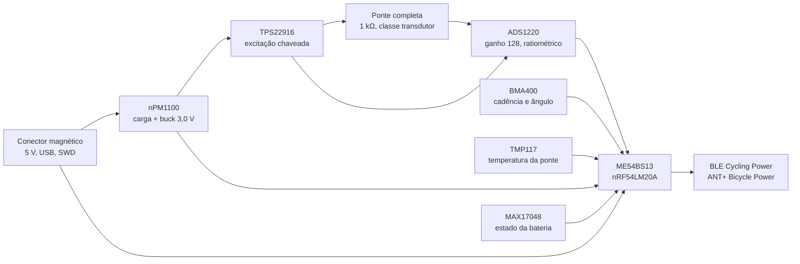

# Lista de componentes (fase 1: módulo no braço do pedivela)

Lista fechada em 2026-09-27. Cada peça tem o datasheet baixado do fabricante e conferido (os PDF ficam em [`datasheets/`](datasheets/), fora do git). Os números abaixo são os do datasheet, com o documento indicado. O estudo que levou a esta lista está no doc "Medidores de potência para bicicleta: estudo para o projeto" (Claude Docs, 2026-09-27).

**Nesta página:** [Decisão](#decisão) · [A placa](#a-placa) · [Extensômetros](#extensômetros) · [Fora da placa](#fora-da-placa) · [O que ficou de fora](#o-que-ficou-de-fora) · [Não verificado](#não-verificado)

## Decisão

O sensor é o **TI ADS1220**: 0,26 µV RMS de ruído com ganho 128 a 175 amostras/s, 585 µA medindo, 0,4 µA desligado, referência ratiométrica, 3,5 × 3,5 mm. O conversor não é o limite dos ±1 a 2 %; a colagem, a temperatura e a calibração são. A compensação de temperatura fica no firmware, aberta e testada no PC.

## A placa

| Bloco | Peça | Datasheet | Números conferidos | Driver no NCS v3.3.0 |
|---|---|---|---|---|
| Conversor da ponte | **TI ADS1220**, VQFN-16 | SBAS501D (rev. maio 2026) | Ganho 128, modo normal, AVDD 3,3 V: 0,09 µV RMS a 20 SPS, 0,18 a 90, 0,26 a 175. Corrente AVDD com ganho 64 ou 128: 135 µA em duty-cycle, 510 normal, 890 turbo; DVDD 55, 75, 95 µA; power-down 0,1 µA (3 máx.), 400 nA típico. Referência externa de 0,75 V até AVDD. Referência interna 2,048 V, 5 ppm/°C. Sensor de temperatura 0,5 °C. 2,3 a 5,5 V. 3,5 × 3,5 mm. −40 a +125 °C | Não: driver próprio em `zephyr_app/modules/pm_drivers` |
| Alternativa com driver pronto | TI ADS124S06, VQFN-32 | SBAS660C (rev. junho 2017) | 19 nV RMS com ganho 128; 250 µA AVDD + 225 µA DVDD medindo com referência externa; +185 µA se usar a referência interna de 2,5 V; power-down 0,1 µA; 5 × 5 mm; SPI com CRC, calibração de sistema, detecção de falhas | Sim: `ti,ads124s06` |
| Alternativa com compensação no chip | Renesas ZSSC3224, PQFN-24 | Datasheet Renesas | Ganho 6,6 a 216, ADC de 12 a 24 bits, compensação de 1ª e 2ª ordem em memória MTP, erro do CI 0,01 % FSO, 1050 µA ativo, 20 nA sleep, 24 bits a 60 Hz, 1,68 a 3,6 V, 4 × 4 mm | Não |
| Acelerômetro | **Bosch BMA400**, LGA-12 | BST-BMA400-DS000-14 (rev. 2.3, julho 2025) | 14,5 µA normal (OSR 3) ou 3,5 µA (OSR 0), 850 nA em low-power a 25 Hz, 160 nA em sleep; ODR 12,5 a 800 Hz; ±2 a ±16 g; FIFO de 1 kB; VDDIO 1,2 a 3,6 V; 2 × 2 × 0,95 mm | **Não: driver próprio.** O `bosch,bma4xx` da árvore reconhece o chip ID `0x90` com um aviso e **não opera a peça**: ele usa o mapa de registradores do BMA422 (dados em `0x12`, configuração em `0x40`) e o BMA400 tem outro (`0x04`, `0x19`). O driver está em `zephyr_app/modules/pm_drivers/drivers/sensor` ([`docs/04`](../docs/04-arquitetura-firmware.md)) |
| Temperatura da ponte | **TI TMP117**, WSON-6 | Datasheet TI | ±0,1 °C máx. de −20 a 50 °C, 16 bits (0,0078 °C), 3,5 µA a 1 Hz, 150 nA desligado, 1,7 a 5,5 V, 2 × 2 mm, I2C | Sim: `ti,tmp11x` |
| Carga e trilho de 3,0 V | **Nordic nPM1100**, QFN-24 4 × 4 mm | Product Specification v1.5 | Carregador Li-ion de 20 a 400 mA por resistor, JEITA, terminação selecionável; VBUS de 4,1 a 6,7 V (20 V absoluto); buck de 1,8 a 3,0 V e 150 mA; 800 nA quiescente, 460 nA em ship mode; sem interface de controle; LED de carga e erro | Não precisa (pinos) |
| Alternativa | TI BQ25180 (DSBGA-8) + TI TPS62840 (SON-8) | Datasheets TI | BQ25180: 5 mA a 1 A, proteções OVP, UVLO, curto, sobrecorrente, térmica, ship mode 3,2 µA, 15 nA desligado, I2C. TPS62840: buck de 60 nA quiescente, 750 mA, 1,8 a 6,5 V, 16 tensões por pino | BQ25180: `ti,bq25180` |
| Medidor de bateria | **MAX17048**, TDFN-8 2 × 2 mm | 19-6171 (rev. 7, novembro 2016) | ModelGauge sem resistor de sentido, ±7,5 mV, 3 µA em hibernate, I2C, alerta | Sim: `maxim,max17048` |
| Chave da excitação | **TI TPS22916** | Datasheet TI | 1 a 5,5 V, 2 A, 60 a 200 mΩ, 0,5 µA ligado, 10 nA desligado, bloqueio de corrente reversa | GPIO |
| Proteção dos sinais do conector | **TI TPD4E05U06** | Datasheet TI | IEC 61000-4-2 ±12 kV contato e ±15 kV ar, 0,42 a 0,5 pF por canal, 6,5 V de ruptura, 10 nA de fuga; quatro canais: D+, D−, SWDIO, SWCLK | Passivo |
| Diodo ideal no VBUS (opcional) | TI LM66100 | Datasheet TI | 1,5 a 5,5 V, 1,5 A, 79 a 141 mΩ, 150 nA quiescente | Passivo |
| LDO de 3,0 V (só se o buck sair) | TI TPS7A02 | SBVS277C | 25 nA quiescente, 3 nA desligado, 200 mA, 1,5 %, 1,5 a 6 V, X2SON 1 × 1 mm ou SOT23-5 | Regulador |
| MCU e rádio | **MinewSemi ME54BS13** (nRF54LM20A, antena de PCB) | Datasheet v1.0.0 | 16,5 × 12,0 × 2,4 mm; BLE, ANT+ (add-on `sdk-ant`), USB | Sim, mais o add-on ANT |
| Versão I2C do conversor | TI ADS122C04, WQFN-16 | SBAS751B | Os mesmos 20 bits efetivos, 315 µA, I2C, 3 × 3 mm | Não |
| Bateria | LiPo de 100 a 150 mAh com proteção embutida | Listagem do fornecedor | Cerca de 100 h a 1 mA média; tamanho pelo pod | |
| Conector | Magnético de 6 pinos pogo, ímã com polaridade | Desenho do fornecedor | 5 V, GND, D+, D−, SWDIO, SWCLK; cabo com USB-A e saída SWD de 10 vias; 4 pinos se a gravação de fábrica ficar no Tag-Connect | |
| Indicação | LED RGB de baixa corrente | | Pareamento, calibração, carga (o nPM1100 tem saídas de LED) | |

Topologia dos trilhos: o buck do nPM1100 dá 3,0 V para o módulo, o ADS1220 e os sensores; a excitação da ponte sai desse trilho pela TPS22916 e vai também aos pinos REFP0 e REFN0 do ADS1220, então o ruído do buck cancela na medição ratiométrica. A ponte de 1 kΩ a 3,0 V drena 3 mA só enquanto a chave está ligada.

## Extensômetros

Não são circuitos integrados, mas definem a precisão. Referência: Micro-Measurements (Vishay Precision Group), páginas abertas em 2026-09-27.

| O que | Escolha | Fonte |
|---|---|---|
| Padrão | **Ponte completa numa peça só, de flexão**, classe transdutor: um filme, uma colagem, um alinhamento, com as quatro grades já posicionadas e ligadas de fábrica. Era alternativa nesta linha e vira a escolha, por dois motivos medidos: o padrão de cisalhamento a 45° é de torquímetro de eixo e dá 8,9 vezes menos sinal num braço de pedivela ([`docs/06`](../docs/06-medicao-e-calibracao.md#cisalhamento-ou-flexão-o-padrão-especificado-está-errado)), e quatro colagens separadas multiplicam por quatro o erro de alinhamento, que é o gargalo da precisão | [Transducer Class](https://www.micro-measurements.com/transducer-class); `docs/06` |
| Padrões de análise (para a bancada) | CEA 062UV e 187UVA (350 Ω), CEA 125US e 250USA (120, 350 e 1000 Ω), C2A 062LV | [Shear and torque patterns](https://www.micro-measurements.com/shear-pattern-strain-gages) |
| Resistência | **5 kΩ** (decisão do dono). O guia do fabricante nomeia 120, 350, 1 k e 5 kΩ e diz que, havendo escolha, a resistência mais alta é preferível: gera menos calor na grade, sofre menos dessensibilização pelo fio e melhora a relação sinal-ruído, por permitir excitação maior sem auto-aquecimento | Guia de seleção, p. 4, citado |
| Fios já presos | **Opção P2**, que pelo fabricante "praticamente elimina a necessidade de soldar durante a instalação": cabo de 3,1 m, 30 AWG estanhado, grade inteira encapsulada, vida em fadiga inalterada e sem aumento de rigidez. **Dois poréns medidos:** o cabo da P2 tem **três** condutores e uma ponte cheia precisa de quatro, então para o padrão de ponte cheia a fiação tem de ser confirmada peça a peça; e o limite é −50 a +80 °C, pelo vinil, que cobre com folga os −10 a +50 °C do requisito. A alternativa é a **opção W**, terminais de circuito impresso já presos, que aceita fio mais grosso mas encurta a vida em fadiga e engrossa a peça | Guia de seleção, p. 5 e 6, citado |
| Compensação térmica | S-T-C casado com o material: 13 para alumínio (braço), 06 para aço (eixo) | Guia de seleção |
| Cola | M-Bond AE-10 ou AE-15 para o módulo (resistentes à umidade); M-Bond 200 para a bancada | Guia de seleção, p. 8 |
| Proteção | 3145 RTV + M-Coat B para longo prazo | Guia de seleção, p. 9 |

**Tentativa de 2026-09-28, para ninguém repetir:** a lista de padrões não foi obtida. As páginas de catálogo da Micro-Measurements (`/pca/transducer-class-gages/full_bridge_patterns` e `/pca?search=s5030`, que são os próprios links do site) são carregadas por script e devolvem só a casca; o sitemap tem 114 endereços e nenhum de lista de padrões; a biblioteca de documentos serve PDF por identificador numérico, e os oito vizinhos do guia de seleção são fichas de segurança; HBK e Omega respondem 403; Kyowa lista as vinte famílias sem especificação; a TML lista resistências (60, 120, 350 e **1000 Ω**) e nenhuma das de uso geral é ponte completa. O que se confirmou no site do fabricante é que "padrões de ponte completa" e "padrões de alta resistência, 350 Ω a 20 kΩ" são **categorias separadas**. Falta o navegador com script ou uma pergunta ao fornecedor.

**O que falta confirmar no catálogo, e é o que fecha a compra:** existe padrão de **ponte completa de flexão em 5 kΩ**? O guia nomeia 5 kΩ como resistência de catálogo, mas a disponibilidade é por padrão, e ponte completa num filme só costuma aparecer em 350 e 1000 Ω. Se só houver 1000 Ω, a ponte volta a drenar 3 mA e as 50 h só fecham com o modo duty-cycle do conversor ([`docs/02`](../docs/02-hardware.md#orçamento-de-consumo)). Padrão e resistência são uma decisão só.

## Fora da placa

- Um braço esquerdo usado, igual ao do ciclista, para a bancada.
- ADS1232 em placa de avaliação como referência de bancada (SBAS350H: 17 nV RMS a 10 SPS com ganho 128, mas 1,35 mA e só 80 SPS).
- Massas de 5 a 20 kg e um medidor comercial de referência para a prova de estrada.

## O que ficou de fora

| Peça | Motivo |
|---|---|
| Avia HX711 | Ruído, consumo e alimentação de 5 V; peça de balança de cozinha |
| TI ADS1235 | 23 mW e alimentação de 5 V ou ±2,5 V |
| TI PGA302 | Saída analógica e alimentação de 4,5 a 20 V |
| Renesas ZSSC3218 | Só existe como die |
| MAX17262 | WLP de 1,5 mm; o MAX17048 tem TDFN e driver pronto |

## Não verificado

A Analog Devices e a ST recusaram a conexão desta máquina em todos os caminhos (site, DigiKey, Arrow, alldatasheet, GitHub): **AD4130-8**, **AD7124-4** e **LIS2DW12** não entraram na lista. O AD4130-8 é o único que poderia bater o ADS1220 em consumo (excitação e chave da ponte com duty-cycle interno, driver `adi,ad4130-adc` no Zephyr). Se o datasheet chegar, a comparação é refeita com os mesmos critérios.
