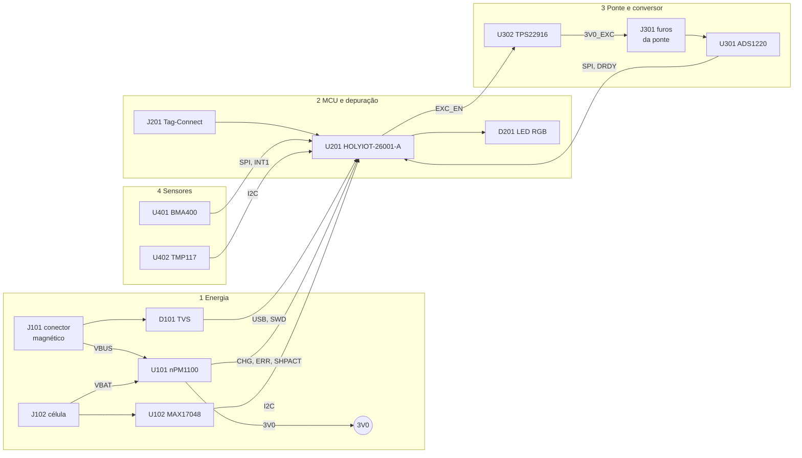
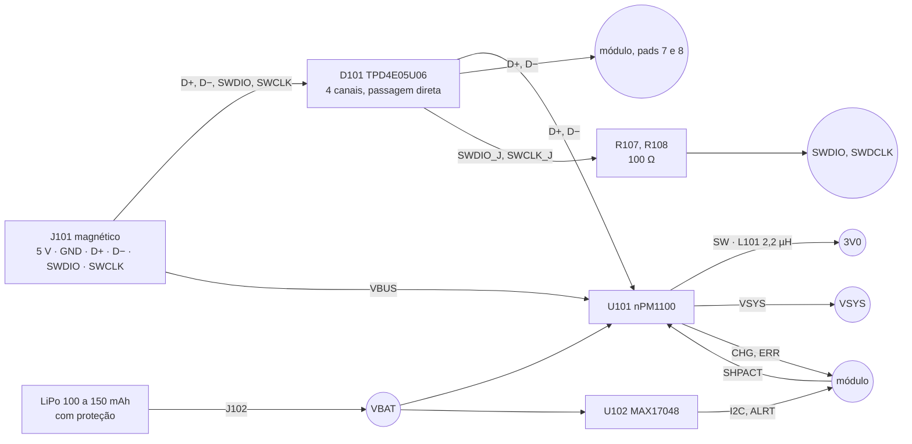
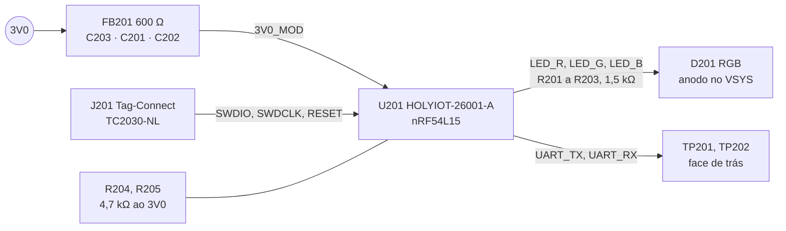
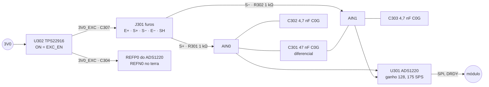
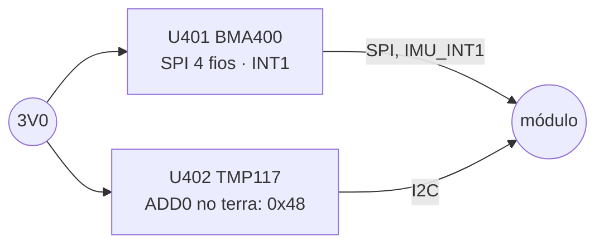

# Folhas do esquemático

As quatro folhas, bloco a bloco. Cada uma traz o circuito, as decisões que
não aparecem no desenho e o que fica em aberto. As ligações completas
estão na [lista de nós](03-netlist.md), as peças em [05](05-materiais.md) e
os contatos de cada conector em [06](06-conectores-e-pontos-de-teste.md).
O PDF gerado está em [`esquematico/pmeter-esquematico.pdf`](esquematico/pmeter-esquematico.pdf).

**Nesta página:** [Como as folhas são desenhadas](#como-as-folhas-são-desenhadas) · [Folha 1 · Energia](#folha-1--energia) · [Folha 2 · MCU e depuração](#folha-2--mcu-e-depuração) · [Folha 3 · Ponte e conversor](#folha-3--ponte-e-conversor) · [Folha 4 · Sensores](#folha-4--sensores) · [Verificação](#verificação)

> [!WARNING]
> Nada aqui foi montado. O esquemático e a placa existem como arquivos de
> CAD ([04](04-placa.md)); nenhuma placa foi fabricada e nenhum componente
> passou por bancada. Toda pinagem foi lida na ficha do fabricante, e a
> única peça cuja numeração **não** vem de ficha é o conector magnético
> ([06](06-conectores-e-pontos-de-teste.md#j101--conector-magnético)).

## Como as folhas são desenhadas

O gerador é o do ciclocomputador, portado sem mudar o padrão
(`cad/make_sch.py` com `cad/blocos.py`, `cad/sheets.py` e `cad/simbolos.py`;
[`cad/README.md`](cad/README.md)). É o que o dono pediu em 2026-09-27:
a mesma ideia e o mesmo desenho, para as duas placas serem lidas do mesmo
jeito.

- a **raiz** é um diagrama de blocos, um por folha, com os sinais que
  atravessam folhas desenhados entre os blocos;
- cada folha tem **blocos funcionais** na ordem em que o sinal flui, cada
  um numa caixa tracejada com título;
- dentro do bloco, o **passivo ao lado do pino que serve**, do lado para
  onde o pino aponta, e o desacoplamento numa prateleira sob o CI;
- **alimentação e terra por símbolo**: `VBUS`, `VBAT`, `VSYS`, `3V0`,
  `3V0_MOD`, `3V0_EXC` e `GND` nunca viajam por fio entre blocos;
- sinal que sai do bloco vira **rótulo local**; sinal que sai da folha,
  **rótulo hierárquico**, os dois num toco curto saído do pino;
- só o conector da célula toma símbolo da biblioteca do KiCad; os CIs e
  o módulo saem como retângulos com os pinos nomeados e numerados pela
  ficha, porque um símbolo bonito com o fio no pino errado é pior que um
  retângulo certo;
- tudo em A4, grade de 50 mil.

## Folha 1 · Energia

Uma entrada de 5 V pelo conector magnético, uma célula, um trilho de saída.

### As decisões desta folha

**O nPM1100 é configurado por pino, sem interface.** `VOUTBSET0` e
`VOUTBSET1` altos dão 3,0 V no buck (tabela da 6.3.1 do PS v1.5);
`VTERMSET` alto dá 4,2 V de terminação (tabela 12); `ISET` no `AVSS`
deixa a detecção da porta decidir entre 100 e 500 mA (tabela 10); `MODE`
baixo é o modo automático do buck; `ICHG` de 6,8 kΩ dá cerca de 75 mA
(625 / 0,0747 − 1562,5, equação da 6.2.4), 0,5 C de uma célula de
150 mAh; sem termistor no pack, `NTC` leva 10 kΩ ao `AVSS` (6.2.5). Os
três pinos estáticos penduram no `VSYS` e não no `3V0`, porque o `VSYS`
existe antes de o buck ligar.

**D+ e D− vão ao nPM1100 e ao módulo, os dois.** O PS v1.5 (7.3) desenha
exatamente isso: o nPM1100 detecta o tipo de porta e o SoC espera a
detecção terminar antes de ligar o seu USB. O trilho `VBUS` também chega
ao pad 9 do módulo, que é o detector de USB do SoC (a placa não alimenta
nada por ele).

**Ship mode sem botão.** `SHPHLD` fica só no pull-up de 1 MΩ ao `VBAT`
(`R106`); o firmware entra em ship mode levando `SHPACT` alto por 200 ms
sem cabo, e o pod só sai dele com o cabo, porque o `VBUS` acorda o
nPM1100 (3.5). É o estado de fábrica e de guarda longa, 460 nA.

**O medidor lê a célula pelo `VDD`.** No MAX17048 o pino `CELL` não é
ligado internamente (ficha, página 6): o CI mede a tensão no próprio
`VDD`, que é o `VBAT`; `CTG` e `QSTRT` vão ao terra como a ficha manda
quando não são usados. Não há resistor de sentido: o ModelGauge estima a
carga pela tensão.

**A proteção dos sinais fica no conector, não no módulo.** O
TPD4E05U06 em USON-10 usa os quatro pinos `NC` como passagem direta
(tabela 4-2 do SLVSBO7O: "used for optional straight-through routing"): o
sinal entra por um lado e sai pelo pino da frente, que é a única forma de
um par atravessar uma peça de 0,5 mm de passo sem contorná-la. Os 100 Ω
em série no SWD ficam **depois** do TVS, entre ele e o módulo.

**Os pontos de teste ficam na face de trás.** `TP101` a `TP104` medem
`VBUS`, `VBAT`, `3V0` e `GND` na bancada, com a placa fora do pod; dentro
do pod a única porta é o conector magnético, e a face de trás tem de ser
plana porque a célula encosta nela ([07](07-pod.md)).

### Em aberto nesta folha

- o conector magnético é **genérico**: a peça, o passo real, a numeração
  e o footprint mudam quando um fornecedor for alcançado
  ([06](06-conectores-e-pontos-de-teste.md#j101--conector-magnético));
- a polaridade do `J102` (1 = `VBAT+`, 2 = `GND`) é escolha deste projeto e
  vai ao fabricante do pack;
- os códigos LCSC do nPM1100, do MAX17048 e do JST estão marcados "a
  conferir" em [05](05-materiais.md).

## Folha 2 · MCU e depuração

### As decisões desta folha

**O filtro pi do módulo continua, agora por decisão do projeto.** Quem
pedia o footprint era a ficha do ME54BS13 (7.2, Power Supply Design), e o
HOLYIOT-26001-A **não tem ficha**: o fabricante publica só o desenho
mecânico. O filtro fica porque a razão dele não mudou — o `3V0` vem de um
buck chaveado e a peça é um rádio —, e porque tirá-lo depois custa uma
revisão de placa enquanto deixá-lo custa dois 0402: `C203` de 4,7 µF antes
do ferrite `FB201`, `C201` de 100 nF a 0,5 mm do pad 15 (`VDD`) e `C202` de
4,7 µF do lado do módulo. O ferrite pode virar 0 Ω na montagem.

**Os pinos são os de [`docs/02`](../docs/02-hardware.md#pinos-do-módulo).**
`SPI00` em P2.01 (clock), P2.02, P2.04, com `ADC_CS` P2.05, `ADC_DRDY`
P2.03, `IMU_CS` P2.07 e `IMU_INT1` P2.08; `I2C22` em P1.11 (clock) e
P1.12; `EXC_EN` P2.06; `CHG_N` P1.09; `ERR_N` P1.08; `SHPACT` P1.15;
`GAUGE_ALRT` P1.07; `VBUS_SENSE` P1.06; LED em P1.10, P1.13 e P1.14;
`UART20` em P1.04 e P1.05. Nenhum deles é escolha de gosto: o `SCL` de um
TWIM e o `SCK` de um SPIM precisam de pino com clock, e a lista usada é a
dos pinos que a **própria Nordic** usa no NCS para cada periférico
([09](09-modulo-de-radio.md#o-mapa-de-pinos-do-projeto)). O de-para para o
pad do módulo é a tabela `PADS_HOLYIOT` de [`cad/parts.py`](cad/parts.py),
os 36 pads lidos no desenho do fabricante, e ela ainda precisa ser
conferida num módulo real.

**O LED é de anodo comum no `VSYS`** e os catodos descem por 1,5 kΩ a
pinos do módulo em nível baixo: com 5 V do cabo são 2 mA por cor; na
célula, 0,7 mA. O LED escolhido é muito mais brilhante que o do
ciclocomputador, e os 1,5 kΩ são o valor de partida a recalcular na
bancada ([`cad/footprints.py`](cad/footprints.py) diz o mesmo).

**Os pull-ups do I2C ficam junto do mestre**, e não junto de um dos
escravos: 4,7 kΩ para um barramento de dois escravos a 100 kHz.

**Dois SWD.** O Tag-Connect (`J201`) grava a placa nua na fábrica e na
bancada; o conector magnético leva `SWDIO` e `SWCLK` para fora do pod
fechado, pelos 100 Ω. Os dois chegam aos mesmos pads 5 e 6 do módulo.

### Em aberto nesta folha

- o valor dos resistores do LED, a acertar com a peça na mão;
- o console pelos pontos de teste não sai do pod: dentro dele o log vai
  por BLE ([`docs/04`](../docs/04-arquitetura-firmware.md)).

## Folha 3 · Ponte e conversor

### As decisões desta folha

**A medição é ratiométrica.** A referência externa `REFP0` é o mesmo nó
que excita a ponte, `3V0_EXC`, e `REFN0` é o terra da ponte: qualquer
deriva da excitação sai da conta (SBAA532A, 3.1). É por isso que a chave
alimenta a ponte **e** a referência, e por isso que `C304` fica na
referência e não no trilho.

**O filtro é o da figura 9-11 do SBAS501D.** 1 kΩ em série em cada
entrada, 47 nF C0G diferencial e 4,7 nF C0G de modo comum em cada
entrada, dez vezes menor que o diferencial para que o descasamento dos
dois não vire sinal diferencial. O corte diferencial fica em 1,7 kHz e o
de modo comum em 34 kHz (**conta** deste projeto; a ficha dá a topologia,
não os valores). Só C0G: um X7R nas entradas de um conversor de 24 bits
é um microfone e um termômetro.

**`AIN2` e `AIN3` ficam abertos**, como a 9.1.5 manda para entradas não
usadas; `CLK` vai ao `DGND` para o oscilador interno. O pad térmico vai ao
`AVSS` sem via por baixo ([regra `AL6`](cad/README.md#as-regras-do-dry-run)).

**A excitação é chaveada pelo firmware**, não pela `PSW` interna do
ADS1220: com 1 kΩ a ponte puxa 3 mA e o firmware desliga a chave fora de
`Active` e `Calibrating` ([`docs/02`](../docs/02-hardware.md#orçamento-de-consumo)
diz o que isso custa e o que não resolve). O TPS22916B liga em 140 µs a
3,6 V e o `VOUT` assenta em `C307` antes da primeira conversão.

**Os fios da ponte chegam por furos, não por pads.** Cinco furos
metalizados de 0,9 mm (`J301`): os fios sobem do braço do pedivela por um
rasgo no fundo do pod, direto sob os furos, e a solda no furo segura o fio
onde um pad na face de cima exigiria dobrá-lo pela borda
([07](07-pod.md)). O quinto furo é a blindagem do cabo, ao terra.

### Em aberto nesta folha

- os extensômetros (resistência, padrão e cola) são decisão de
  [`docs/06`](../docs/06-medicao-e-calibracao.md) e não desta folha;
- a temporização entre `EXC_EN`, o `START` e o `DRDY` se decide na
  bancada.

## Folha 4 · Sensores

### As decisões desta folha

**O BMA400 fala SPI de 4 fios**, no mesmo `SPI00` do conversor, com `CSB`
próprio (`IMU_CS`) e `INT1` para acordar o SoC do `$SLEEP`; `INT2`, `NC` e
os dois pads sem função ficam abertos. `VDD` e `VDDIO` no `3V0`, cada um
com o seu 100 nF.

**O TMP117 mede a ponte, não o ar.** Fica na placa ao lado dos furos da
ponte, o mais perto que a placa permite do braço; `ADD0` no terra dá o
endereço 0x48, e `ALERT` fica aberto porque a leitura é a 1 Hz pelo
firmware.

### Em aberto nesta folha

- a curva de temperatura da ponte é calibração ([`docs/06`](../docs/06-medicao-e-calibracao.md)),
  e o lugar do TMP117 na placa é o que o colocador conseguiu ao lado dos
  furos: a distância real está em [04](04-placa.md).

## Verificação

`python cad/make_sch.py` gera a raiz e as quatro folhas;
`python cad/check_sch.py` roda o ERC do KiCad, exporta o netlist e o
compara com [`cad/nets.py`](cad/nets.py) pino a pino, confere os 12 pinos
deixados abertos de propósito e a geometria de cada folha (fio sobre
componente, peça fora da folha, peça sobre peça, rótulos hierárquicos
contra os pinos dos blocos). O resultado de 2026-09-27 está em
[08](08-dry-run-2026-09-27.md).
