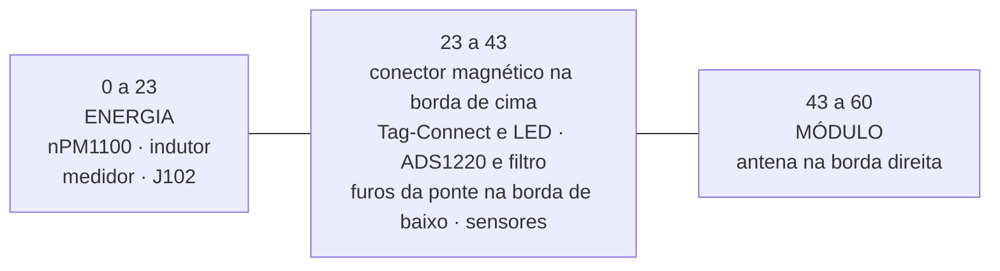

# Placa

O contorno, as camadas, onde cada bloco fica e onde nada pode ficar. Fecha
o que as [folhas do esquemático](02-esquematico.md) deixam em aberto por
natureza: um esquemático diz o que se liga a quê, e é o layout que decide
se a antena enxerga o ar, se o ruído do buck cai dentro da ponte e se a
placa cabe no pod. Tudo aqui sai de [`cad/`](cad/README.md); o que foi
medido está em [08](08-dry-run-2026-09-27.md).

**Nesta página:** [O contorno](#o-contorno) · [Camadas](#camadas) · [Posicionamento](#posicionamento) · [Zonas proibidas](#zonas-proibidas) · [O land pattern do módulo](#o-land-pattern-do-módulo) · [A orientação do acelerômetro](#a-orientação-do-acelerômetro) · [Roteamento](#roteamento) · [O que falta](#o-que-falta) · [Verificação](#verificação)

> [!WARNING]
> **Não existe placa física e nada foi fabricado nem medido.** Não há
> gerber, não há pilha de camadas de fabricante e ninguém encostou uma
> ponta de prova em nada. O que existe é o projeto em KiCad, em
> [`cad/`](cad/README.md): as 57 peças posicionadas, os três planos de
> cobre e **parte** das trilhas.
>
> **A placa não está roteada.** 77 das 110 ligações têm cobre; 34 itens
> continuam desconectados no DRC completo ([roteamento](#roteamento)).
> Ela não pode ser fabricada assim.

## O contorno

| Item | Valor |
|---|---|
| Tamanho | **60 × 16 mm** |
| Espessura | 0,8 mm |
| Raio dos cantos | 1,5 mm |
| Furos de fixação | nenhum: a placa assenta em ressaltos e é envasada ([07](07-pod.md)) |
| Recorte | sob a área da antena do módulo, 4,3 × 10,2 mm na borda direita |

O alvo de [`docs/02`](../docs/02-hardware.md#placa) era 48 × 16. **60 é o
que as 57 peças realmente ocupam numa face só**, e o número saiu de rodar
o colocador em um comprimento atrás do outro (`PMETER_W=52 python
make_pcb.py`), não de uma conta:

| Comprimento | Colocação | Observação |
|---|---|---|
| 48 mm | **não cabe**: 18 peças sem lugar | o alvo de `docs/02` |
| 49, 50, 51 mm | não cabe: 19, 9 e 5 peças sem lugar | |
| 52 mm | cabe | mas o roteamento fecha menos ligações: a placa fica sem canal livre |
| **60 mm** | cabe | o que está desenhado |
| 64 mm | cabe | e **piora** o roteamento: trilhas mais longas cruzam mais |

A largura de 16 mm é o limite do pod, não uma escolha: a face interna do
braço do pedivela dá 20 mm de envelope, menos duas paredes de 1,2 e duas
folgas de 0,5 ([07](07-pod.md#o-envelope)). O módulo de rádio tem 12 mm de
largura e é ele que põe o piso.

## Camadas

Empilhamento assimétrico de quatro camadas, o mesmo do ciclocomputador:

| Camada | Uso | Dielétrico abaixo |
|---|---|---|
| `F.Cu` | sinais e todas as peças | 0,10 mm |
| `In1.Cu` | **terra contínuo** | 0,50 mm |
| `In2.Cu` | alimentação e sinais que atravessam | 0,10 mm |
| `B.Cu` | sinais; nenhuma peça, só pads de teste | — |

`F.Cu` e `B.Cu` também levam despejo de terra, costurado à `In1.Cu` por
vias na borda e por uma malha de 4 mm ([`cad/route.py`](cad/route.py)).

Classes de rede ([`cad/make_pro.py`](cad/make_pro.py)): isolamento de
0,127 mm em todas (o mínimo do fabricante), trilha de 0,15 mm para sinal e
0,40 para alimentação, via de 0,45/0,25 mm e de 0,60/0,30 na classe de
alimentação.

## Posicionamento



O que decide cada limite:

- **o módulo** fica no extremo direito com a antena virada para fora da
  borda, porque a ficha manda (ME54BS13 V1.0.0, 7.3). A placa é vazada sob
  a área da antena (7.4);
- **o bloco de energia** acaba 20 mm antes do módulo, que é a distância
  que a mesma ficha pede de uma fonte chaveada ou de um indutor de
  potência (7.2, *Interference Isolation Rule*). É esse número, e não a
  estética, que empurra o buck para o outro extremo;
- **o conector magnético** fica deitado na borda de cima, no meio, com os
  pinos para a tampa do pod;
- **os furos da ponte** ficam na borda de baixo, sob o conversor: os fios
  sobem do braço por um rasgo no fundo do pod, direto sob eles
  ([07](07-pod.md#os-fios-da-ponte));
- **o canto analógico** (ADS1220, filtro, chave da excitação) fica entre
  os dois, o mais longe que a placa permite do buck e do módulo.

Tudo numa face só. Na face de trás vão apenas os sete pontos de teste, que
são pads: a célula encosta nessa face dentro do pod, e ela tem de ser
plana ([07](07-pod.md#o-que-segura-cada-peça)).

## Zonas proibidas

| Zona | O que é | Fonte |
|---|---|---|
| `KEEPOUT_ANTENA_MODULO` | 4,7 mm da borda direita: sem cobre, sem componente, sem metal | ME54BS13 V1.0.0, 7.3 e 7.4 |
| `RECORTE_ANTENA_MODULO` | a placa é **vazada** sob a área da antena | 7.4 |
| `SOMBRA_TAMPA_MAX_3-2MM` | teto de 3,2 mm sobre a face da frente | [07](07-pod.md#a-pilha-de-alturas) |

O teto de 3,2 mm **não** é dado pelo módulo: quem o fixa é o conector da
célula, um JST SH de 2,90 mm, mais 0,3 de ar. O módulo tem 2,40. Isso foi
medido pelo dry run do pod, que reprovou a peça quando o teto ainda era
2,7 ([08](08-dry-run-2026-09-27.md#o-pod)).

## O land pattern do módulo

A ficha do ME54BS13 **não traz land pattern oficial** (a Minew fornece o
dela sob pedido), então o footprint é desenhado aqui a partir do desenho
mecânico. Até 2026-09-27 isso era só uma ressalva; agora existe medida.

O footprint gerado foi comparado, pad a pad, com um desenho independente
do mesmo módulo, de origem comunitária
(`datasheets/ME54BS13_3rdparty_girishji.kicad_mod`, fora do git):

| O que foi comparado | Resultado |
|---|---|
| Quantidade e nome dos pads | **80 iguais**: 20 castelados numerados e a matriz LGA de `A0` a `F9` |
| Posição de cada pad, relativa ao centro da caixa de pads | **desvio máximo 0,000 mm** |
| Tamanho de cada pad | igual, contando o giro próprio do pad (os castelados do desenho de referência estão a 90°, e 0,7 × 1,5 girado é o mesmo cobre que 1,5 × 0,7) |

Os dois desenhos são o mesmo land pattern. É evidência independente de que
os 20 pads castelados a 1,1 mm de passo e a matriz LGA a 1,5 × 1,2 mm
estão certos. A regra `ME7` de
[`cad/dry_run_pcb.py`](cad/dry_run_pcb.py) refaz essa medida a cada
execução e **falha dizendo que não pôde medir** se o arquivo de referência
não estiver presente.

Além disso, o número de cada pad foi conferido contra a pinagem vista de
cima da ficha (`ME54BS13_pin-definition_top-view_v1.0.0.png`): os 20
castelados (1 `GND`, 2 `RF`, 3 `GND`, 4 `nRESET`, 5 `SWDIO`, 6 `SWDCLK`,
7 `D−`, 8 `D+`, 9 `VBUS`, 10 e 11 `GND`, 12 a 18 `P1.26` a `P1.15`,
19 `VCC`, 20 `GND`) e os 19 pads LGA usados pelo projeto batem, um a um,
com a tabela de [`docs/02`](../docs/02-hardware.md#pinos-do-módulo).
**O espelhamento** do mapa continua por conferir num módulo real.

## A orientação do acelerômetro

O firmware escolhe qual eixo do BMA400 é o radial e qual é o tangencial
por dois símbolos Kconfig. Trocar os dois mete o termo centrípeto dentro
da cadência e **a potência sai errada sem nenhum sinal de erro**. O fato
que decide isso é físico e está aqui, medido.

**O que a ficha diz** (Bosch BST-BMA400-DS000-14, 8.2, página 112, na
tabela de orientação): numa **vista de cima**, com o ponto do pino 1 no
canto **superior esquerdo**, o `+X` do sensor aponta para **cima** da
página e o `+Y` para a **esquerda**; o `+Z` sai da face que leva o ponto.

**O que o footprint dá**: no `Package_LGA:LGA-12_2x2mm_P0.5mm` do KiCad o
pad 1 fica em (−0,762; −0,750), isto é, no canto **superior esquerdo** do
desenho — o mesmo canto da ficha.

**Como o U401 está posto**: rotação 0°, na face da frente.

**O resultado, medido pela regra `IM1`:**

| Eixo do sensor | Direção na placa | Papel no pedivela |
|---|---|---|
| `X` | −y (para a borda de cima) | **tangencial** |
| `Y` | −x (para a ponta esquerda) | **radial** |
| `Z` | saindo da face da frente | lateral, ao longo do eixo do pedivela |

O eixo longo da placa (x) é o que corre **ao longo do braço**, e a ponta
direita — a do módulo e da antena — é a que aponta para **fora**, para o
pedal: a antena fica o mais longe possível do eixo central e do quadro.
Logo o `+Y` do sensor, que aponta para a ponta esquerda, aponta **para o
eixo central**, para dentro.

> [!IMPORTANT]
> **O mapeamento está trocado em relação ao que o firmware supõe.** O
> firmware tem `PM_IMU_AXIS_RADIAL = X` e `PM_IMU_AXIS_TANGENTIAL = Y`, e
> a medida dá o contrário. Há duas saídas, e as duas fecham:
>
> 1. **girar o `U401` 90°** na placa, e aí o `X` do sensor passa a correr
>    ao longo do braço e o Kconfig fica como está;
> 2. **trocar os dois símbolos** no firmware, e então o sinal de
>    `PM_IMU_RADIAL_SIGN` tem de ser o que aponta para fora: como o `+Y`
>    aponta para o eixo central, o radial positivo é `−Y`.
>
> A regra `IM1` de [`cad/dry_run_pcb.py`](cad/dry_run_pcb.py) refaz essa
> medida a cada execução, reprova enquanto os dois lados não concordarem,
> e **falha dizendo que não pôde medir** se a ficha não estiver em
> `datasheets/`.

## Roteamento

| Medida | Valor |
|---|---|
| Segmentos | 546 |
| Vias | 179 |
| Ligações fechadas | **77 de 110** |
| Itens desconectados no DRC completo | **34**, em 24 redes |
| Violações de DRC | **0 erros** (14 avisos, todos de registro de biblioteca) |

As redes com mais itens em aberto são `3V0` (7), `LED_G` (6), `USB_DM`
(6), `SWDIO_J` (5), `SPI_MISO`, `SPI_SCK`, `VBAT` e `VSYS` (4 cada).

O roteador é o do ciclocomputador e levou três correções medidas nesta
placa, que [`cad/README.md`](cad/README.md#o-que-mudou-em-relação-ao-ciclocomputador)
detalha: a ordem das ligações passa a crescer do pino mais próximo; o
pescoço dentro do campo de pads deixou de pedir folga que um passo de
0,5 mm não tem; e a isolação reservada em volta de um pad, de uma trilha e
de uma via passou a ser a da trilha **mais larga** que pode passar ali, e
não a da mais estreita. A última troca 17 ligações por **zero erro de
DRC**, e foi escolhida assim de propósito: uma violação de isolamento é um
curto na placa fabricada, e uma ligação sem trilha é uma falta visível.

## O que falta

Em ordem de gravidade, tudo medido em [08](08-dry-run-2026-09-27.md):

1. **34 ligações sem cobre.** A placa não é fabricável.
2. **10 de 19 capacitores de desacoplamento fora do limite da ficha**, o
   pior a 18,7 mm do pino que serve. A causa é conhecida: quando o anel em
   volta do CI não tem lugar livre, `encostar()` cai no seu plano B e a
   peça vai parar longe, em vez de a colocação falhar dizendo que não
   coube. É o primeiro conserto da próxima rodada.
3. **O filtro da ponte longe dos pinos do conversor** (`R301` a 9,4 mm),
   pela mesma causa.
4. **A chave da excitação a 4,4 mm do módulo**, contra os 5 mm que este
   projeto pede.
5. **Um vão de 5,3 mm na costura de terra da borda**, contra 5.
6. **A placa passa do envelope alvo do pod** em 1,2 mm de cada ponta, o
   que é a decisão de tamanho registrada em [07](07-pod.md#o-envelope).

## Verificação

```
python hardware_powermeter/cad/make_dxf.py
python hardware_powermeter/cad/check_dxf.py
python hardware_powermeter/cad/make_pcb.py
python hardware_powermeter/cad/route.py
"D:/KiCAD/bin/python.exe" hardware_powermeter/cad/fill_zones.py
python hardware_powermeter/cad/make_pro.py
python hardware_powermeter/cad/check_pcb.py --como-esta
python hardware_powermeter/cad/dry_run_pcb.py
```

> [!CAUTION]
> **O KiCad reescreve o `pmeter.kicad_pro` com os padrões dele** sempre que
> o `pcbnew` ou o `kicad-cli` abre o projeto. Rodar o DRC sem regerar o
> arquivo antes mede a placa contra isolamento de 0,2 mm, via mínima de
> 0,5 e furo mínimo de 0,3, que não são as regras deste projeto: em
> 2026-09-27 isso deu 722 erros, dos quais 390 eram as 195 vias reprovadas
> duas vezes. `python make_pro.py` antes de cada DRC.
