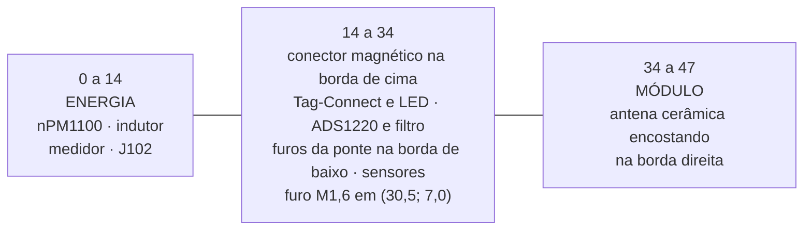

# Placa

O contorno, as camadas, onde cada bloco fica e onde nada pode ficar. Fecha
o que as [folhas do esquemático](02-esquematico.md) deixam em aberto por
natureza: um esquemático diz o que se liga a quê, e é o layout que decide
se a antena enxerga o ar, se o ruído do buck cai dentro da ponte e se a
placa cabe no pod. Tudo aqui sai de [`cad/`](cad/README.md); o que foi
medido está em [10](10-dry-run-2026-09-28.md), e a primeira medida completa
em [08](08-dry-run-2026-09-27.md).

**Nesta página:** [O contorno](#o-contorno) · [Camadas](#camadas) · [Posicionamento](#posicionamento) · [Zonas proibidas](#zonas-proibidas) · [O land pattern do módulo](#o-land-pattern-do-módulo) · [A orientação do acelerômetro](#a-orientação-do-acelerômetro) · [Roteamento](#roteamento) · [O que falta](#o-que-falta) · [Verificação](#verificação)

> [!WARNING]
> **Não existe placa física e nada foi fabricado nem medido.** Não há
> gerber, não há pilha de camadas de fabricante e ninguém encostou uma
> ponta de prova em nada. O que existe é o projeto em KiCad, em
> [`cad/`](cad/README.md): as 58 peças posicionadas, os três planos de
> cobre e as trilhas.
>
> **A placa está roteada com 0 erros de DRC**, e mesmo assim **não pode ser
> fabricada**: 3 ligações de sinal continuam sem cobre e 7 dos 17
> capacitores de desacoplamento estão além do limite da ficha
> ([o que falta](#o-que-falta)).

## O contorno

| Item | Valor |
|---|---|
| Tamanho | **47 × 14 mm** |
| Espessura | 0,8 mm |
| Raio dos cantos | 1,5 mm |
| Furo de fixação | **um**, M1,6 passante em (30,5; 7,0), Ø 2,2 mm, com reserva de 1,4 mm de raio; o outro extremo da placa é preso pelos ressaltos ([07](07-pod.md)) |
| Recorte | **nenhum**: a antena do módulo é cerâmica e pede zona livre, não placa vazada |

O alvo de [`docs/02`](../docs/02-hardware.md#placa) era 48 × 16. A placa é
menor que o alvo, e quem a encolheu foi a **troca do módulo de rádio**
([09](09-modulo-de-radio.md)): o ME54BS13 ocupava 12,0 × 16,5 mm, o
HOLYIOT-26001-A ocupa 10,0 × 12,5, e aquele módulo sozinho era 26 % da área
da placa — mais que as 37 peças pequenas somadas. Nenhuma outra alavanca de
tamanho chega perto: passar os passivos de 0402 para 0201 devolveria menos
de um terço disso e custaria montagem.

**A largura é o ganho que interessa.** Ela é o limite do pod, não uma
escolha: a face interna do braço do pedivela dá 20 mm de envelope, menos
duas paredes e duas folgas ([07](07-pod.md#o-envelope)), e quem punha o
piso era a largura do módulo. Com 10 mm no lugar de 12 a placa vai de 16
para **14 mm**, e o pod de 19,4 para **17,4** — abaixo da faixa inteira da
classe de referência (18 a 22 mm).

**O comprimento não saiu de uma conta**, e sim de rodar o colocador e o
roteador em um comprimento atrás do outro (`PMETER_W=48 python
make_pcb.py`). O que decide não é área livre e sim **quantos lugares aceitam
uma via**: a fuga de um pad de passo fino precisa de uma. Em 47 mm as 58
peças assentam, `RF4` passa (a antena cerâmica encosta na borda) e o
roteador fecha; encurtar mais tira sítios de via antes de tirar área.

## Camadas

Empilhamento assimétrico de quatro camadas, o mesmo do ciclocomputador:

| Camada | Uso | Dielétrico abaixo |
|---|---|---|
| `F.Cu` | sinais e todas as peças | 0,10 mm |
| `In1.Cu` | **terra contínuo** | 0,50 mm |
| `In2.Cu` | alimentação e sinais que atravessam | 0,10 mm |
| `B.Cu` | sinais; nenhuma peça, só pads de teste | — |

`F.Cu` e `B.Cu` também levam despejo de terra, costurado à `In1.Cu` por
vias na borda e por uma malha de 4 mm ([`cad/route.py`](cad/route.py)).

Classes de rede ([`cad/make_pro.py`](cad/make_pro.py)): isolamento de
0,127 mm em todas (o mínimo do fabricante), trilha de 0,15 mm para sinal e
0,40 para alimentação, via de 0,45/0,25 mm e de 0,60/0,30 na classe de
alimentação.

## Posicionamento



O que decide cada limite:

- **o módulo** fica no extremo direito com a antena virada para fora da
  borda. O guia de montagem do fabricante classifica a antena passando
  para fora da borda da placa como a **melhor** posição, o canto como boa e
  o meio da placa como a pior, e pede a região sem plano de terra
  ([09](09-modulo-de-radio.md#a-antena-manda-no-layout)). Não há mais
  recorte vazado: aquilo era o que a antena de traço do módulo antigo
  pedia;
- **o bloco de energia** acaba 20 mm antes do módulo, que é a distância que
  a regra de isolamento de interferência pede de uma fonte chaveada ou de
  um indutor de potência. É esse número, e não a estética, que empurra o
  buck para o outro extremo;
- **o conector magnético** fica deitado na borda de cima, no meio, com os
  pinos para a tampa do pod;
- **os furos da ponte** ficam na borda de baixo, sob o conversor: os fios
  sobem do braço por um rasgo no fundo do pod, direto sob eles
  ([07](07-pod.md#os-fios-da-ponte));
- **o canto analógico** (ADS1220, filtro, chave da excitação) fica entre
  os dois, o mais longe que a placa permite do buck e do módulo.

Quase tudo numa face só. A face de trás leva os sete pontos de teste, que
são pads, e onze peças que não precisam ser alcançadas: o desacoplamento do
módulo com os resistores de barramento (`C201` a `C203`, `FB201`, `R204`,
`R205`), os dois chips baixos da ponta direita (`U302` e `U402`) e o
desacoplamento deles (`C307`, `C308`, `C403`). Isso é possível porque a
célula cobre só 23 dos 47 mm: passada ela o fundo do pod desce, e a regra
`PD4` mede o ar sob **cada** peça em vez de proibir todas
([07](07-pod.md#o-que-segura-cada-peça)).

## Zonas proibidas

| Zona | O que é | Fonte |
|---|---|---|
| `KEEPOUT_ANTENA_MODULO` | 4,3 mm da borda direita: sem cobre, sem componente, sem metal, sem plano de terra | guia de montagem do HOLYIOT-26001-A ([09](09-modulo-de-radio.md#a-antena-manda-no-layout)) |
| `SOMBRA_CELULA_MAX_0-0MM` | a sombra da célula na face de trás: nenhuma peça pode ficar sob ela | derivada das cotas da própria célula em `make_dxf` |
| `SOMBRA_TAMPA_MAX_2-7MM` | teto de 2,7 mm sobre a face da frente | [07](07-pod.md#a-pilha-de-alturas) |

**O recorte vazado saiu.** A antena de traço do módulo antigo pedia a placa
aberta sob ela; a cerâmica do HOLYIOT pede o contrário — corpo dielétrico
sobre substrato, com a região livre de cobre e **encostando numa borda**.
A regra `RF4` do dry run mudou junto: ela mede se a antena está dentro da
zona livre **e** se toca uma borda da placa, e não mais se existe um furo
vazado.

O teto é o de `make_dxf.TETO_TAMPA` e o nome da zona sai dele, então os dois
nunca divergem. Quem o fixa é a peça mais alta que fica **sob a tampa**: hoje
o módulo, com 2,40 mm mais 0,3 de ar. Ele já foi 3,2, quando a célula
chegava por um conector JST SH de 2,90 mm; desde que ela passou a ser
soldada em dois furos (`J102`, sem corpo), o teto voltou para 2,7. A regra
`PD2` do dry run do pod é quem mede isso a cada execução, e o único que
atravessa a tampa é o conector magnético (`make_dxf.ATRAVESSA_TAMPA`).

## O land pattern do módulo

> [!WARNING]
> **Do HOLYIOT-26001-A não existe ficha em PDF, nem land pattern oficial,
> nem desenho de terceiros.** O que existe é o desenho mecânico do anúncio
> do fabricante, fotografado pelo dono em 2026-09-28. O footprint é
> desenhado aqui a partir dele, e **não tem conferência independente**.
> Com o módulo antigo havia: um desenho comunitário do mesmo módulo batia
> pad a pad com o nosso, desvio máximo 0,000 mm. Aqui não há com o que
> comparar, e a única saída é medir uma peça real quando ela chegar.

O que o desenho dá, e o que o gerador
[`cad/footprints.py`](cad/footprints.py) reproduz:

| | Valor |
|---|---|
| Corpo | 10,0 × 12,5 mm |
| Ilhas | **36**, todas meio-furo (castelado), passo **1,2 mm** |
| Nas bordas esquerda e direita | 7 fileiras × 2 ilhas de cada lado: a externa em \|x\| = 4,75 mm, 1,5 × 0,6; a interna em \|x\| = 2,5 mm, 1,0 × 0,8 |
| Na borda de baixo | 8 ilhas de 0,6 × 1,0, em \|x\| = 0,6 / 1,8 / 3,0 / 4,2 |
| Pé de solda | **0,5 mm** para fora do corpo, só nas ilhas de borda |
| Antena | cerâmica, a faixa de 3,8 mm na ponta de cima (`Dwgs.User` no footprint) |

A regra `ME7` de [`cad/dry_run_pcb.py`](cad/dry_run_pcb.py) foi refeita em
2026-09-28 junto com o módulo. Ela **não pode mais** comparar com um
terceiro, então mede a coerência interna do desenho, que é o que ainda pega
erro de gerador: uma ilha por pino da tabela `PADS_HOLYIOT` do esquemático
(36 para 36), nenhum nome repetido, o corpo do `F.Fab` igual ao de
`footprints.CORPO` — que é o corpo que o 3D e o pod usam —, nenhuma ilha
saindo mais que os 0,5 mm de pé de solda, e passo constante em cada
fileira. **Medido em 2026-09-28: passa, com a saída máxima em exatamente
0,500 mm.** E a regra diz, em toda execução, que isso não é conferência
independente.

> O primeiro desenho da regra media o corpo pelo centro do envelope das
> ilhas, e isso estava errado: as ilhas não são simétricas em `y` (só a
> borda de baixo tem fileira), então o corpo saía 1,9 mm fora do lugar e
> toda ilha de baixo parecia estar escapando da peça. O corpo é o retângulo
> do `F.Fab`.

**O espelhamento** do mapa continua por conferir num módulo real: é a mesma
pendência do módulo antigo, e ela não some porque a peça mudou.

## A orientação do acelerômetro

O firmware escolhe qual eixo do BMA400 é o radial e qual é o tangencial
por dois símbolos Kconfig. Trocar os dois mete o termo centrípeto dentro
da cadência e **a potência sai errada sem nenhum sinal de erro**. O fato
que decide isso é físico e está aqui, medido.

**O que a ficha diz** (Bosch BST-BMA400-DS000-14, 8.2, página 112, na
tabela de orientação): numa **vista de cima**, com o ponto do pino 1 no
canto **superior esquerdo**, o `+X` do sensor aponta para **cima** da
página e o `+Y` para a **esquerda**; o `+Z` sai da face que leva o ponto.

**O que o footprint dá**: no `Package_LGA:LGA-12_2x2mm_P0.5mm` do KiCad o
pad 1 fica em (−0,762; −0,750), isto é, no canto **superior esquerdo** do
desenho — o mesmo canto da ficha.

**Como o U401 está posto**: rotação 0°, na face da frente.

**O resultado, medido pela regra `IM1`:**

| Eixo do sensor | Direção na placa | Papel no pedivela |
|---|---|---|
| `X` | −y (para a borda de cima) | **tangencial** |
| `Y` | −x (para a ponta esquerda) | **radial** |
| `Z` | saindo da face da frente | lateral, ao longo do eixo do pedivela |

O eixo longo da placa (x) é o que corre **ao longo do braço**, e a ponta
direita — a do módulo e da antena — é a que aponta para **fora**, para o
pedal: a antena fica o mais longe possível do eixo central e do quadro.
Logo o `+Y` do sensor, que aponta para a ponta esquerda, aponta **para o
eixo central**, para dentro.

> [!IMPORTANT]
> **O mapeamento está trocado em relação ao que o firmware supõe.** O
> firmware tem `PM_IMU_AXIS_RADIAL = X` e `PM_IMU_AXIS_TANGENTIAL = Y`, e
> a medida dá o contrário. Há duas saídas, e as duas fecham:
>
> 1. **girar o `U401` 90°** na placa, e aí o `X` do sensor passa a correr
>    ao longo do braço e o Kconfig fica como está;
> 2. **trocar os dois símbolos** no firmware, e então o sinal de
>    `PM_IMU_RADIAL_SIGN` tem de ser o que aponta para fora: como o `+Y`
>    aponta para o eixo central, o radial positivo é `−Y`.
>
> A regra `IM1` de [`cad/dry_run_pcb.py`](cad/dry_run_pcb.py) refaz essa
> medida a cada execução, reprova enquanto os dois lados não concordarem,
> e **falha dizendo que não pôde medir** se a ficha não estiver em
> `datasheets/`.

## Roteamento

| Medida | Valor |
|---|---|
| Segmentos | **440** |
| Vias | **153** |
| Ligações fechadas | **75** |
| Itens desconectados no DRC completo | **14**, em 7 ligações |
| **Erros de DRC** | **0** |
| Avisos de DRC | 25, todos de registro de biblioteca |

Das 7 ligações em aberto, **4 são vias de costura do plano de terra** — que
o plano resolve, e o `reparar.py` diz isso com todas as letras — e **3 são
de sinal**: `I2C_SCL`, `SPI_MOSI` e `SPI_SCK`, as três do mesmo trecho
entre o conversor e o módulo.

O estágio de congestão negociada rodou as 160 rodadas e **foi recusado**:
ele chega a zero célula disputada só com 62 a 64 ligações, contra as 75 do
sequencial, e o critério exige as duas coisas ao mesmo tempo. Fica o
resultado sequencial, e a saída diz isso.

O roteador é o do ciclocomputador e levou três correções medidas nesta
placa, que [`cad/README.md`](cad/README.md#o-que-mudou-em-relação-ao-ciclocomputador)
detalha: a ordem das ligações passa a crescer do pino mais próximo; o
pescoço dentro do campo de pads deixou de pedir folga que um passo de
0,5 mm não tem; e a isolação reservada em volta de um pad, de uma trilha e
de uma via passou a ser a da trilha **mais larga** que pode passar ali, e
não a da mais estreita. A última troca 17 ligações por **zero erro de
DRC**, e foi escolhida assim de propósito: uma violação de isolamento é um
curto na placa fabricada, e uma ligação sem trilha é uma falta visível.

## O que falta

Em ordem de gravidade, tudo medido em [10](10-dry-run-2026-09-28.md):

1. **7 de 17 capacitores de desacoplamento além do limite da ficha**, o
   pior a 7,7 mm de um pino que pede 2. O colocador foi instrumentado por
   dentro e **decide certo**: o melhor lugar **livre** está mesmo a 2,90 mm
   do pino do `C302` e a 6,25 do `C402`. Quem come esse raio é o
   empilhamento de courtyards — o do próprio circuito integrado, o do 0402
   e a folga entre peças —, e num VQFN de 3,5 mm com um 0402 na mesma face
   os 2 mm da ficha podem simplesmente não caber. A saída clássica é o
   desacoplamento na **face de trás direto sob o chip**, onde o laço é
   pad → via → pad; é decisão do dono. O `AN1` e o `AN2` têm a mesma raiz.
2. **3 ligações de sinal sem cobre** — `I2C_SCL`, `SPI_MOSI` e `SPI_SCK` —,
   todas no mesmo trecho entre o conversor e o módulo. A placa não é
   fabricável assim.
3. **9 trechos da serial dentro do retângulo sem plano do nó de
   chaveamento** (`US1`). O conflito é estrutural: a serial tem de chegar
   ao nPM1100, que lê `D+`/`D−` para escolher a corrente de carga, e esses
   pinos ficam ao lado do próprio nó. A 115200 baud o risco é pequeno, mas
   a regra relata em vez de esconder.

## Verificação

```
python hardware_powermeter/cad/make_dxf.py
python hardware_powermeter/cad/check_dxf.py
python hardware_powermeter/cad/make_pcb.py
python hardware_powermeter/cad/route.py
"D:/KiCAD/bin/python.exe" hardware_powermeter/cad/fill_zones.py
python hardware_powermeter/cad/make_pro.py
python hardware_powermeter/cad/check_pcb.py --como-esta
python hardware_powermeter/cad/dry_run_pcb.py
```

> [!CAUTION]
> **O KiCad reescreve o `pmeter.kicad_pro` com os padrões dele** sempre que
> o `pcbnew` ou o `kicad-cli` abre o projeto. Rodar o DRC sem regerar o
> arquivo antes mede a placa contra isolamento de 0,2 mm, via mínima de
> 0,5 e furo mínimo de 0,3, que não são as regras deste projeto: em
> 2026-09-27 isso deu 722 erros, dos quais 390 eram as 195 vias reprovadas
> duas vezes. `python make_pro.py` antes de cada DRC.
