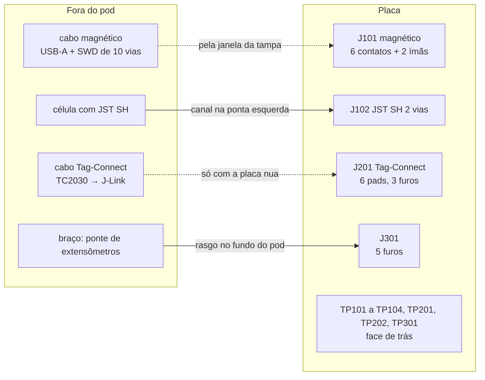

# Conectores e pontos de teste

Todo conector e todo ponto de teste da placa, **contato a contato**. As
[folhas do esquemático](02-esquematico.md) dizem quais sinais existem e a
[lista de nós](03-netlist.md) diz de onde cada um sai e aonde chega;
nenhuma das duas diz **em que contato** de cada conector o sinal entra. É
essa lacuna que este documento fecha, porque ela é a forma clássica de
inverter a polaridade da célula na primeira montagem.

**Nesta página:** [Como ler](#como-ler) · [De onde vem cada pinagem](#de-onde-vem-cada-pinagem) · [J101 · Conector magnético](#j101--conector-magnético) · [J102 · Célula](#j102--célula) · [J201 · Tag-Connect](#j201--tag-connect) · [J301 · Furos da ponte](#j301--furos-da-ponte) · [Pontos de teste](#pontos-de-teste) · [O que falta conferir](#o-que-falta-conferir)

> [!WARNING]
> **Nada disto foi montado, medido ou fabricado.** Cada pinagem abaixo
> vem de uma ficha de fabricante ou de uma escolha feita aqui, e está
> marcada como tal. O conector magnético **não tem fornecedor escolhido**:
> a sua numeração é deste projeto e muda com a peça.

## Como ler

- **Contato**: o número como o desenho do fabricante o numera; onde não há
  fabricante (o magnético), o número é o do footprint deste projeto.
- **Direção**: do ponto de vista **da placa**. `entrada` é o que chega,
  `saída` é o que a placa aciona, `bidir` é linha compartilhada, `alim` é
  alimentação ou retorno.
- **Origem da pinagem**: cada seção diz se a ordem dos contatos veio da
  **ficha do fabricante** ou é **escolha deste projeto**.
- Os designadores seguem o esquema por folha de [05](05-materiais.md#como-ler).

## De onde vem cada pinagem

| Conector | Origem | Confiança |
|---|---|---|
| J101 magnético | **escolha deste projeto** sobre um footprint genérico | baixa: muda com a peça |
| J102 JST SH | ficha JST (mecânica); a polaridade é **escolha deste projeto** | média: a mandar ao fabricante do pack |
| J201 Tag-Connect | ficha do TC2030 (o padrão ARM de 6 vias) | alta |
| J301 furos | escolha deste projeto (ordem dos fios) | alta: são fios soldados, sem cabo padrão |

## J101 · Conector magnético

Seis contatos pogo em linha, dois ímãs com polaridade nos extremos, na
face de cima da placa, atravessando a janela da tampa do pod
([07](07-pod.md)). O cabo termina em USB-A (5 V, GND, D+, D−) e numa saída
SWD de 10 vias para o J-Link ([`docs/02`](../docs/02-hardware.md#conector-magnético)).

> [!IMPORTANT]
> **Nenhuma peça foi escolhida.** Todas as páginas de fornecedor tentadas
> em 2026-09-27 estavam fora de alcance desta máquina. O footprint
> `pmeter:Pogo_Magnetico_6P_P2.5mm` é um lugar reservado (seis pads
> redondos de 1,5 mm a 2,5 mm de passo, dois pads de 1 × 3 mm para as
> abas dos ímãs, corpo de 18 × 5 × 3 mm) e a numeração abaixo é deste
> projeto. Quando a peça for escolhida, o footprint, a altura e a janela
> da tampa mudam com ela, e o dry run do pod mede os três.

| Contato | Sinal | Direção | Por quê nesta posição |
|---|---|---|---|
| 1 | `GND` | alim | na ponta, ao lado do 5 V |
| 2 | `VBUS` | entrada | ao lado do terra: um cabo forçado ao contrário põe 5 V no terra e terra no 5 V, um curto que a fonte do cabo aguenta, e não 5 V num sinal |
| 3 | `USB_DM` | bidir | par USB no meio, lado a lado |
| 4 | `USB_DP` | bidir | |
| 5 | `SWDIO_J` | bidir | par SWD na outra ponta, pelo TVS e por 100 Ω |
| 6 | `SWCLK_J` | entrada | |
| MP1, MP2 | `GND` | mecânico | as abas do quadro dos ímãs, soldadas ao terra |

Os quatro sinais passam pelo `D101` (TPD4E05U06, 12 kV de contato) antes
de chegar ao módulo; o `VBUS` entra no nPM1100, que é entrada, e nada sai
do pod pelos contatos sem cabo.

## J102 · Célula

**JST SM02B-SRSS-TB** na placa (série SH, passo 1,0 mm, 2 vias, entrada
lateral, 2,9 mm de altura, 1 A por contato) e SHR-02V-S no cabo do pack.
Fica **na ponta esquerda** da placa, a 270°, com a boca virada para a
ponta: a célula deita **sob** a placa com as abas nessa ponta, e o fio
dobra em volta da ponta pelo canal de 2,5 mm do pod
([07](07-pod.md)). O `orientacao.py` mede a boca do footprint e confere o
giro.

> [!IMPORTANT]
> **A polaridade é escolha deste projeto** e vai ao fabricante do pack
> antes da montagem: não existe padrão para conector de célula.

| Contato | Sinal | Direção | Observação |
|---|---|---|---|
| 1 | `VBAT+` | alim | o fio vermelho, na convenção usual |
| 2 | `GND` | alim | |

A célula é de 100 a 150 mAh **com proteção própria** (a placa não tem
proteção de sobredescarga além do que o nPM1100 faz); o envelope reservado
no pod é 25 × 15 × 4 mm.

## J201 · Tag-Connect

**TC2030-IDC-NL**: seis pads de 0,7 × 0,6 mm a 1,27 mm de passo e três
furos de alinhamento, sem peça na placa. É a gravação de fábrica e a
bancada com a placa nua; dentro do pod fechado a depuração é pelo
conector magnético. Pinagem da ficha do Tag-Connect (o padrão ARM de 6
vias), em pé, com o `VTref` no `3V0`:

| Contato | Sinal | Direção |
|---|---|---|
| 1 | `VTref` (`3V0`) | alim |
| 2 | `SWDIO` | bidir |
| 3 | `nRESET` | entrada |
| 4 | `SWDCLK` | entrada |
| 5 | `GND` | alim |
| 6 | `SWO` | — (não ligado) |

## J301 · Furos da ponte

Cinco furos metalizados de 0,9 mm em ilhas de 1,5 mm, a 2,0 mm de passo,
na borda de baixo da placa, sob o conversor. Os fios sobem do braço pelo
rasgo no fundo do pod e entram nos furos por baixo; a solda no furo é o
alívio de tração ([07](07-pod.md#os-fios-da-ponte)).

| Furo | Sinal | Vai para |
|---|---|---|
| 1 | `E+` | `3V0_EXC`: a excitação, também `REFP0` do ADS1220 |
| 2 | `S+` | `R301` 1 kΩ → `AIN0` |
| 3 | `S−` | `R302` 1 kΩ → `AIN1` |
| 4 | `E−` | `GND` (o retorno da ponte e `REFN0`) |
| 5 | `SH` | `GND`: a blindagem do cabo, se houver |

A ordem `E+ S+ S− E−` é a ordem das cores usuais dos cabos de célula de
carga (vermelho, verde, branco, preto), para que quem for soldar não
precise de tabela.

Com a ponte escolhida, o **S5229**, que é ponte completa numa peça só
([01](01-lista-de-componentes.md#a-peça-achada-no-databook-do-fabricante-2026-09-28)),
**quatro** destes cinco furos são terminais do extensômetro: as duas
pontas da excitação e as duas do sinal. O quinto é a blindagem do cabo,
que não é terminal de grade nenhuma; fica onde está porque é por ali que
o cabo entra. Os cinco furos permanecem: a blindagem vale o furo, e o
padrão de 2,0 mm em cinco ilhas ocupa 10 mm de borda que a placa já tem.

## Pontos de teste

Pads de 1,0 mm **na face de trás**, para a bancada com a placa nua: no
pod a célula encosta nessa face e nada é alcançável além do conector
magnético. Cada um fica junto do que mede, pela tabela `JUNTO` de
[`cad/make_pcb.py`](cad/make_pcb.py).

| Ponto | Sinal | Junto de | Para quê |
|---|---|---|---|
| TP101 | `VBUS` | J101 | o 5 V do cabo chega? |
| TP102 | `VBAT` | J102 | a tensão da célula |
| TP103 | `3V0` | U101 | o buck |
| TP104 | `GND` | U101 | a referência da ponta de prova, com via própria ao plano |
| TP201 | `UART_TX` | U201 | o console do firmware |
| TP202 | `UART_RX` | U201 | |
| TP301 | `3V0_EXC` | U302 | a excitação da ponte chaveando |

## O que falta conferir

- **o conector magnético inteiro**: fornecedor, passo, corrente, altura,
  footprint, e se a peça escolhida aceita a numeração acima;
- a polaridade do `J102` com o fabricante do pack;
- o espelhamento da tabela `PADS_ME54BS13` num módulo real, que decide se
  os pads 5, 6 e 4 (SWD e reset) do módulo são os que o `J201` alcança.
