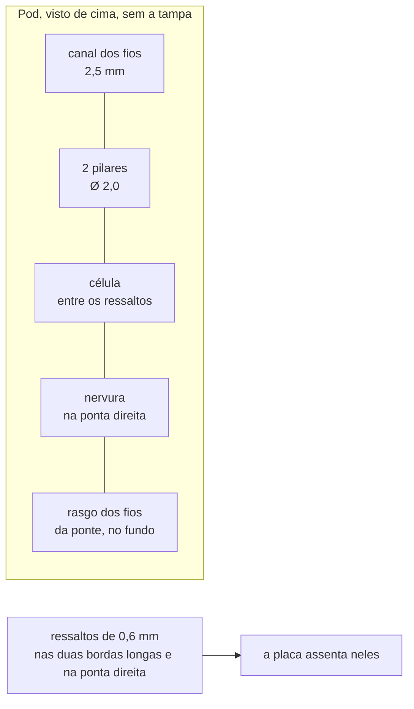
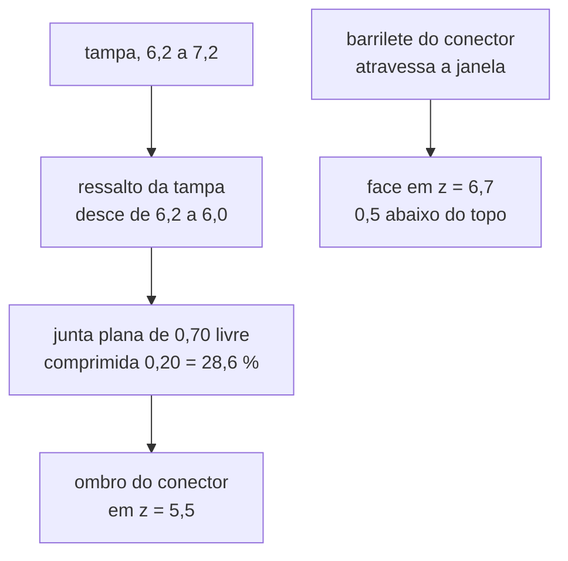

# Pod

O invólucro colado na face interna do braço esquerdo do pedivela: o que
ele segura, como, e o que ainda depende de medir o pedivela do dono. É
desenhado **em volta da placa real** por [`pod/make_pod.py`](pod/make_pod.py)
e medido por [`pod/dry_run_pod.py`](pod/dry_run_pod.py), pela mesma ideia
do case do ciclocomputador: um gerador, um dry run, e nenhum número que
não venha de um documento ou de uma medida.

**Nesta página:** [O envelope](#o-envelope) · [A pilha de alturas](#a-pilha-de-alturas) · [O que segura cada peça](#o-que-segura-cada-peça) · [Os fios da ponte](#os-fios-da-ponte) · [O conector magnético na tampa](#o-conector-magnético-na-tampa) · [Vedação e envase](#vedação-e-envase) · [Massa](#massa) · [As regras do dry run](#as-regras-do-dry-run) · [Medir o sólido, não a constante](#medir-o-sólido-não-a-constante) · [Lugares reservados](#lugares-reservados)

> [!WARNING]
> **Nada foi impresso, colado nem pesado.** Toda medida abaixo sai do
> gerador ou de uma conta feita aqui, e a massa é **estimativa por volume
> e densidade**, não pesagem. As medidas do pedivela são lugares
> reservados: ninguém mediu o braço.

## O envelope

| Medida | Alvo de [`docs/02`](../docs/02-hardware.md#requisitos) | O que o desenho dá | Situação |
|---|---|---|---|
| Comprimento | **38 mm** | **74,5 mm** | **fora**: a placa tem 50 mm ([04](04-placa.md#o-contorno)) e a célula ficou **ao lado** dela |
| Largura | 20 mm | **21,0 mm** | **fora por 1,0**: placa de 16 mais 0,5 de folga e 2,0 de parede de cada lado |
| Altura | 10 mm | **7,2 mm** | dentro, com 2,8 de folga |

As duas medidas que não fecham são consequência direta de duas decisões já
tomadas, e nenhuma delas é um defeito de geometria:

- **O comprimento** é a placa mais a célula ao lado. A decisão do dono em
  2026-09-30 foi tirar a célula de baixo da placa, o que levou a altura de
  10,0 para 7,2 e o comprimento para cá. Encurtar o pod pede encurtar a
  placa ou empilhar a célula de novo.
- **A largura** é a placa de 16 mm mais 0,5 de folga e 2,0 de parede de cada
  lado. A parede é 2,0 porque o sulco do anel O precisa de 1,05 mais 0,5 de
  terra de cada lado (`PD13`); com 1,2 de parede não há vedação por anel O.

O alvo de `docs/02` foi corrigido em 2026-10-01: ele é **38 × 20 × 10**
desde 2026-09-27, e o gerador ainda media contra os 60 que o próprio
documento diz que o projeto deixou de perseguir. A regra `PD10` passou a
medir contra o número certo, e reprova.

### O pod não cola pela face inteira

A face interna do braço não é plana de ponta a ponta: ela tem uma
concordância de cerca de 2,5 mm de cada lado, então dos 20 mm de largura da
classe só **15** são planos. Um pod de 19,0 colado por baixo inteiro
apoiaria nesses raios dos dois lados — cola grossa nas bordas, fina no meio,
e a junta descola de fora para dentro. Por isso o fundo tem uma **base de
colagem de 15 mm** e sobe 1,0 mm fora dela: o pod continua com 19,0 de
largura, porque a placa precisa deles, e a cola só toca metal plano. A regra
`PD17` mede isso.

> [!IMPORTANT]
> **O tamanho do pod e o orçamento de consumo são a mesma decisão, e a
> saída mais óbvia do consumo é a pior para o pod.** O
> [orçamento de consumo](../docs/02-hardware.md#orçamento-de-consumo)
> deixa três saídas para fechar as 50 h pedalando, e elas não custam o
> mesmo aqui:
>
> | Saída do consumo | Efeito no pod |
> |---|---|
> | Extensômetros de **5 kΩ** | **nenhum**: a ponte cai de 3,0 para 0,6 mA e o total pedalando de 3,9 para cerca de 1,5 mA sem tocar na célula |
> | Modo **duty-cycle** do ADS1220 | nenhum: é firmware. Junto com a ponte de 5 kΩ o total cai para **0,68 mA**, e é essa combinação que faz a célula de 81 mAh valer 119 h |
> | Célula de **200 mAh** | **piora**: a célula fica sob a placa, então cresce na altura, que é o número que fechou mais apertado, e provavelmente no comprimento |
>
> Com 0,68 mA a célula de 200 mAh deixou de ser necessária, e é por isso que
> ela não está no desenho.

O que ainda governa cada medida:

- **o comprimento** segue a placa, e leva junto a sala dos dois parafusos
  de fechamento: eles custam 5,4 mm porque a placa toma o meio e cada ponta
  tem de abrigar o seu ressalto;
- **a altura** é a pilha abaixo, e fecha em 10,0 com a célula de 4,0 mm
  **sob** a placa. Pôr a célula **ao lado** estouraria o comprimento: uma de
  23 × 11 ao lado de uma placa de 47 × 14 daria 72 mm de comprimento ou
  27 de largura, os dois bem piores;
- **a largura** é o módulo de rádio mais as paredes. O módulo põe o piso da
  largura da placa, e foi por isso que trocá-lo (12,0 → 10,0 mm de largura)
  levou o pod de 19,4 para 19,0 **mesmo com a parede engordando de 1,2 para
  2,0** por causa do sulco do anel O.

## A pilha de alturas

A placa e a célula ficam **lado a lado**, e não empilhadas: quem fixa a
altura do pod é a pilha da placa, e a célula cabe no mesmo espaço porque a
baía dela é **cavada no piso**.

| Camada | Altura | De onde vem |
|---|---|---|
| Cola ao braço | 0,5 mm | fora do pod; entra só na folga até o quadro |
| Piso | 1,2 mm | fora da base de colagem a face de baixo está em `RELEVO` = 0,5, então o piso ali tem 0,7; sobre a base tem 1,2 |
| Ar sob o verso | 1,5 mm | `cad/make_dxf.TETO_VERSO`: o que as 43 peças do verso pedem |
| Placa | 0,8 mm | [04](04-placa.md#camadas) |
| Teto sobre a placa | 2,7 mm | o módulo **reserva** 2,4 (o anúncio do HOLYIOT-26001-A não dá a altura), mais 0,3 de ar (`cad/make_dxf.TETO_TAMPA`). A regra `PD18` mede a peça contra essa reserva |
| Tampa | 1,0 mm | escolha deste desenho |
| **Total** | **7,2 mm** | com a cola, 7,7 até o braço |

E a baía, ao lado:

| Camada | Altura | De onde vem |
|---|---|---|
| Piso da baía | 0,7 mm | **cavado** 0,5 no piso, para a reserva de inchaço não levantar o teto |
| Célula | 5,0 mm | envelope de 15 × 14 × 5,0, **≥ 81 mAh** |
| Reserva de inchaço | 0,5 mm | 10 % da espessura: uma bolsa de lítio engorda com ciclo e temperatura. Era **0,000 mm**, com igualdade exata, enquanto a `PD2` cobrava 0,30 de ar de toda peça rígida da placa |
| **Total** | **6,2 mm** | que é exatamente o teto da cavidade |

O conector magnético é mais alto que o teto **de propósito**: ele
atravessa a tampa ([abaixo](#o-conector-magnético-na-tampa)), e por isso
está isento da regra do teto tanto na placa (`ME2`) quanto no pod (`PD2`),
com a regra `PD3` medindo-o no lugar.

## O que segura cada peça

- **a placa** assenta em dois ressaltos de 0,6 mm ao longo das bordas
  longas e num terceiro na ponta direita, mais dois pilares de 2,0 mm de
  diâmetro na ponta esquerda — e é **prensada** contra eles por dois dedos
  que descem da tampa, através de uma pastilha de 0,3 mm. Não é só apoio: uma
  cadeia de medida que começa num extensômetro não pode ter a placa se
  mexendo em relação ao braço (`PD15`);
- **a célula** deita no fundo, entre os ressaltos, com 0,5 mm de ar até a
  face de trás da placa, presa por uma nervura logo depois dela e pelo
  envase. A nervura fica **depois do rasgo dos fios da ponte** quando o
  rasgo cai onde ela ficaria, que é o caso desta placa: o `J301` está
  0,2 mm além da ponta da célula, e até 2026-09-28 a nervura saía com
  0,0 mm de largura por causa disso. O envelope reservado é 25 × 15 × 4 mm; a célula exata **não
  está escolhida**, e é ela que tem de caber nele, não o contrário;
- **os fios da célula** sobem pelo canal de 2,5 mm da ponta esquerda,
  dobram sobre a ponta da placa e entram no `J102`, cuja boca olha para
  essa ponta ([06](06-conectores-e-pontos-de-teste.md#j102--célula));
- **a face de trás da placa é plana sob a célula**, e só sob ela. A célula
  cobre 23 dos 47 mm da placa; passados eles o fundo do pod desce — primeiro
  a nervura, com 1,0 mm de ar até a placa, depois o fundo raso, com 2,0. É
  nessa parte que ficam os pontos de teste, o desacoplamento do módulo e o
  dos dois chips do verso (`U302` e `U402`). A regra `PD4` **mede o ar sob
  cada peça** contra o que está embaixo dela; até 2026-09-28 ela reprovava
  qualquer corpo no verso, sem olhar onde, o que é outra coisa.

## Os fios da ponte

Os cinco fios (`E+`, `S+`, `S−`, `E−` e a blindagem) saem das ilhas da
matriz do extensômetro **como feixe**, correm pela face do braço dentro de
uma canaleta do pod, sobem pela perna dela até o **rasgo no fundo** e só ali
se abrem para os cinco furos metalizados do `J301`. Eles chegam à placa
**por baixo** e são soldados nos furos: a solda no furo é o alívio de
tração, que um pad na face de cima não daria sem dobrar o fio pela borda da
placa.

Por que a canaleta existe: a linha de cola tem **0,5 mm** e um fio 30 AWG
com isolação tem o mesmo 0,5. Até 2026-10-01 os fios eram roteados em linha
reta de cada ilha ao seu pad e corriam até **44,83 mm sob fundo colado** —
o pod empenava sobre cinco cordas, ou a junta abria no meio, onde a cadeia
de medição começa. O pod abre agora um **bolso** sobre a matriz (4,0 × 3,7
mais 0,4 de margem) e uma canaleta de 3,5 mm sobre o feixe, as duas com a
profundidade do relevo, e a área colada é o que sobra. A regra `PD25` mede,
coluna por coluna no sólido, que sobra pelo menos 0,15 mm de cola livre
acima de cada fio e da matriz.

O lugar da matriz (`GAUGE_X`, `GAUGE_DESLOC_Y`) mora no `make_pod.py` e o
`make_conjunto.py` o lê de lá: é o **pod** que reserva esse lugar, e os dois
desenhos têm de usar o mesmo número.

A regra `PD7` mede que os cinco furos ficam sobre o rasgo, que o rasgo não
passa da parede e que a beirada de um ressalto não fica mais de 0,4 mm em
balanço sobre ele. O rasgo fica fora da sombra da célula (regra `PD5`).

## O conector magnético na tampa

O requisito de [`docs/02`](../docs/02-hardware.md#requisitos) é literal:
**"IPX7: pod envasado, junta na face do conector"**. Até 2026-10-01 o
desenho fazia outra coisa — uma junta plana de 1,5 mm num anel em volta da
janela, desenhada acima de uma chapa maciça, com a borda interna 0,55 mm
por **fora** do corpo do conector nos quatro lados: ela nunca tocava a
peça, e sobrava um anel aberto de 16,61 mm² da face do conector até a
cavidade, fechado só pelo menisco do envase.

Hoje a porta tem três partes:

| Peça | Medida | De onde vem |
|---|---|---|
| Janela | o **barrilete** mais 0,15 de folga | o barrilete é o corpo menos o ombro de cada lado |
| Ombro | 0,8 mm de largura, 2,0 mm acima da placa | **requisito de compra**, como a altura do módulo: nenhum conector está escolhido |
| Junta | 0,70 de espessura livre, 0,65 de largura útil | a largura útil é o ombro menos a folga da janela |
| Aperto | 0,20 mm, 28,6 % | o ressalto da tampa desce 0,2 abaixo do teto da cavidade |
| Poço | 0,5 mm, limite **0,8** | o curso do pino do cabo magnético, **a conferir no cabo comprado** |

O lábio em volta da janela e o dreno **saíram do projeto**, e por medida: o
lábio ficava 0,40 mm acima do topo da junta e represava água sobre os
contatos, e a soleira do dreno ficava 0,50 mm **acima** do fundo do poço,
com queda zero em 2,65 mm — a água do poço só tinha para onde ir para
dentro. Um canal de dreno numa tampa de 1,0 mm teria de passar abaixo da
face de baixo dela, virando um furo para a cavidade.

A regra `PD3` mede que o barrilete atravessa a janela com folga e que a
face não passa do topo nem fica abaixo do teto; a `PD24` mede, no sólido,
que o ressalto existe e quanto ele comprime; a `PD29` mede que nenhuma
outra abertura da tampa come a pegada da junta.

Sobre o LED há um furo **redondo** de 2,5 mm na tampa, a encher com resina
transparente: o LED fica na placa, sob a tampa, e a luz sai por ali. Ele é
redondo desde 2026-10-01: a chapa recebe um furo quadrado de 2,6 e um anel
entre o quadrado e um polígono de 16 lados devolve o círculo, porque
`placa_com_furos` só sabe furar em retângulo. Antes o furo era um quadrado
de 2,5 × 2,5 = 6,25 mm² onde o PDF desenhava e o texto anunciava um círculo
de 4,91 — 27 % a mais de resina. A `PD9` mede a área **no sólido**.

## Vedação e envase

O requisito é IPX7 ([`docs/02`](../docs/02-hardware.md#requisitos)). A
regra `PD20` não conta vedações: ela enumera os **caminhos de água** e
cobra **duas barreiras em série** em cada um.

| Caminho | Primeira barreira | Segunda |
|---|---|---|
| Pela porta do conector | a junta plana no ombro, comprimida 28,6 % | o envase da cavidade |
| Pela costura concha-tampa | o anel O de 0,80 num sulco de 1,05 × 0,58, 25 % de compressão **medidos no sólido** | a aba da tampa colada por dentro das paredes |
| Pelo rasgo dos fios da ponte | a cola ao braço em volta do rasgo | o colar que represa o envase, em quatro barras |
| Pelo furo de luz do LED | a resina transparente enchendo a espessura da tampa | o envase sob o furo |
| Pelo furo de cada parafuso | a anilha vedante sob a cabeça, comprimida 30 % | a rosca no ressalto, acima do envase |

O **nível do envase** passou a ser um número: ele para 0,4 mm abaixo do
teto da cavidade. Antes não havia nenhum — todo texto dizia "até a face de
baixo da tampa" —, o que punha o menisco rasante à boca dos dois furos
cegos dos parafusos, e um M1,6 autoatarraxante não atarraxa em resina
curada. Pelo mesmo motivo o pescoço do parafuso que atravessa a placa
segue acima dela até passar esse nível.

Nada disso foi provado: não há peça impressa, nem ensaio de imersão.

## Massa

Estimativa por volume e densidade, **nada pesado** (regra `PD11` e página
3 do PDF). As densidades usadas: pod impresso 1,15 g/cm³, envase de
silicone 1,0, FR-4 1,85, célula 2,0, e as peças como sólido a 2,5 sobre
70 % do contorno de ocupação vezes a altura.

O alvo é 20 g com célula ([`docs/02`](../docs/02-hardware.md#requisitos)).
O número que o gerador imprime está em [08](08-dry-run-2026-09-27.md#o-pod);
o que decide se ele fecha é a espessura do envase, que é o maior volume
da conta.

## As regras do dry run

`python hardware_powermeter/pod/dry_run_pod.py` mede o pod contra a placa
colocada e contra os STL que o gerador grava. **Onze delas medem o sólido
desenhado**, não a constante que o gerou. Uma regra que não acha o que
medir **falha dizendo isso**.

| Regra | O que mede |
|---|---|
| PD1 | a placa na cavidade, com a folga e o canal dos fios |
| PD2 | toda peça da frente sob a tampa, com 0,3 mm de ar |
| PD3 | o barrilete do conector atravessando a janela, e a face dele no poço |
| PD4 | o ar sob cada peça da face de trás, **medido no sólido** |
| PD5 | a célula na baía, com a folga do berço e a reserva de inchaço |
| PD6 | **todo metal** contra a área da antena, **nos três eixos**: a célula, o braço de alumínio e os dois parafusos |
| PD7 | o rasgo sob os cinco furos da ponte, dentro do piso |
| PD8 | nenhum pad da face de trás sob um pilar ou um ressalto |
| PD9 | o furo de luz sobre o corpo do LED |
| PD10 | o envelope contra o alvo de `docs/02` (**38 × 20 × 10**) |
| PD11 | a massa estimada contra os 20 g |
| PD12 | a aba da tampa sem bater em peça da borda |
| PD13 | o sulco do anel O, com a **profundidade medida no sólido** |
| PD14 | o que atravessa a placa **medido no sólido**, contra o furo dela e contra a reserva em volta do furo |
| PD15 | retenção da célula e da placa |
| PD16 | nada em pé na face de fora da tampa para represar água |
| PD17 | o pod no braço: largura, base de colagem com margem, pilha cola + pod |
| PD18 | o módulo não é mais alto que o teto reservado |
| PD19 | toda abertura do pod aponta para a vedação que a fecha |
| PD20 | **duas barreiras em série** em cada caminho de água |
| PD21 | **nenhum par de corpos ocupa o mesmo espaço** (voxel de 0,1 mm) |
| PD22 | caminho **contínuo** para um fio de 0,9 da baía até o J102 |
| PD23 | a face de baixo toca o braço só na base de colagem, e o relevo existe |
| PD24 | o ressalto da tampa comprime a junta da porta, medido no sólido |
| PD25 | nem o fio nem a matriz correm dentro da linha de cola |
| PD26 | toda primitiva dos STL é um sólido fechado, sem aresta de borda |
| PD27 | **meta-regra**: nenhuma constante de geometria fica sem uso |
| PD28 | todo furo cego tem a boca acima do envase e proporção viável |
| PD29 | as aberturas da tampa não se comem nem comem a junta |
| PD30 | o assento da placa é mais largo que a folga do pino |
| PD31 | a cabeça do parafuso e a anilha que a veda cabem onde estão |

## Medir o sólido, não a constante

Em 2026-10-01 dez revisores mediram este pod e acharam **sete
interferências** que o impediam de fechar. No mesmo commit, o dry run dizia
que **18 das 20 regras estavam cumpridas**.

A causa era uma só. O desenho é uma sopa de triângulos; a classe `Malha`
não sabia subtrair e não dava para perguntar a ela "este ponto está
dentro?". Então sete regras liam a **constante** que deveria ter gerado a
geometria, e uma regra assim passa com a peça desenhada ou sem ela:
`PARAF_PESCOCO_D = 2,00` estava declarado desde sempre, o ressalto saía em
diâmetro cheio de 3,40 por um furo de 2,20, e nenhuma regra viu.

O que mudou: a `Malha` passou a registrar cada primitiva na **mesma
chamada** que emite os triângulos, e [`medir.py`](pod/medir.py) rasteriza
esse registro numa grade de voxels de 0,1 mm. Como o registro e a malha
saem da mesma chamada, não podem divergir. Dez regras novas medem a
geometria, e cada uma foi **testada por mutação**: o defeito volta ao
gerador e a regra tem de reprovar.

Os sete bloqueantes e o que fechou cada um:

| Bloqueante | O que fechou | Quem mede |
|---|---|---|
| Ressalto de 3,40 num furo de 2,20 | o pescoço de 2,00 passou a ser desenhado | `PD14`, por raio no sólido |
| Aba da tampa 5,565 mm³ dentro da célula e 2,315 nas nervuras | a aba virou quatro barras cortadas em tudo o que sobe na cavidade | `PD21` |
| Os dois fios da célula sem saída (0,000 mm) | passagem de 3,4 cortada nas nervuras e no piso | `PD22`, por conectividade |
| Colar sobre o R302 e o C304 | altura **por barra**, 0,1 abaixo do que passa sobre ela | `PD21` e `PD4` |
| Junta da janela 0,30 enterrada no sólido | junta no ombro do conector, comprimida por um ressalto da tampa | `PD24` |
| Dreno 0,50 acima do fundo do poço | o lábio e o dreno saíram; a vedação é a junta | `PD16` e `PD20` |
| 44,83 mm de fio sob fundo colado | bolso sobre a matriz e canaleta sobre o feixe | `PD25` |

E o relevo da base de colagem, que **acrescentava** duas caixas onde queria
cavar: hoje a concha nasce em `z = RELEVO` e a base é um ressalto desenhado
dentro dela. A `PD23` mede 0,00 mm² de face em z = 0 fora da base, onde
antes havia 445,20.

## Lugares reservados

Estes quatro números **não foram medidos** e o desenho os trata como
tais; a página 3 do PDF os repete com linha para preencher:

| O que | O que o desenho supõe |
|---|---|
| Largura da face interna do braço esquerdo | o pod tem 19,0 mm, e cola por uma base de 15 |
| Folga entre a face interna do braço e o quadro na pedalada | o pod tem 10,5 mm com a cola |
| Raio da concordância entre a face e o corpo do braço | o fundo do pod é plano |
| Distância do eixo do pedivela ao centro do pod | livre; decide onde a ponte é colada ([`docs/06`](../docs/06-medicao-e-calibracao.md)) |

E o conector magnético: enquanto não houver peça escolhida, a janela, o
poço e a altura mudam com ela
([06](06-conectores-e-pontos-de-teste.md#j101--conector-magnético)).
