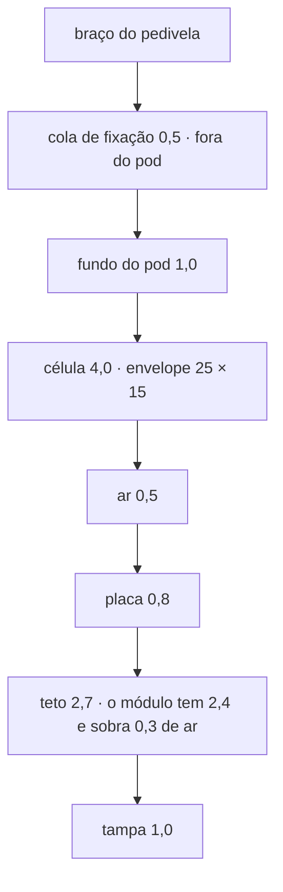
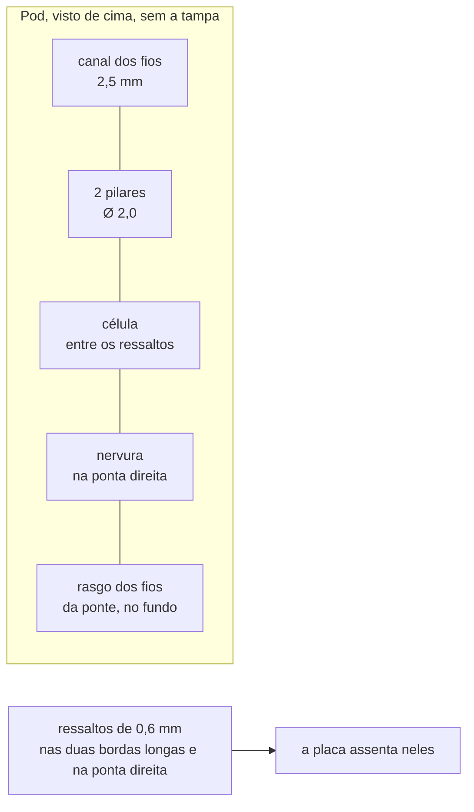

# Pod

O invólucro colado na face interna do braço esquerdo do pedivela: o que
ele segura, como, e o que ainda depende de medir o pedivela do dono. É
desenhado **em volta da placa real** por [`pod/make_pod.py`](pod/make_pod.py)
e medido por [`pod/dry_run_pod.py`](pod/dry_run_pod.py), pela mesma ideia
do case do ciclocomputador: um gerador, um dry run, e nenhum número que
não venha de um documento ou de uma medida.

**Nesta página:** [O envelope](#o-envelope) · [A pilha de alturas](#a-pilha-de-alturas) · [O que segura cada peça](#o-que-segura-cada-peça) · [Os fios da ponte](#os-fios-da-ponte) · [O conector magnético na tampa](#o-conector-magnético-na-tampa) · [Vedação e envase](#vedação-e-envase) · [Massa](#massa) · [As regras do dry run](#as-regras-do-dry-run) · [Lugares reservados](#lugares-reservados)

> [!WARNING]
> **Nada foi impresso, colado nem pesado.** Toda medida abaixo sai do
> gerador ou de uma conta feita aqui, e a massa é **estimativa por volume
> e densidade**, não pesagem. As medidas do pedivela são lugares
> reservados: ninguém mediu o braço.

## O envelope

| Medida | Alvo de [`docs/02`](../docs/02-hardware.md#requisitos) | O que o desenho dá | Situação |
|---|---|---|---|
| Comprimento | 60 mm | **56,4 mm** | dentro: placa de 51 mm ([04](04-placa.md#o-contorno)), mais o canal dos fios da célula (2,5), a folga da ponta direita (0,5) e duas paredes (2,4) |
| Largura | 20 mm | **19,4 mm** | dentro: placa de 16 mais 0,5 de folga e 1,2 de parede de cada lado |
| Altura | 8,5 mm | **8,5 mm** | dentro, e é o número mais caro dos três: só fecha com célula de 2,5 mm de espessura, que só é possível porque os extensômetros de 5 kΩ derrubaram o consumo |

As três medidas passaram a caber em 2026-09-28, e não por desenho novo: a
face de trás da placa passou a carregar o que não precisa ser alcançado
(pontos de teste, o desacoplamento do módulo e o dos dois chips do verso), o
que encolheu a placa de 60 para 51 mm; a célula de 2,5 mm fechou a altura; e
a largura nunca esteve acima.

> [!IMPORTANT]
> **O tamanho do pod e o orçamento de consumo são a mesma decisão, e a
> saída mais óbvia do consumo é a pior para o pod.** O
> [orçamento de consumo](../docs/02-hardware.md#orçamento-de-consumo)
> deixa três saídas para fechar as 50 h pedalando, e elas não custam o
> mesmo aqui:
>
> | Saída do consumo | Efeito no pod |
> |---|---|
> | Extensômetros de **5 kΩ** | **nenhum**: a ponte cai de 3,0 para 0,6 mA e o total pedalando de 3,9 para cerca de 1,5 mA sem tocar na célula. A 1,5 mA, 50 h pedem cerca de 75 mAh, então a faixa da célula pode descer de 100 a 150 para 100 mAh, o que **ajuda** o pod. Quanto, ninguém sabe: nenhuma célula foi escolhida e o envelope de 25 × 15 × 4 cobre a faixa inteira |
> | Modo **duty-cycle** do ADS1220 | nenhum: é firmware |
> | Célula de **200 mAh** | **piora**: a célula fica sob a placa, então cresce na altura, que é o número que fechou mais apertado, e provavelmente no comprimento |
>
> Quem decide o consumo precisa saber disso antes de escolher a célula de
> 200 mAh.

O que ainda governa cada medida:

- **o comprimento** segue a placa, e a placa segue o **roteador**, não o
  colocador: de 48 a 54 mm todas as 56 peças assentam, e o que muda é
  quantos lugares aceitam uma via. Em 48 mm o roteamento parava com 13
  ligações abertas; 51 dá 36 % mais sítios de via
  ([04](04-placa.md#o-contorno) tem a tabela remedida). Encurtar mais quer
  dizer montar peça nos dois lados, e o lado de baixo é onde a célula
  encosta;
- **a altura** é a pilha abaixo, e só fecha em 8,5 com a célula de 2,5 mm
  **sob** a placa. Pôr a célula **ao lado** estouraria o comprimento: uma
  de 25 × 15 ao lado de uma placa de 51 × 16 dá 78 mm de comprimento ou
  35 mm de largura, os dois bem piores;
- **a largura** é o limite do pod, não uma escolha: a face interna do braço
  dá 20 mm, menos duas paredes de 1,2 e duas folgas de 0,5.

## A pilha de alturas

| Camada | Altura | De onde vem |
|---|---|---|
| Cola ao braço | 0,5 mm | fora do pod; entra só na folga até o quadro |
| Fundo | 1,0 mm | escolha deste desenho |
| Célula | 4,0 mm | envelope de uma LiPo de 100 a 150 mAh ([`docs/02`](../docs/02-hardware.md#pod)) |
| Ar sobre a célula | 0,5 mm | a célula incha com a idade |
| Placa | 0,8 mm | [04](04-placa.md#camadas) |
| Teto sobre a placa | 2,7 mm | o módulo ME54BS13 tem 2,4 de altura, mais 0,3 de ar (`cad/make_dxf.TETO_TAMPA`) |
| Tampa | 1,0 mm | escolha deste desenho |
| **Total** | **10,0 mm** | com a cola, 10,5 até o braço |

O conector magnético é mais alto que o teto **de propósito**: ele
atravessa a tampa ([abaixo](#o-conector-magnético-na-tampa)), e por isso
está isento da regra do teto tanto na placa (`ME2`) quanto no pod (`PD2`),
com a regra `PD3` medindo-o no lugar.

## O que segura cada peça

- **a placa** assenta em dois ressaltos de 0,6 mm ao longo das bordas
  longas e num terceiro na ponta direita, mais dois pilares de 2,0 mm de
  diâmetro na ponta esquerda. Não há parafuso: a placa é envasada;
- **a célula** deita no fundo, entre os ressaltos, com 0,5 mm de ar até a
  face de trás da placa, presa por uma nervura logo depois dela e pelo
  envase. A nervura fica **depois do rasgo dos fios da ponte** quando o
  rasgo cai onde ela ficaria, que é o caso desta placa: o `J301` está
  0,2 mm além da ponta da célula, e até 2026-09-28 a nervura saía com
  0,0 mm de largura por causa disso. O envelope reservado é 25 × 15 × 4 mm; a célula exata **não
  está escolhida**, e é ela que tem de caber nele, não o contrário;
- **os fios da célula** sobem pelo canal de 2,5 mm da ponta esquerda,
  dobram sobre a ponta da placa e entram no `J102`, cuja boca olha para
  essa ponta ([06](06-conectores-e-pontos-de-teste.md#j102--célula));
- **a face de trás da placa é plana sob a célula**, e só sob ela. A célula
  cobre 23 dos 48 mm da placa; passados eles o fundo do pod desce — primeiro
  a nervura, com 1,0 mm de ar até a placa, depois o fundo raso, com 2,0. É
  nessa parte que ficam os pontos de teste, o desacoplamento do módulo e o
  dos dois chips do verso (`U302` e `U402`). A regra `PD4` **mede o ar sob
  cada peça** contra o que está embaixo dela; até 2026-09-28 ela reprovava
  qualquer corpo no verso, sem olhar onde, o que é outra coisa.

## Os fios da ponte

Os cinco fios (`E+`, `S+`, `S−`, `E−` e a blindagem) sobem do braço por
um **rasgo no fundo do pod**, desenhado direto sob os cinco furos
metalizados do `J301`, com 0,5 mm de folga em volta deles. Eles chegam à
placa **por baixo** e são soldados nos furos: a solda no furo é o alívio
de tração, que um pad na face de cima não daria sem dobrar o fio pela
borda da placa. A regra `PD7` mede que os cinco furos ficam sobre o rasgo
e que o rasgo não entra nos ressaltos.

O rasgo fica fora da sombra da célula (regra `PD5`), para que o envase
que o fecha não empurre a célula.

## O conector magnético na tampa

A tampa tem uma janela com 0,3 mm de folga em volta do contorno de
ocupação do conector. O conector é mais alto que o teto, então a face
dele fica **num poço**, abaixo do topo da tampa: é onde a cabeça
magnética do cabo assenta, e é o que impede que a peça fique acima da
superfície do pod, onde bateria na perna do ciclista. Em volta do poço
há uma junta plana de 1,5 mm de largura num rebaixo de 0,3.

A regra `PD3` mede as três coisas ao mesmo tempo: a janela cobre o
contorno com a folga, a face do conector não passa do topo da tampa, e
não fica abaixo da face de baixo dela (se ficasse, o cabo não a
alcançaria).

Sobre o LED há um furo de 2,5 mm na tampa, a encher com resina
transparente: o LED fica na placa, sob a tampa, e a luz sai por ali
(regra `PD9`).

## Vedação e envase

O requisito é IPX7 ([`docs/02`](../docs/02-hardware.md#requisitos)). O
desenho fecha isso em três lugares:

| Onde | Como |
|---|---|
| Cavidade | envasada até a face de baixo da tampa, com a placa e a célula dentro |
| Tampa | colada pela aba de 0,8 mm que desce 1,0 mm por dentro das paredes |
| Conector | junta plana em volta do poço, e o corpo do conector envasado por trás |
| Rasgo dos fios | fechado pelo envase, que entra nele |

Nada disso foi provado: não há peça impressa, nem ensaio de imersão.

## Massa

Estimativa por volume e densidade, **nada pesado** (regra `PD11` e página
3 do PDF). As densidades usadas: pod impresso 1,15 g/cm³, envase de
silicone 1,0, FR-4 1,85, célula 2,0, e as peças como sólido a 2,5 sobre
70 % do contorno de ocupação vezes a altura.

O alvo é 20 g com célula ([`docs/02`](../docs/02-hardware.md#requisitos)).
O número que o gerador imprime está em [08](08-dry-run-2026-09-27.md#o-pod);
o que decide se ele fecha é a espessura do envase, que é o maior volume
da conta.

## As regras do dry run

`python hardware_powermeter/pod/dry_run_pod.py` mede o pod contra a placa
colocada. Uma regra que não acha o que medir **falha dizendo isso**.

| Regra | O que mede |
|---|---|
| PD1 | a placa na cavidade, com a folga e o canal dos fios |
| PD2 | toda peça da frente sob a tampa, com 0,3 mm de ar |
| PD3 | a janela, o poço e a face do conector magnético |
| PD4 | o ar sob cada peça da face de trás: contra a célula, a nervura, um pilar ou o fundo |
| PD5 | a célula entre os ressaltos, sob a placa, longe da nervura, dos pilares e do rasgo |
| PD6 | a célula a 5 mm da área da antena do módulo (ficha ME54BS13, 7.4: nada de metal) |
| PD7 | o rasgo sob os cinco furos da ponte, dentro do fundo |
| PD8 | nenhum pad da face de trás sob um pilar ou um ressalto (os pilares deslizam em y até sair de cima dos pads) |
| PD9 | o furo de luz sobre o corpo do LED |
| PD10 | o envelope contra o alvo de `docs/02` |
| PD11 | a massa estimada contra os 20 g |
| PD12 | a aba da tampa sem bater em peça da borda |

## Lugares reservados

Estes quatro números **não foram medidos** e o desenho os trata como
tais; a página 3 do PDF os repete com linha para preencher:

| O que | O que o desenho supõe |
|---|---|
| Largura da face interna do braço esquerdo | o pod tem 19,4 mm |
| Folga entre a face interna do braço e o quadro na pedalada | o pod tem 10,5 mm com a cola |
| Raio da concordância entre a face e o corpo do braço | o fundo do pod é plano |
| Distância do eixo do pedivela ao centro do pod | livre; decide onde a ponte é colada ([`docs/06`](../docs/06-medicao-e-calibracao.md)) |

E o conector magnético: enquanto não houver peça escolhida, a janela, o
poço e a altura mudam com ela
([06](06-conectores-e-pontos-de-teste.md#j101--conector-magnético)).
