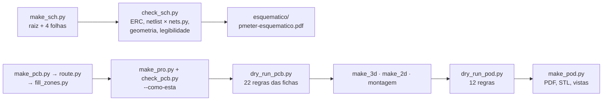

# Dry-run de 2026-09-27: esquemático, placa e pod

O primeiro dry-run do hardware deste projeto, feito no dia em que a cadeia
de CAD do ciclocomputador foi portada para cá. Diz o que foi medido, com
que ferramenta, o que passou, o que não passou e o que ninguém conseguiu
medir.

**Nesta página:** [O que foi medido](#o-que-foi-medido-e-como) · [Esquemático](#esquemático) · [Placa](#placa) · [O pod](#o-pod) · [O que a cadeia aprendeu](#o-que-a-cadeia-aprendeu-hoje) · [O que fica aberto](#o-que-fica-aberto)

> [!WARNING]
> **Nada foi fabricado, montado, impresso nem medido em bancada.** Todo
> número abaixo sai de um arquivo de CAD, de uma ficha de fabricante ou de
> uma conta feita aqui, e diz de qual. A massa do pod é estimativa por
> volume e densidade, não pesagem.

## O que foi medido, e como

| Etapa | Resultado |
|---|---|
| Esquemático | 5 folhas, 57 posições, 45 nós; **o ERC do KiCad não acusa erro** e o netlist bate com `nets.py` pino a pino |
| Legibilidade do PDF | **38 pares de texto sobrepostos**, contra 81 antes das correções de hoje |
| Placa gerada | 57 peças, 45 redes, 2 áreas de regra, 0 furos; nenhuma peça fora da borda, sobre outra ou em área de antena |
| Roteamento | 546 segmentos, 179 vias, **77 das 110 ligações fechadas** |
| DRC completo | **0 erros**, 14 avisos (registro de biblioteca), **34 itens desconectados** |
| Regras das fichas | **13 cumpridas, 6 violadas, 4 sem medida** |
| Pod | **11 regras cumpridas, 1 violada**, massa estimada 17,0 g contra 20 |

## Esquemático

O que passou: o ERC do KiCad sem nenhum erro aceito; os 45 nós do KiCad
iguais aos de `nets.py`; os 12 pinos deixados abertos de propósito
conferidos um a um; nenhum fio por cima de componente, nenhuma peça fora
da folha, nenhuma peça sobre outra; os rótulos hierárquicos batendo com os
pinos dos blocos nas quatro folhas.

**O que não passou: a legibilidade.** O revisor do dono leu as cinco
páginas do PDF e achou um defeito sistemático — campos de referência e de
valor caindo sobre o corpo dos símbolos e sobre os nomes dos pinos, e
rótulos sobrepostos em área densa. Três coisas saíram disso:

1. **Uma regra automática**, que era o pedido principal:
   [`cad/sch_legivel.py`](cad/sch_legivel.py) exporta o PDF e mede as
   palavras que o plotter realmente desenhou. `TX1` reprova dois textos no
   mesmo lugar; `TX2` reprova uma referência ou um valor dentro do corpo
   de um símbolo. O `check_sch.py` roda as duas.
2. **Uma causa medida.** A altura real de um campo de 1,27 mm no PDF é
   **2,43 mm**: a fonte de traço carrega espaço de ascendente e
   descendente, cerca de 0,58 mm de cada lado, e todo afastamento vertical
   do gerador tinha sido calculado como se não carregasse. Era por isso
   que uma referência imprimia sobre o próprio valor.
3. **Duas correções no gerador**: os campos passaram a ser afastados pela
   altura real (`sch_lib.ALT_TXT`), e o espaço entre peças vizinhas dentro
   de um bloco subiu de 3 para 5 passos de grade.

O efeito, medido: **81 pares sobrepostos antes, 38 depois**. O que resta
são nomes de pino colidindo entre si dentro dos CIs mais densos e rótulos
vizinhos na prateleira de rótulos. **Fica aberto**, e a regra impede que
seja esquecido.

## Placa

### O que passou

| Regra | O que mede | Resultado |
|---|---|---|
| RF1, RF3, RF4 | área da antena livre, 5 mm em volta, placa vazada sob ela | cumpridas |
| RF9 | 20 mm do módulo à fonte chaveada | cumprida |
| AL2 | largura por corrente (IPC-2221B) | nenhum trecho abaixo |
| AL5 | filtro pi no pino de alimentação do módulo | montado como `C203 \| FB201 \| C201+C202` |
| AL6 | nenhuma via sob pad térmico | cumprida |
| GN1 | pads de terra ligados | cumprida |
| ME2 | peças da frente sob o teto, face de trás plana | cumprida |
| ME3 | corpo cotado na ficha cabe no footprint | cumprida |
| **ME7** | **land pattern do módulo contra um desenho independente** | **80 pads, desvio máximo 0,000 mm** |

O ME7 é novo de hoje e responde uma ressalva que existia desde o começo: a
ficha do ME54BS13 não traz land pattern oficial. A comparação com um
desenho de terceiros do mesmo módulo fecha em zero
([04](04-placa.md#o-land-pattern-do-módulo)).

### O que não passou

| Regra | O que foi medido | Gravidade |
|---|---|---|
| **RT1** | **34 itens desconectados** em 24 redes; 77 das 110 ligações fechadas | **impede fabricar** |
| **AL1** | **10 de 19 capacitores** além do limite da ficha; o pior, `C308`, a **18,7 mm** do `U302` que ele desacopla | grave |
| **AN2** | filtro da ponte longe dos pinos do conversor: `R301` a 9,4 mm, `R302` a 10,7 | grave: é a entrada de 24 bits |
| AN1 | `U302` a 4,4 mm do módulo, contra os 5 deste projeto | média |
| GN2 | maior vão na costura de terra da borda: 5,3 mm contra 5 | baixa |
| ME1 | a placa passa 1,2 mm de cada ponta do envelope alvo do pod | é a decisão de tamanho de [07](07-pod.md#o-envelope) |

**AL1 e AN2 têm a mesma causa**, e ela é um defeito da colocação, não do
desenho: quando o anel em volta de um CI não tem posição livre,
`make_pcb.encostar()` cai num plano B que empurra a peça para longe em vez
de falhar dizendo que não coube. É exatamente a armadilha que o projeto já
conhece em outra forma — *uma regra que não acha o que medir tem de falhar
dizendo isso* — e é o primeiro conserto da próxima rodada.

### Não medido aqui

`RF2` (o lado de RF virado para a borda) é medido por
[`cad/orientacao.py`](cad/orientacao.py), que passa; `AL3` (o laço de
chaveamento) precisa de bancada; `ME4` e `ME5` precisam de um STEP de
fabricante, e nenhuma peça desta placa tem um.

## O pod

Envelope **65,4 × 19,4 × 10,5 mm**, massa estimada **17,0 g** contra os
20 g do requisito.

| Regra | Resultado |
|---|---|
| PD1 | placa de 60 × 16 na cavidade de 63 × 17, com o canal de 2,5 mm dos fios da célula |
| PD2 | a peça mais alta sob a tampa é o `J102` com 2,9 mm; o teto está a 3,2 e sobram 0,3 de ar |
| PD3 | o conector atravessa a janela e a face dele fica 1,0 mm abaixo do topo da tampa |
| PD4 | face de trás plana: 7 peças, todas pads |
| PD5 | célula de 23 × 15 × 4 entre os ressaltos, 0,5 sob a placa, 1,4 do rasgo |
| PD6 | célula a 30 mm da área da antena |
| PD7 | os cinco furos da ponte sobre o rasgo de 10,3 × 2,3 mm |
| PD8 | nenhum pad da face de trás sob pilar ou ressalto |
| PD9 | furo de luz de 2,5 mm sobre o LED |
| **PD10** | **fora do envelope alvo**: 65,4 contra 60 de comprimento, 10,5 contra 8,5 de altura |
| PD11 | 17,0 g estimados contra 20 |
| PD12 | a aba da tampa não bate em peça nenhuma |

O dry-run do pod mudou quatro coisas do desenho no mesmo dia, todas por
medida e não por gosto:

- **o teto subiu de 2,7 para 3,2 mm**: quem o fixa é o conector da célula
  (2,90 mm), não o módulo (2,40). Isso virou também um **requisito sobre o
  conector magnético**, que tem de ter pelo menos 3,2 mm para alcançar a
  tampa ([06](06-conectores-e-pontos-de-teste.md#j101--conector-magnético));
- **a célula encolheu de 25 para 23 mm** de comprimento: ela tem de acabar
  antes do rasgo dos fios da ponte, e entre os pilares e o rasgo sobram
  23 mm;
- **a aba da tampa afinou** de 0,8 para 0,4 mm: a 0,95 do total ela descia
  sobre o corpo do módulo;
- **o rasgo estreitou** 0,1 mm: a 0,5 de folga ele entrava sob o ressalto
  em que a placa assenta.

`PD10` é a única regra que continua reprovando, e ela é uma **decisão do
dono**, não um defeito: o pod só chega a 8,5 mm de altura com a célula ao
lado da placa, e aí o comprimento piora muito mais
([07](07-pod.md#o-envelope) tem as contas e o cruzamento com o orçamento
de consumo).

## O que a cadeia aprendeu hoje

Cinco armadilhas medidas, todas registradas no `CLAUDE.md`:

1. **O KiCad reescreve o `.kicad_pro`** com os padrões dele sempre que
   abre o projeto. Um DRC rodado depois disso mede a placa contra
   isolamento de 0,2 mm e via mínima de 0,5: deu 722 erros que não
   existiam. `make_pro.py` antes de cada DRC.
2. **A altura real de um texto de 1,27 mm no PDF é 2,43 mm.**
3. **Uma via da mesma rede podia pousar dentro de um furo metalizado**,
   porque o mapa de vias só recusava rede diferente. Oito costuras de
   terra caíram dentro dos furos da ponte.
4. **A isolação reservada em volta de um pad, de uma trilha e de uma via**
   tem de ser a da trilha mais larga que pode passar ali, não a da mais
   estreita.
5. **Folga de contorno de ocupação maior não é melhor**: 0,30 mm entre
   contornos, tentada para abrir canal de roteamento, apertou o anel do
   desacoplamento, o plano B da colocação disparou e doze capacitores
   saíram do limite. Voltou para 0,05.

## O que fica aberto

| O que | Onde |
|---|---|
| 34 ligações sem cobre | [04](04-placa.md#roteamento) |
| O plano B da colocação, que espalha desacoplamento em vez de falhar | [04](04-placa.md#o-que-falta) |
| 38 pares de texto sobrepostos no esquemático | [esquemático](#esquemático) |
| O tamanho do pod contra o alvo, cruzado com o orçamento de consumo | [07](07-pod.md#o-envelope) |
| O fornecedor do conector magnético, agora com altura mínima de 3,2 mm | [06](06-conectores-e-pontos-de-teste.md#j101--conector-magnético) |
| O espelhamento do mapa de pads do módulo, num módulo real | [04](04-placa.md#o-land-pattern-do-módulo) |
| As medidas do pedivela do dono | [07](07-pod.md#lugares-reservados) |
