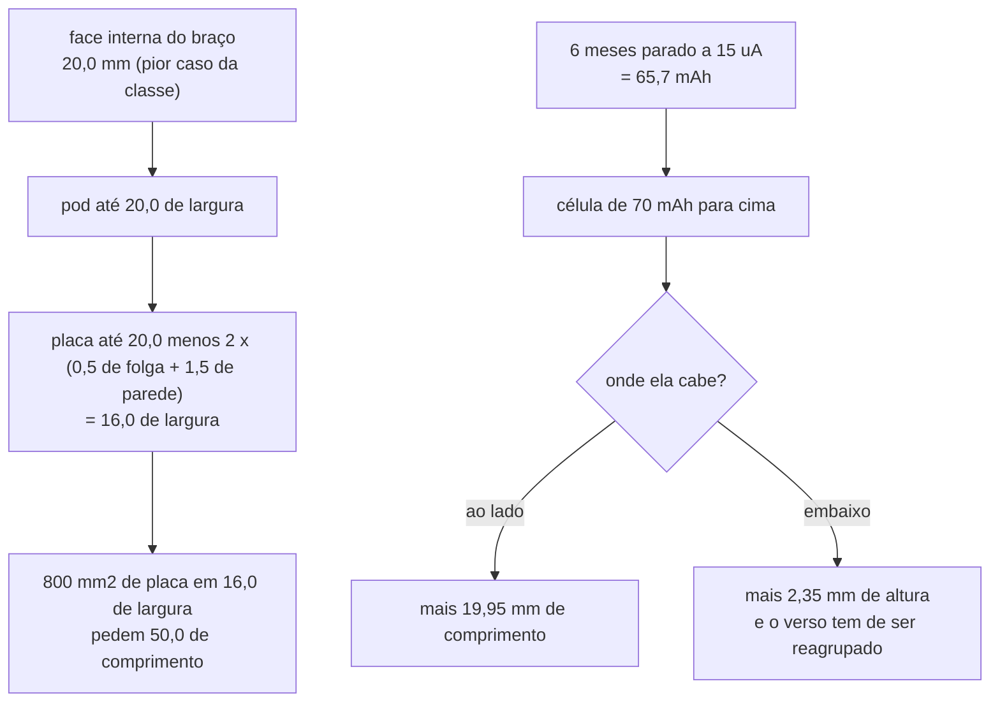

# A classe medida: 4iiii Precision 3+ e U2e V4 contra o nosso

Comparação do aparelho deste projeto com os dois produtos que o dono apontou
como referência, **pelo que os fabricantes publicam**, lida em 2026-10-01. E
a conta de quanto do nosso excesso de comprimento e de altura é escolha e
quanto é consequência da lista de peças.

**Nesta página:** [O que eles publicam](#o-que-eles-publicam) · [Comprimento](#comprimento-7445-mm-contra-cerca-de-38) · [Altura](#altura-720-mm-contra-550) · [Autonomia](#autonomia-119-h-contra-800) · [O que caberia no alvo](#o-que-caberia-no-alvo-de-38--20) · [Apple Find My e Samsung Find](#apple-find-my-e-samsung-find) · [O que decidir](#o-que-decidir)

> [!WARNING]
> **Nenhum dos dois publica as três dimensões.** O 4iiii publica massa e
> "profile"; o U2e publica massa e mais nada de geometria. O comprimento e a
> largura da classe nesta página são a **fotogrametria de 2026-09-27**
> ([`docs/01`](../docs/01-visao-geral.md#o-envelope-da-classe-medido-por-fotogrametria)),
> medida em foto de imprensa com o braço de 170 mm como régua — não é
> paquímetro. E os números do nosso aparelho são de gerador, não de peça:
> **nada foi impresso, montado nem pesado.**

## O que eles publicam

| | **4iiii Precision 3+** | **U2e V4** | **Nosso** |
|---|---|---|---|
| Massa | **9 g** | **20 g** | 14,2 g (estimada) |
| Perfil / altura | **5,5 mm** | não publica | 7,2 mm (8,65 nos parafusos) |
| Comprimento | não publica (**37 a 39** por fotogrametria) | não publica | **74,45 mm** |
| Largura | não publica (**18 a 22** por fotogrametria) | não publica | 21,0 mm |
| Bateria | **CR2032** | Li-Po recarregável | Li-Po ~81 mAh |
| Carga | troca a pilha | **USB magnético** | conector magnético de 6 pinos |
| Autonomia | **até 800 h** | **máximo de 52 h** | 119 h (projeto) |
| Precisão | **± 1 %** | ± 2,5 % | ± 2 % (meta da fase 1) |
| Potência | 0 a 4.000 W | 0 a 2.000 W | 0 a 2.000 W |
| Cadência | 30 a 170 rpm | 10 a 200 rpm | 10 a 200 rpm |
| Temperatura | 0 a 50 °C | −5 a +50 °C | −10 a +50 °C |
| Estanqueidade | IPx7 | IPX7 | IPX7 (meta) |
| Rádio | ANT+ e Bluetooth | ANT+ e Bluetooth LE | ANT+ e BLE |
| Rastreio | **Apple Find My** | não publica | não |

Fontes: [4iiii Precision 3+](https://shop-uk.4iiii.com/products/left-side-precision-3-plus-powermeter-ride-ready)
e [U2e V4](https://u2e.com.br/v4/), lidas em 2026-10-01.

**A leitura que importa:** os dois não são o mesmo produto. O **U2e V4 é o
nosso par** — Li-Po recarregável, carga por conector magnético, ANT+ e BLE —,
e por todo número publicado o nosso desenho está à frente dele: **5,8 g mais
leve, 2,3× mais autonomia e 0,5 ponto melhor de precisão**. O **4iiii é outra
arquitetura**: pilha-botão trocável, sem circuito de carga, sem conector de
dados. É contra ele que perdemos, e as três perdas têm causa medida.

## Comprimento: 74,45 mm contra cerca de 38

A parcela, medida no gerador:

| Parcela | mm |
|---|---|
| parede | 2,00 |
| folga do berço | 0,25 |
| célula | 15,00 |
| folga lateral da célula | 0,50 |
| canal dos fios | 2,50 |
| sala do parafuso esquerdo | 1,70 |
| **placa** | **50,00** |
| folga da placa | 0,50 |
| parede | 2,00 |
| **total** | **74,45** |

Metade do excesso é a **célula ao lado** (19,95 mm) e metade é a **forma da
placa**. E a forma é o ponto, porque a área não é:

| | área da placa | formato |
|---|---|---|
| Nosso | 50 × 16 = **800 mm²** | 3,1 : 1 |
| Classe (fotogrametria) | ~38 × 20 = **760 mm²** | 1,9 : 1 |

**Usamos a mesma área que a classe, numa forma pior.** A ocupação medida é de
**325 mm² na frente (41 %) e 75 mm² no verso (9 %)** sobre 59 peças: não há
gordura para cortar, há uma proporção a mudar. As três peças que mandam no
comprimento são, medidas em x:

| Peça | mm em x | área |
|---|---|---|
| `U201`, módulo de rádio | 37,00 a 50,00 (**13,0**) | 136,5 mm² |
| `J301`, conector da ponte | 20,75 a 31,25 (10,5) | 22,1 mm² |
| `J101`, conector magnético | 19,25 a 28,75 (9,5) | 52,2 mm² |

## Altura: 7,20 mm contra 5,50

| Camada | mm | Quem a fixa |
|---|---|---|
| piso | 1,20 | o relevo da base de colagem precisa de 0,5, e sobra 0,7 de piso |
| ar do verso | 1,50 | os 43 passivos que foram para o verso **para encurtar a placa** |
| placa | 0,80 | 4 camadas |
| teto | 2,70 | o **módulo de rádio**: 2,40 de peça mais 0,30 de ar |
| tampa | 1,00 | |
| **total** | **7,20** | mais 1,45 nos dois parafusos, com a cabeça e a anilha |

Os 5,5 mm do 4iiii não cabem nesta pilha por dois motivos estruturais: eles
**não usam módulo de rádio** (um SoC nu com antena na placa custa cerca de
1,0 mm, não 2,7) e a pilha-botão de 3,2 mm é a própria tampa do aparelho —
eles vendem a portinhola da bateria como peça de reposição, o que diz que a
vedação deles é uma junta de face na portinhola, não um anel O em sulco de
parede como o nosso.

**O módulo e o anel O custam, juntos, cerca de 2,7 mm de altura e 4,0 mm de
largura.** Os dois foram decisão sua, e os dois compram coisas reais:
certificação de rádio pronta e uma vedação que não depende de uma peça
moldada.

## Autonomia: 119 h contra 800

Duas causas, e as duas são multiplicativas:

| | 4iiii | Nosso | Razão |
|---|---|---|---|
| Volume da célula | 1.005 mm³ (CR2032) | 1.050 mm³ | 1,0× |
| Carga | 225 mAh | 81 mAh | **2,8×** |
| **Densidade** | **0,224 mAh/mm³** | **0,077 mAh/mm³** | **2,9×** |
| Consumo médio | 0,28 mA (225 / 800) | 0,68 mA | **2,4×** |
| **Autonomia** | **800 h** | **119 h** | **6,7×** |

A densidade é o número que surpreende: **no mesmo volume, a pilha-botão tem
quase três vezes a carga da bolsa de LiPo.** Uma bolsa pequena gasta uma
fração grande do envelope com invólucro, abas e o circuito de proteção; uma
CR2032 é quase só química. Trocar de química não é opção — a CR2032 não
recarrega —, mas o número explica por que nenhuma célula que caiba neste pod
chega perto das 800 h.

O consumo é o outro lado, e ali há o que fazer: **a ponte de 5 kΩ sozinha é
0,6 dos nossos 0,68 mA, 88 % do orçamento**
([`docs/02`](../docs/02-hardware.md#orçamento-de-consumo)). Um aparelho de
0,28 mA com ± 1 % de precisão ou usa ponte de resistência bem mais alta, ou
excita em janelas bem mais curtas que a conversão inteira — e essa segunda
saída o nosso ADS1220 não dá, porque o filtro digital dele integra a
conversão toda (SBAS501D, 8.3.6). É o ponto onde a classe tem engenharia que
não está no nosso desenho.

## O que caberia no alvo de 38 × 20

O alvo de [`docs/02`](../docs/02-hardware.md#requisitos) é **38 × 20 × 10**.
Com parede de 2,0 e folga de 0,5, o pod é sempre `placa + 5,0` em largura e
`placa + 5,0` em comprimento (fora a célula). Então o alvo dá uma placa de
**33 × 15 = 495 mm²** — e nós precisamos de **800**.

**O alvo de 38 × 20 não é alcançável com esta lista de peças numa placa só e
com vedação por anel O.** As saídas, cada uma com o custo medido:

| Saída | O que dá | O que custa |
|---|---|---|
| **A. Mudar a proporção** da placa para ~36 × 20, com a célula embaixo numa bolsa de 3,0 mm (20 × 18 = 1.080 mm³ ≈ 83 mAh, a mesma carga) | pod de **41 × 25 × 9,2** | o comprimento fecha, a **largura vai a 25**: pior que hoje, e passa do braço |
| **B. Parede fina** (1,0 a 1,2) com junta de face na tampa, como a portinhola do 4iiii, no lugar do anel O em sulco | pod = placa + 2,5 → placa de 17,5 num pod de 20 | a 800 mm² isso dá **46 mm** de comprimento: melhora 28 mm, não chega a 38 |
| **C. Tirar carga e dados** (CR2032, sem `J101`, sem nPM1100, sem medidor de carga, sem USB) | solta ~110 mm² de placa e 2,8× de carga | reverte a decisão do dono de 2026-09-27: acaba o USB e o SWD pelo cabo, e o aparelho deixa de ser gravável sem abrir |
| **D. Duas placas empilhadas** | 2 × 400 mm² = 33 × 15 cada | altura vai a **11,5**: estoura os 10 |
| **E. Rever o alvo** para ~46 × 21 × 8 | é o que B entrega | o aparelho fica 20 % mais comprido que a classe |

A combinação **B + A** — parede fina e placa mais quadrada — é a única que
não troca capacidade por tamanho, e ela chega a cerca de **46 × 21**. Para ir
além disso é preciso tirar função.

## A fundo: o que prende o comprimento

Pedido do dono em 2026-10-01: analisar a fundo os itens 1 (o alvo de
envelope) e 2 (a parede de 2,0 mm). O item 2 está **feito** e vem no fim
desta seção; o item 1 é esta análise.

### A cadeia de restrições, medida



**A placa já está no limite da largura.** Com a parede em 1,5 mm (item 2,
feito), uma placa de 16,0 é exatamente o que cabe num pod de 20,0. Não há como
alargá-la para encurtá-la sem passar do braço.

### As peças cabem em 31 mm; a placa tem 50

Empacotando os contornos de ocupação reais por prateleiras numa tira de
16,0 mm, com 0,25 de folga entre vizinhos:

| Face | Peças | Courtyard | Empacota em | Ocupação |
|---|---|---|---|---|
| Frente | 15 | 325 mm² | **31,0 × 16,0** | 66 % |
| Verso | 36 | 75 mm² | 7,1 × 16,0 | 65 % |

Hoje a placa é **50 × 16**, com **41 % de ocupação na frente**. Os 19 mm entre
os 31 do empacotamento e os 50 de hoje **não são peças**: são colocação,
roteamento, a área livre da antena e as peças que têm de ficar onde estão (o
`J301` sobre o rasgo, o `J101` na borda). O empacotamento é um **piso**, não um
alvo — ele não roteia nada —, mas prova que o comprimento de hoje é escolha de
colocação, e não necessidade da lista de peças.

### A célula é o que decide, e o requisito que manda não é o que parece

| Requisito | Carga que ele pede |
|---|---|
| ≥ 50 h pedalando a 0,68 mA | **34 mAh** |
| **≥ 6 meses parado a 15 µA** | **65,7 mAh** |

**É a guarda que manda, não a pedalada.** Com os 81 mAh de hoje são 7,4 meses,
23 % de folga; abaixo de ~70 mAh a guarda de 6 meses deixa de fechar sem o ship
mode, que depende de o dono acionar. Esse é o piso da célula.

### Por que a célula não cabe embaixo da placa como ela está hoje

O verso está **16 % ocupado** — 84 % livre — e mesmo assim **não cabe célula
nenhuma lá**: as 43 peças e as ilhas estão **espalhadas**, e o maior retângulo
livre mede **40,5 × 2,5 mm**. Uma célula de 3,5 mm ali daria 354 mm³, ou seja
**27 mAh**: um terço do piso.

Isso é achado de colocação, não de área. As 36 peças do verso com corpo
empacotam em **7,1 × 16 mm**; agrupadas numa faixa, elas liberariam um bolso de
cerca de 18 × 14 para a célula — à esquerda ou à direita do rasgo da ponte, que
corta o verso ao meio, em x 21,4 a 31,7.

### As três configurações, medidas

| | Comprimento | Largura | Altura | Célula | Autonomia |
|---|---|---|---|---|---|
| **Hoje** (célula ao lado) | **73,45** | 20,0 | 7,20 | 15 × 14 × 5,0 ≈ 81 mAh | 119 h / 7,4 meses |
| **Célula embaixo**, verso reagrupado, placa como está | **54,0** | 20,0 | 9,55 | ~18 × 14 × 3,5 ≈ 70 a 84 mAh | 103 a 123 h / 6,4 a 7,7 meses |
| **Célula embaixo + placa recolocada** em ~35 × 16 | **39,0** | 20,0 | 9,55 | ~15 × 14 × 3,5 ≈ 57 a 70 mAh | 84 a 103 h / **5,2 a 6,4 meses** |

A altura com a célula embaixo é `1,2 + 1,1 × espessura + 0,8 + 2,7 + 1,0`; com
3,5 mm dá 9,55 e com 3,9 dá 9,99 — o teto de 10 mm é o que limita a espessura
da célula a **3,9 mm**.

**A leitura:** o alvo de 38 mm é alcançável, mas a 39 mm a guarda de 6 meses
fica no fio ou abaixo dele, **dependendo da densidade real da célula comprada**.
E ele custa duas coisas que não são pequenas: **2,35 mm de altura** e uma
**recolocação completa da placa**, com o roteamento refeito — o que acabou de
fechar com 0 erros.

### O que é barato e o que é caro

| Mudança | Ganho | Custo |
|---|---|---|
| **Parede 2,0 → 1,5** (item 2, **feito**) | largura 21,0 → **20,0**, massa 14,2 → 13,4 g | cordão de anel O de 0,60, requisito de compra |
| Célula embaixo, verso reagrupado | comprimento **73,5 → 54,0** | +2,35 mm de altura, recolocação do verso, re-roteamento parcial |
| Recolocar a placa para ~35 × 16 | comprimento **54,0 → 39,0** | recolocação completa e re-roteamento; guarda de 6 meses no limite |

## O item 2, feito: a parede sai da vedação

A parede era 2,0 mm porque o sulco do anel O precisa de 1,05 de sulco mais 0,5
de terra de cada lado. Mas a parede estava escrita como número solto, e o sulco
também: **ninguém tinha ligado um ao outro**, e a parede ficou em 2,0 depois que
o cordão já podia ser menor.

Agora ela **sai** da vedação:

```
JUNTA_CORDAO  = 0,60                      requisito de compra
JUNTA_SULCO_L = 1,30 x cordão = 0,78      largura usual de sulco de face
JUNTA_SULCO_P = 0,75 x cordão = 0,45      25 % de compressão
JUNTA_TERRA   = 0,36                      terra de cada lado (a PD13 pede 0,35)
PAREDE        = 0,78 + 2 x 0,36 = 1,50
```

| | Antes | Depois |
|---|---|---|
| Cordão | 0,80 | **0,60** |
| Parede | 2,00 | **1,50** |
| Largura do pod | 21,00 | **20,00** |
| Comprimento | 74,45 | 73,45 |
| Massa estimada | 14,2 g | **13,4 g** |
| Compressão do anel, medida no sólido | 25,0 % | **23,3 %** |
| `PD17`, largura contra o braço | **reprovava** | **cumpre** |

O cordão de 0,60 é **requisito de compra**: ele existe nas séries de anel O em
miniatura, mas não é item de prateleira como o de 1,0. **Se não for
encontrado**, a saída é junta de face na tampa com parede de 1,2 — selo pior
(não é captivo, extruda) e 0,6 mm a mais de folga.

A `PD13` passou a medir o sulco numa **janela com grade de 0,02 mm**: com os
0,1 mm da grade do pod inteiro, um sulco de 0,45 saía medido como 0,50 — meio
voxel de viés — e a compressão calculada dava 16,7 % num sulco que o desenho faz
em 25,0 %.

## A célula: o levantamento nas lojas e o que comprar

### O `401125` não serve mais

O `401125` — 4,0 × 11 × **25** mm — era a célula indicada para a case antiga,
quando ela ficava **sob** a placa e o pod tinha 55,7 mm. Com a célula ao lado,
a baía passou a ser **15 × 14 × 5,0**, e o lado de 25 mm não entra em nenhuma
das duas direções dela.

E aceitá-lo seria um mau negócio mesmo que coubesse:

| | Volume | Carga (0,077 a 0,095) | Comprimento do pod |
|---|---|---|---|
| Baía de hoje, cheia | 1.050 mm³ | 81 a 100 mAh | **73,45** |
| `401125`, com a baía alongada para 25 | 1.100 mm³ | 85 a 104 mAh | **83,45** |

**+5 % de carga por +10 mm de pod.** O lado de 25 mm só cabe ao longo do
comprimento, e cada milímetro ali é um milímetro do aparelho.

### O que cabe na baía de hoje

Códigos `espessura·largura·comprimento`, medidos contra os 15 × 14 × 5,0:

| Código | mm | Volume | 0,077 | 0,095 | Cabe? |
|---|---|---|---|---|---|
| **`501415`** | 5,0 × 14 × 15 | 1.050 mm³ | **81** | **100** | **sim, é a baía inteira** |
| **`501414`** | 5,0 × 14 × 14 | 980 mm³ | **75** | 93 | **sim** |
| `501215` | 5,0 × 12 × 15 | 900 mm³ | 69 | 86 | sim, no fio do piso |
| `401415` | 4,0 × 14 × 15 | 840 mm³ | 65 | 80 | sim, mas **abaixo do piso** a 0,077 |
| `401214` | 4,0 × 12 × 14 | 672 mm³ | 52 | 64 | sim, e **não fecha a guarda** |
| `401125` | 4,0 × 11 × 25 | 1.100 mm³ | 85 | 104 | **não**: o lado de 25 |
| `401123` | 4,0 × 11 × 23 | 1.012 mm³ | 78 | 96 | **não**: o lado de 23 |
| `351418` | 3,5 × 14 × 18 | 882 mm³ | 68 | 84 | **não** na baía; serve se a célula for para baixo |

Contra o piso de **65,7 mAh** (a guarda de 6 meses a 15 µA), e com a densidade
conservadora de 0,077, só **`501415` e `501414`** fecham com folga. Esses dois
são o alvo de compra.

### O levantamento: seis lojas lidas, nenhuma tem

Em 2026-10-01, com o catálogo aberto e lido:

| Loja | O que ela tem de lítio | Bolsa LiPo pequena? |
|---|---|---|
| [Curto Circuito](https://curtocircuito.com.br/acessorios/pilhas-e-baterias) | CR2032, 9 V, suportes | **não** |
| [Usinainfo](https://www.usinainfo.com.br/baterias-699) | CR2025/2016/2430/1620/1616/1025, 18650, 9 V | **não** |
| [Baú da Eletrônica](https://www.baudaeletronica.com.br/acessorios/pilhas-e-baterias) | CR2025, 9 V, suportes, TP4056 | **não** |
| [Huinfinito](https://www.huinfinito.com.br/11-baterias-acessorios) | 18650, 9 V recarregável, pilhas | **não** |
| [Eletrogate](https://www.eletrogate.com/baterias-e-pilhas) | CR2032 (220 mAh, R$ 1,60), CR2025, 9 V | **não** |
| [Vida de Silício](https://vidadesilicio.com.br/categoria/prototipagem-e-ferramentas/alimentacao/pilhas-e-baterias/) | 9 V, suportes | **não** |

E mais duas que **não serviram catálogo** a esta máquina: MakerHero
(ex-FilipeFlop) e Solda Fria com 403/404, Mercado Livre com 403 tanto na busca
quanto na API pública. É o mesmo resultado de 2026-09-28.

**A conclusão é um fato de mercado, não uma falha da busca:** o varejo
brasileiro de eletrônica estoca pilha-botão, 18650 e 9 V, e **não estoca bolsa
LiPo de 100 mAh**. Quem as vende aqui são os anunciantes de marketplace
(Mercado Livre, Shopee) e os importadores — e é por ali, ou por importação
direta, que a `501415` vai ser comprada. O código de tamanho é o termo de busca.

### A especificação de compra

| Requisito | Valor | De onde vem |
|---|---|---|
| Química | LiPo de bolsa, com **fios soldados e PCM integrado** | não há espaço na placa para proteção discreta |
| Carga | **≥ 70 mAh**, e ≥ 81 preferível | 65,7 mAh é a guarda de 6 meses a 15 µA |
| Envelope, arranjo de hoje | **15 × 14 × 5,0 mm** máximo — `501415` ou `501414` | a baía ao lado da placa |
| Envelope, se a célula for para baixo | **18 × 14 × 3,5 mm** máximo — `351418` | o bolso que o verso reagrupado libera; 3,9 é o teto absoluto pela altura |
| Tensão | 3,7 V nominal | nPM1100 |
| Temperatura | −10 a +50 °C | o requisito do aparelho |

### De lambuja: a pilha-botão que caberia

Com a parede em 1,5 a cavidade tem **17,0 mm** de largura, e isso decide quais
pilhas-botão entram:

| | Diâmetro × altura | Típico | Cabe na cavidade? | Pedalando |
|---|---|---|---|---|
| CR2032 | 20,0 × 3,2 | 220 mAh | **não**: 20,0 contra 17,0 | — |
| CR2025 | 20,0 × 2,5 | 160 mAh | **não** | — |
| **CR1632** | 16,0 × 3,2 | 140 mAh | **sim** | **206 h** |
| CR1620 | 16,0 × 2,0 | 75 mAh | sim | 110 h |
| CR1220 | 12,5 × 2,0 | 40 mAh | sim | 59 h |

Uma CR1632 daria **206 h contra as 119 h de hoje**, custaria quase nada e está
em qualquer prateleira — mas acaba com a recarga, e com ela o conector
magnético, o USB e o SWD pelo cabo, que foi **decisão do dono em 2026-09-27**.
Fica registrado como medida, não como proposta. E note que o 4iiii usa
justamente uma CR2032 — que no nosso pod **não caberia**, porque ele é mais
estreito que o deles.

> [!WARNING]
> **A densidade de energia deste projeto pode estar conservadora.** Os
> documentos usam **0,077 mAh/mm³**, e as bolsas de varejo costumam ficar entre
> 0,09 e 0,10. Se for 0,095, a baía de hoje vale **100 mAh** em vez de 81, e a
> guarda vai de 7,4 para 9,1 meses. **Isto não foi conferido em ficha de
> fabricante**, e é a primeira coisa a conferir quando uma célula real for
> escolhida: ela muda o piso de tamanho de toda a análise acima.

## Apple Find My e Samsung Find

> [!IMPORTANT]
> **Esta seção não pôde ser conferida em fonte primária nesta sessão** — o
> orçamento de busca da sessão acabou antes dela. O que o 4iiii publica
> (que o Precision 3+ tem Apple Find My) está conferido; o resto é o que eu
> sei do programa e **precisa ser lido na documentação da Apple e do Google
> antes de virar decisão**.

### O que o 4iiii mostra

O Precision 3+ anuncia **Apple Find My** na própria página de produto. Isso
prova que o caminho está aberto para fabricante pequeno — e que ele passa
pelo programa **MFi** da Apple, porque usar a rede Find My e o nome dela num
produto exige licença e certificação. Não é uma biblioteca que se baixa.

### Como funciona, e o que ele pede do nosso aparelho

O acessório anuncia por BLE uma **chave pública que gira**; qualquer iPhone
por perto escuta, cifra a própria localização com essa chave e sobe o
relatório; só o dono, com a chave privada, consegue ler. O aparelho não sabe
onde está e não fala com a Apple — ele só anuncia.

| O que a rede pede | Como estamos |
|---|---|
| Um anúncio BLE a cada ~2 s no estado separado | **já temos**: o estado guardado anuncia a cada 2 s. Pode ser o mesmo anúncio, não um a mais |
| Criptografia de curva elíptica (a Apple usa `secp224r1`) | o nRF54L15 tem o acelerador CRACEN; **suporte a P-224 a confirmar** |
| Memória para o estado e as chaves | a RAM é o aperto: **124.068 B de 188 KB, 64 %**, com 68 KB de folga ([09](09-modulo-de-radio.md#a-ram-é-o-que-fica-apertado)). O ANT+ é quem come isso |
| **Um emissor de som** (requisito antiperseguição: o acessório tem de poder tocar quando pedido) | **não temos**, e é o pior problema: o pod é envasado e acabamos de fechar as seis aberturas dele. Um transdutor é mais uma abertura, mais área de placa que não há, e mais consumo |
| Licença MFi e certificação | decisão comercial, não técnica |

### O custo em autonomia, medido contra o nosso orçamento

O requisito de guarda é **≥ 6 meses parado**
([`docs/02`](../docs/02-hardware.md#requisitos)). Hoje o estado dormindo é de
**15 µA**, dos quais cerca de 10 µA são o rádio anunciando a cada 2 s: 81 mAh
dão **5.390 h = 7,4 meses**, com 23 % de folga. Se o anúncio do Find My for
**além** do nosso, o rádio dobra e o total vai a ~25 µA: **3.240 h = 4,4
meses**, abaixo do requisito. Se ele **substituir** o nosso anúncio, o custo
é praticamente zero.

**Então a pergunta técnica é uma só:** o anúncio do Find My pode carregar
também o nosso papel de "estou aqui, me pareie", ou são dois? Isso está na
especificação do programa e é o que decide se a função é de graça ou se come
três meses de guarda.

### Samsung Find

**Não é viável.** A Samsung não publica SDK de acessório para a rede
SmartThings Find: as SmartTag são peça dela, e a rede é fechada a terceiros.
Não há caminho equivalente ao MFi.

### A alternativa que cobre Android

A rede equivalente do Google, **Find My Device network** (parte do Fast Pair),
é aberta a fabricante de acessório com registro de provedor e tem
especificação publicada — bem mais acessível que o MFi. Num mercado como o
brasileiro, onde o Android é maioria, **ela cobre mais bicicletas que a da
Apple**, e vale ser avaliada antes, não depois.

### Caminho não oficial

Existe o **OpenHaystack**, que faz engenharia reversa do anúncio e usa a rede
Find My sem MFi. Funciona para um aparelho pessoal. **Não serve para produto:**
não se pode anunciar "Apple Find My", não há suporte, e a detecção
antiperseguição da Apple avisa o iPhone ao lado de que há um rastreador
desconhecido junto dele — o que, num aparelho colado na bicicleta de outra
pessoa, é exatamente o alarme que você não quer disparar.

## O que decidir

1. **O alvo de envelope.** 38 × 20 × 10 não fecha com esta lista de peças
   (495 mm² disponíveis contra 800 necessários). Ou o alvo vira ~46 × 21 × 8,
   ou sai função.
2. **A parede de 2,0 mm.** Trocar o anel O de sulco por junta de face na
   tampa libera 1,6 mm de largura e cerca de 28 mm de comprimento. É a maior
   economia que não custa capacidade.
3. **A proporção da placa.** 50 × 16 para ~36 × 20 mantém a área e encurta o
   aparelho; depende de 2, porque senão a largura estoura.
4. **Find My.** Antes de qualquer código: ler a especificação para saber se o
   anúncio é um ou dois (3 meses de guarda em jogo), e decidir sobre o emissor
   de som, que hoje o pod não tem onde pôr. A rede do Google merece ser
   avaliada primeiro.
