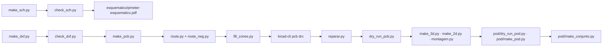

# Hardware do medidor de potência

O aparelho inteiro em CAD: o esquemático, a placa de quatro camadas, o pod
impresso em volta dela e as medidas que cada um tem de passar. Tudo é
**gerado por programa** a partir dos documentos desta pasta, pela mesma
ideia do ciclocomputador: um gerador, um dry run, e nenhum número que não
venha de uma ficha ou de uma medida.

> [!WARNING]
> **Nada foi fabricado, impresso, soldado nem colado.** Não existe gerber
> enviado, não existe placa física, nenhuma peça passou por bancada e
> nenhum extensômetro foi colado num pedivela. O que existe é o projeto em
> KiCad, os STL do pod e os dry runs que os medem. As medidas do braço do
> pedivela são **lugares reservados**: ninguém mediu o braço do dono.

## Índice

- [O que existe](#o-que-existe)
- [A cadeia](#a-cadeia)
- [Os documentos](#os-documentos)
- [Os dry runs](#os-dry-runs)
- [Antes de mandar fabricar](#antes-de-mandar-fabricar)

## O que existe

| Parte | Estado |
|---|---|
| Esquemático | 4 folhas, 57 peças, 45 nós, gerado e conferido nó a nó contra `nets.py` pelo `check_sch.py` |
| Placa | 51 × 16 mm, 4 camadas, 56 peças colocadas, 44 redes; roteada por programa |
| Pod | 56,4 × 19,4 × 8,5 mm, 11,9 g estimados, dois STL (concha e tampa) |
| Ponte | S5229 de 5 kΩ numa peça só, `N2K-13-S5229A-50C/DG/E3`, colada no braço |

## A cadeia

Os comandos, um a um, com o intérprete certo de cada etapa, estão em
[`cad/README.md`](cad/README.md#a-cadeia). Duas armadilhas que custam caro:
o `fill_zones.py` **só** roda com o Python do KiCad, e o `check_pcb.py`
regera a placa se você esquecer o `--como-esta`.

## Os documentos

| Documento | Assunto |
|---|---|
| [01 · Lista de componentes](01-lista-de-componentes.md) | cada peça com o número da ficha, incluindo a ponte S5229 e as armadilhas de compra |
| [02 · Esquemático](02-esquematico.md) | as quatro folhas, bloco a bloco |
| [03 · Netlist](03-netlist.md) | os 45 nós, pino a pino, e os pinos deixados abertos de propósito |
| [04 · Placa](04-placa.md) | contorno, camadas, posicionamento, zonas proibidas, land pattern do módulo, roteamento |
| [05 · Materiais](05-materiais.md) | a lista de montagem com footprint e código de compra |
| [06 · Conectores e pontos de teste](06-conectores-e-pontos-de-teste.md) | o conector magnético, os furos da ponte, os furos da célula, o Tag-Connect |
| [07 · Pod](07-pod.md) | o invólucro: envelope, pilha de alturas, o que segura cada peça, vedação, massa |
| [08 · Dry run de 2026-09-27](08-dry-run-2026-09-27.md) | a primeira medida completa da placa e do pod |
| [CAD](cad/README.md) | os geradores, o que muda em relação ao ciclocomputador, as regras e as armadilhas |

## Os dry runs

Duas ferramentas, e as duas **falham dizendo que não puderam medir** quando
não acham o que medir — foi assim que se descobriu que a `ME2` do
ciclocomputador passou dias sem sombra nenhuma para medir.

| Ferramenta | O que mede |
|---|---|
| [`cad/dry_run_pcb.py`](cad/dry_run_pcb.py) | as regras que as fichas dos componentes e a IPC-2221B impõem à placa: isolamento da antena, laço de chaveamento, desacoplamento junto do pino, orientação do acelerômetro, corpos 3D contra o footprint |
| [`pod/dry_run_pod.py`](pod/dry_run_pod.py) | o pod contra a placa real: a placa na cavidade, o teto da tampa, a janela do conector, o ar sob cada peça do verso, a célula, o rasgo dos fios, os pilares, o envelope e a massa |

O dry run do pod lê a placa colocada, então roda **depois** do `make_pcb.py`;
o `make_conjunto.py`, que desenha o pod no braço do pedivela com a ponte
colada, roda depois dos dois.

## Antes de mandar fabricar

Nada disto foi feito, e nenhum arquivo de fabricação deve sair antes:

1. **Fechar o roteamento.** O número atual está em
   [04](04-placa.md#roteamento) e a placa **não é fabricável** enquanto
   houver ligação sem cobre.
2. **Medir o pedivela do dono** (Shimano 105 e Ultegra): largura da face
   interna, folga até o quadro, raio da concordância e distância do eixo ao
   pod. São quatro números e hoje são lugares reservados
   ([07](07-pod.md#lugares-reservados)).
3. **Escolher a célula** dentro do envelope de 23 × 13 × 2,5 mm e conferir a
   capacidade contra as 50 h de [`docs/02`](../docs/02-hardware.md#orçamento-de-consumo).
4. **Fechar o conector magnético**: a peça de hoje é genérica
   (`confirmed=False` em `cad/parts.py`), e trocá-la troca o footprint, a
   altura e a janela da tampa.
5. **Pedir a ponte com o código de autocompensação escrito**: sem ele o
   fabricante embarca o `06`, que é o de aço, e o braço do dono é de
   alumínio ([01](01-lista-de-componentes.md)).
6. **Conferir o empilhamento com o fabricante**: as quatro camadas aqui são
   assimétricas e a impedância do par USB foi calculada para 0,10 mm de
   dielétrico sob a `F.Cu`.
