# CAD da placa

Os geradores do KiCad 8: esquemático, placa, roteamento, verificações,
3D e desenhos. É a cadeia do ciclocomputador
(`hardware_gnssbike/cad/`), portada em 2026-09-27 com o nome de projeto
`pmeter`, as tabelas desta placa e três correções no roteador que esta
placa, mais densa e mais estreita, obrigou a fazer. Nada aqui é
desenhado à mão: cada arquivo `.kicad_*` sai de um script, e cada
script diz de que documento ou ficha tirou cada número.

**Nesta página:** [A cadeia](#a-cadeia) · [Os arquivos](#os-arquivos) · [O que mudou em relação ao ciclocomputador](#o-que-mudou-em-relação-ao-ciclocomputador) · [As regras do dry run](#as-regras-do-dry-run) · [Armadilhas](#armadilhas)

> [!WARNING]
> Nada foi fabricado nem montado. A placa existe como
> `pmeter.kicad_pcb`; o que foi medido está em
> [08](../08-dry-run-2026-09-27.md) e, depois da troca do modulo, em
> [10](../10-dry-run-2026-09-28.md).

## A cadeia

```mermaid
flowchart LR
    SCH["make_sch.py<br/>raiz + 4 folhas"] --> CSCH["check_sch.py<br/>ERC, netlist × nets.py,<br/>geometria"]
    CSCH --> PDF["kicad-cli sch export pdf<br/>esquematico/pmeter-esquematico.pdf"]
    DXF["make_dxf.py<br/>contorno e zonas"] --> CDXF["check_dxf.py"]
    CDXF --> PCB["make_pcb.py<br/>coloca as 58 peças"]
    PCB --> ROUTE["route.py<br/>labirinto A* em 3 camadas"]
    ROUTE --> FILL["fill_zones.py<br/>malhas, Python do KiCad"]
    FILL --> DRC1["kicad-cli pcb drc<br/>_drc_all.json"]
    DRC1 --> REP["reparar.py<br/>fecha o que o DRC diz aberto"]
    REP --> FILL2["fill_zones.py de novo"]
    FILL2 --> CPCB["check_pcb.py --como-esta<br/>DRC, contorno, redes"]
    CPCB --> DRY["dry_run_pcb.py<br/>24 regras das fichas"]
    DRY --> M3D["make_3d.py<br/>GLB e vistas placa-3d-*.png"]
    M3D --> M2D["make_2d.py · montagem.py<br/>placa/pmeter-pcb.pdf, pmeter-montagem.pdf"]
    M3D --> POD["pod/make_pod.py"]
```



Da raiz do repositório, com o Python do sistema salvo onde está dito:

```
python hardware_powermeter/cad/make_sch.py
python hardware_powermeter/cad/check_sch.py
"D:/KiCAD/bin/kicad-cli.exe" sch export pdf --output hardware_powermeter/esquematico/pmeter-esquematico.pdf hardware_powermeter/cad/pmeter.kicad_sch
python hardware_powermeter/cad/make_dxf.py
python hardware_powermeter/cad/check_dxf.py
python hardware_powermeter/cad/make_pcb.py
python hardware_powermeter/cad/route.py
"D:/KiCAD/bin/python.exe" hardware_powermeter/cad/fill_zones.py
cd hardware_powermeter/cad && "D:/KiCAD/bin/kicad-cli.exe" pcb drc --severity-all --format json -o _drc_all.json pmeter.kicad_pcb
python hardware_powermeter/cad/reparar.py
"D:/KiCAD/bin/python.exe" hardware_powermeter/cad/fill_zones.py
python hardware_powermeter/cad/check_pcb.py --como-esta
python hardware_powermeter/cad/dry_run_pcb.py
python hardware_powermeter/cad/make_3d.py
python hardware_powermeter/cad/make_2d.py
python hardware_powermeter/cad/montagem.py
python hardware_powermeter/pod/dry_run_pod.py
python hardware_powermeter/pod/make_pod.py
```

O tamanho da placa sai de `make_dxf.py` (`W`, `H`) e pode ser
experimentado sem editar o arquivo: `PMETER_W=48 python make_pcb.py`. O
colocador diz o que não coube e o roteador diz o que não ligou; foi assim
que o alvo de 48 × 16 de `docs/02` virou os **47 × 14** registrados em
[04](../04-placa.md#o-contorno).

## Os arquivos

| Arquivo | O que é |
|---|---|
| `parts.py` | as 58 peças com os pinos numerados pela ficha; `confirmed=False` marca as **duas** pinagens não lidas em ficha: o conector magnético genérico e o módulo de rádio, cujo mapa saiu do desenho mecânico do anúncio |
| `nets.py` | os 43 nós, pino a pino, e os pinos deixados abertos de propósito |
| `sheets.py`, `blocos.py`, `simbolos.py` | as 4 folhas, os blocos funcionais de cada uma e os símbolos da biblioteca do KiCad que têm a pinagem certa |
| `sch_lib.py`, `ksym.py`, `make_sch.py`, `check_sch.py`, `make_pro.py` | o gerador do esquemático, o leitor de símbolos do KiCad, o projeto `.kicad_pro` com as classes de rede |
| `make_dxf.py`, `check_dxf.py` | o contorno (`contorno.dxf`), o furo de fixação M1,6 e as zonas (`zonas.dxf`): a área livre da antena cerâmica, o bloco de energia a 20 mm do módulo, o conector magnético, o canto analógico, os furos da ponte, os sensores, o Tag-Connect, a sombra da célula e a da tampa |
| `footprints.py`, `fp_load.py` | qual footprint cada peça usa (biblioteca do KiCad ou gerado aqui com a cota da ficha), os corpos 3D em VRML, as alturas |
| `make_pcb.py` | o colocador: posições fixas (módulo, conector magnético, furos da ponte, conector da célula), âncoras por zona, desacoplamento encostado no pino, o resto por conectividade; os planos de terra e a área sem plano sob o nó de chaveamento |
| `route.py` | o roteador: vias de terra por pad, labirinto A* em `F.Cu`, `In2.Cu` e `B.Cu`, costura de terra na borda, poda de vias soltas. `PAR` está **vazio** desde 2026-09-28: não há mais par diferencial na placa |
| `route_neg.py` | o segundo estágio, de congestão negociada (PathFinder, McMurchie e Ebeling 1995), chamado quando o labirinto empaca; recebe como obstáculo o cobre que não vai rotear. Cada rodada refaz **só as redes que estão no caminho umas das outras**, e a cada `RIPAGEM_TOTAL` rodadas refaz a placa inteira do zero |
| `reparar.py` | fecha as ligações que o **DRC** ainda chama de abertas, na grade da placa pronta: parte sempre de um pad, mira o cobre inteiro da rede e recusa desenhar o que não encosta |
| `fill_zones.py` | preenche as malhas com o Python do KiCad (só ele sabe) |
| `check_pcb.py` | a placa como o KiCad a vê: DRC, peças presentes uma vez, redes dos pads, sobreposições, contorno, furos, cabe no envelope do pod, planos, serigrafia |
| `dry_run_pcb.py` | as regras das fichas e da IPC-2221 medidas na placa ([abaixo](#as-regras-do-dry-run)) |
| `make_3d.py`, `make_2d.py`, `montagem.py`, `orientacao.py` | o GLB e as vistas `placa-3d-*.png`, o PDF das camadas, o desenho de montagem, a conferência de para onde cada conector olha |
| `3d/` | os corpos VRML desenhados aqui; `3d/real/` (fora do git) para STEP de fabricante, quando houver |

## O que mudou em relação ao ciclocomputador

Tudo o que é desta placa está nas tabelas, não no código: zonas em
`make_dxf.py`, `ANCORAS`, `JUNTO`, `BORDA_FIXA`, `DECOPLA`, `ATRAS`,
`NAO_ENCOSTA` e `CHAVEIA` em `make_pcb.py`, `CORRENTE`, `CHAVEADOS`,
`ANALOGICO` e `TERMICOS` em `dry_run_pcb.py`. O que saiu: o receptor
GNSS, o display, o sensor de luz, o painel solar e as regras deles
(`RF5` a `RF8`, `RF10`, `AL4`, `OP1`). O que entrou: o canto analógico
(`AN1`, `AN2`), a face de trás plana (`ME2`), o envelope do pod (`ME1`).

Três coisas no roteador, todas **medidas** nesta placa em 2026-09-27
(`route.py` explica cada uma no lugar):

| O que | Antes | Agora |
|---|---|---|
| Ordem das ligações de uma rede | a ordem da lista de pinos: uma rede com um pino em cada ponta da placa e um pull-up no meio era buscada de uma ponta à outra primeiro, pelo meio apinhado, e falhava ali | **a mais perto primeiro**: a árvore cresce do pino mais próximo do que já está ligado |
| O pescoço dentro do campo de pads | um pescoço 0,025 mm mais largo que a trilha mínima, ou uma classe 0,07 mais estrita, pedia as células a 0,15 mm de cada lado livres, que num passo de 0,5 mm são a isolação do vizinho; **nenhum pino de potência do nPM1100, do ADS1220 ou do TVS conseguia sair do pad** (`veio=1`) | dentro do campo a busca olha só a célula; o pescoço tem a largura mínima em pad de até 0,3 mm (`estreitos − PASSO`); a classe USB fica nos 0,127 do fabricante (`make_pro.py`) |
| Até onde o pescoço dura | até `FOLGA` além da caixa dos pads: a primeira célula fora ainda estava dentro do anel do pad vizinho e a trilha larga não cabia ali (`veio=14`) | até `EXTRA_CAMPO` = `FOLGA` + meia trilha + um passo da grade |

E uma no colocador: os resistores de configuração e os pull-ups
(`NAO_ENCOSTA`) ficam perto do CI mas não encostam no pino, para deixar o
anel do nPM1100 para o desacoplamento e para as saídas dos pinos de
potência.

## As regras do dry run

`dry_run_pcb.py` mede a placa contra as fichas, e imprime o que mediu, o
que violou e o que não pôde medir. Uma regra que não acha o que medir
**falha dizendo isso**.

| Regra | O que mede | Fonte |
|---|---|---|
| RF1, RF3, RF4 | nada sobre a área da antena; 5 mm em volta dela sem peça alheia; a antena cerâmica dentro da zona livre **e encostando numa borda da placa** | guia de montagem do HOLYIOT-26001-A ([09](../09-modulo-de-radio.md#a-antena-manda-no-layout)) |
| RF9 | 20 mm do módulo a fonte chaveada ou indutor | 7.2, Interference Isolation Rule |
| US1 | as duas linhas da serial não atravessam o retângulo sem plano do nó de chaveamento do buck, em camada nenhuma | `make_pcb.sem_plano_no_chaveamento`; **não há mais par diferencial**: o nRF54L15 não tem USB e a 115200 baud não há impedância a controlar |
| AL1 | desacoplamento a 0,5 mm do pino do módulo, 2 mm nos outros CIs, 5 mm nos de reserva | 7.2; fichas do nPM1100, ADS1220, BMA400, TMP117, MAX17048 |
| AL5 | o filtro pi no pino de alimentação do módulo | 7.2 |
| AL2 | largura por corrente, 10 °C de subida | IPC-2221B, 6.2 |
| AN1 | o canto analógico a 4 mm do buck e a 5 mm do módulo | SBAS501D 9.4.1; os números são deste projeto |
| AN2 | o filtro das entradas e da referência junto dos pinos, e `REFP0` no nó da excitação | SBAS501D 9.1.2, figura 9-11; SBAA532A 3.1 |
| GN1, GN2 | pads de terra ligados, via por pad do módulo; costura na borda a cada 5 mm | 7.2; λ/10 a 2,44 GHz |
| AL6 | nenhuma via sob pad térmico | SBAS501D 11.1; nPM1100 PS 8.3 |
| ME1 | a placa no envelope alvo do pod (57,6 × 17,6 por dentro) | docs/02 |
| ME2 | as peças da frente sob o teto da tampa (2,7 mm), o conector que a atravessa exceto, e a face de trás plana | docs/02, Pod; `make_dxf.TETO_TAMPA` |
| ME3 | o corpo cotado na ficha cabe no footprint | `footprints.PACOTE` |
| ME4, ME5, ME6 | os corpos 3D contra as ilhas: só se medem com modelo de fabricante (nenhum ainda) ou GLB | o dono, no 3D do ciclocomputador |
| RT1 | zero itens desconectados no DRC completo (`--severity-all`) | kicad-cli |

Não medidas aqui: RF2 (o lado de RF para a borda: `orientacao.py`), AL3
(o laço de chaveamento: a bancada), e ME4 e ME5 enquanto não houver STEP
de fabricante em `3d/real/`.

## Armadilhas

As do ciclocomputador valem todas (`CLAUDE.md`, seção 6): o
`check_pcb.py` regera a placa sem `--como-esta`; o `fill_zones.py` só com
o Python do KiCad; o `kicad-cli` de `D:/KiCAD/bin`; um render de cima
sai girado 180°; o VRML da biblioteca do KiCad põe vírgula entre todos os
índices. As desta placa:

- **`PMETER_W` muda o contorno, e as zonas seguem** (`make_dxf.XE`,
  `XM`): o bloco de energia acaba 20 mm antes do módulo, o conector
  magnético e o canto analógico ficam no meio. Um número solto nas zonas
  quebra isso.
- **Os pontos de teste ficam atrás** (`ATRAS`): a face de trás tem de ser
  plana para a célula, e um pad é plano. Uma peça com corpo posta atrás
  falha `ME2` e `PD4`.
- **Os furos da ponte são passantes** (`PASSANTE`): ocupam as duas faces
  no colocador e todas as camadas no roteador.
- **Nenhum dos dois estágios do roteador sabe dizer se ligou** (medido em
  2026-09-28). O sequencial conta ligações que achou e o negociado conta
  caminhos que planejou; o negociado fechou dizendo "96 ligações, 0 células
  disputadas" com **onze pads sem cobre nenhum**, entre eles os três
  terminais do `USB_DM`. Pior: o critério de aceitação era `n_ok_n > n_ok`,
  ou seja, mais ligações — não menos pads abertos —, e ao aceitar o
  resultado do negociado o cobre sequencial das redes que ele **não** rodou
  ia para o lixo. Quem julga o roteamento é o DRC do KiCad, e é por isso
  que o `reparar.py` existe e entra na cadeia entre dois DRC.
- **Cobre herdado tem de ser obstáculo para quem herda.** Passar ao
  negociado as trilhas que ele não vai rotear (`pre_seg`, `pre_via`) levou
  o DRC de 182 violações para 25: sem isso ele planeja sobre placa vazia e
  o cobre herdado cai em cima das trilhas dele.
- **Uma via não é de graça.** Ela atravessa todas as camadas, então tem de
  se afastar de todas as redes em todas elas. Uma via posta sem essa
  conferência custou dois curtos, um isolamento de furo e uma ponte de
  máscara — quatro erros por uma ligação que nem fechou
  (`route.via_cabe_aqui`).
- **`SO_FRENTE` é preferência, não lei.** O par USB foi calculado como
  microstrip de 90 Ω em `F.Cu`, e com isso como lei o `USB_DM` não fecha
  (16,7 mm por uma face cheia). O aparelho fala **full speed**, 12 Mbit/s:
  a busca tenta a frente nas duas folgas e só troca de camada se não
  houver caminho — e avisa quando trocou.
- **Rotear depois do `fill_zones.py` custa 4 ligações e 45 trilhas**
  (medido em 2026-09-28, mesma colocação e mesmo código). Direto do
  `make_pcb.py`: 70 ligações na primeira passagem, 36 falhas, 440 segmentos,
  31 não roteados. Depois do preenchimento: 64, 42, 395, 35. **Esvaziar as
  malhas não devolve o resultado bom** — testado —, então não é o cobre
  despejado: é o arquivo inteiro, que o pcbnew reescreve à sua maneira. O
  `route.py` recusa rodar sobre placa preenchida e diz o que rodar antes.
  E o roteador **é determinístico**: duas execuções da mesma entrada dão o
  mesmo arquivo, o que foi medido para descartar a outra hipótese.
- **O passe de encosto final também tem de medir.** Ele liga uma trilha que
  parou a um passo do próprio pad, e desenhava sem conferir nada: um pad
  aberto por 0,15 mm virava um curto de 1,4 mm de trilha. O roteador via os
  cinco pares perto demais, dizia, e gravava a placa. Hoje cada toco é
  medido antes de ser aceito e o que não passa deixa o pad aberto dizendo
  por quê.
- **O conector magnético é genérico**: `confirmed=False` em `parts.py`,
  e a janela da tampa segue o contorno dele; trocar a peça é trocar o
  footprint, a altura e rodar os dois dry runs.
- **Rip-up parcial sozinho DIVERGE nesta placa** (medido em 2026-09-28). O
  PathFinder refaz só as redes que estão no caminho umas das outras, e numa
  placa grande isso é quase todo mundo; aqui o teste de partilha é
  geométrico e acha poucas redes, então o conjunto fica pequeno e a pressão
  bate numa parede: as culpadas não têm para onde ir porque as inocentes
  estão congeladas, e o custo histórico não empurra quem nunca é refeito.
  As células disputadas subiram rodada após rodada — 420, 488, 528, 611,
  972, 1292, **1588 na rodada 10**, com duas ligações perdendo o caminho. A
  saída é a que a literatura usa quando o rip-up é parcial: uma **ripagem
  total a cada `RIPAGEM_TOTAL` rodadas** (hoje 6). As rodadas baratas
  refinam, a rodada cheia redistribui — e de quebra lava qualquer marca
  velha que um rip-up incremental tenha deixado em `uso`, que é o modo de
  falhar de um `_desmarcar` que não seja o inverso exato do `_marcar`. Com
  ela, as rodadas cheias caíram para 234, 199, 155 e 120.
- **As redes culpadas têm de ser anotadas onde o conflito é achado.** A
  célula que entra em `disputadas` é a do **caminho**, e o conflito está numa
  célula do disco de folga dele: procurar depois quem está nela em `uso`
  devolve a própria rede e quase nunca a outra, então a outra nunca era
  refeita e a rodada seguinte achava o mesmo conflito para sempre.
