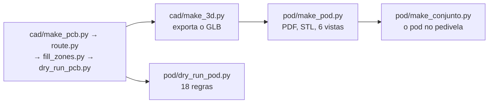

# Pod

O invólucro do módulo, colado na face interna do braço esquerdo do
pedivela. É desenhado **em volta da placa real** (`cad/pmeter.kicad_pcb`,
lida com o contorno de ocupação, a altura e a face de cada peça) e da
célula, pela mesma ideia do case do ciclocomputador: um gerador e um dry
run próprio. O que ele é e o que decide está em [07-pod.md](../07-pod.md).

**55,7 × 19,0 × 10,0 mm, 13,3 g estimados.** Nada foi impresso nem montado.

| Arquivo | O que faz |
|---|---|
| `make_pod.py` | desenha o pod: concha e tampa em STL, `pmeter-pod.pdf` com planta, cortes e a página das decisões, e **seis vistas** em `docs/img/hardware/`: `pod-3d-aberta`, `pod-3d-fechada`, `pod-3d-explodida`, `pod-3d-tampa-por-dentro`, `pod-3d-celula-no-berco` e `pod-3d-por-baixo` |
| `dry_run_pod.py` | mede o pod contra a placa: **18 regras** (`PD1` a `PD18`), cada uma com a fonte, e **uma regra que não acha o que medir falha dizendo isso** |
| `make_conjunto.py` | o pod no braço do pedivela: `conjunto-3d-montado`, `conjunto-3d-aberto`, `conjunto-3d-extensometros`, `conjunto-3d-produto` e `conjunto-3d-produto-lateral` |
| `pod-concha.stl`, `pod-tampa.stl` | sopa de triângulos para o fatiador, não sólido de CAD |
| `pmeter-pod.pdf` | 3 páginas: planta, cortes, decisões e lugares reservados |

## Ordem



`dry_run_pod.py` lê a placa colocada (roda logo depois do `make_pcb.py`);
`make_pod.py` precisa do GLB, que o `dry_run_pcb.py` e o `make_3d.py`
exportam — e o `make_3d.py` **o reexporta sozinho** quando ele está mais
velho que a placa, para os corpos de agora nunca aparecerem sobre a placa
de antes. Os três rodam com o Python do sistema, da raiz do repositório:

```
python hardware_powermeter/pod/dry_run_pod.py
python hardware_powermeter/pod/make_pod.py
python hardware_powermeter/pod/make_conjunto.py
```

## O que é decisão deste desenho

Tudo em `make_pod.py`, em constantes com o motivo ao lado.

| O quê | Valor | Por quê |
|---|---|---|
| Paredes | **2,0 mm** | eram 1,2; o sulco do anel O precisa de 0,5 mm de parede de cada lado além do próprio sulco de 1,05 (`PD13`) |
| Fundo e tampa | 1,0 mm, raio 3 | escolha deste desenho |
| Célula | **23 × 11 × 4,0 mm**, sob a placa | classe `401123`, ≥ 78 mAh, com fios e proteção integrada. Pôr a célula **ao lado** daria 72 mm de comprimento ou 27 de largura |
| Vedação | anel O de cordão **0,80 mm** em sulco de 1,05 × 0,58 | **27,5 % de compressão**, dentro da faixa de 20 a 30 % para vedação estática |
| Fechamento | **dois parafusos M1,6** autoatarraxantes, ressalto de 3,40, furo-guia de 1,35 | um deles passa **pelo furo da placa**, que é o que prende a placa no meio do vão |
| Teto sobre a placa | 2,7 mm | `cad/make_dxf.TETO_TAMPA`; quem o fixa é o módulo, com 2,40 mais 0,3 de ar |
| Base de colagem | **15 mm** de largura, com alívio de 1,0 mm em volta | a face interna do braço só é plana em 15 dos 20 mm: o resto é concordância, e cola sobre raio descola de fora para dentro |
| Conector magnético | atravessa a tampa, face num poço, lábio de 0,6 mm com **dreno** de 1,2 | poço fechado junta água; o dreno é o que faz o lábio não virar copo |
| Rasgo dos fios | no fundo, sob os cinco furos da ponte | os fios sobem do braço direto sob eles |
| Furo de luz | 2,5 mm sobre o LED | |

As medidas do braço são **lugares reservados** até serem medidas no
pedivela do dono, e a regra `PD17` falha de propósito enquanto isso: ela
compara a pilha cola + pod (10,5 mm) com a folga de quadro reservada
(10,0), e esse é um número **da bicicleta**, não do pod.

## Massa

Estimada por volume e densidade (página 3 do PDF e regra `PD11`), nada
pesado: pod impresso 1,15 g/cm³, envase 1,0, FR-4 1,85, célula 2,0, peças
2,5 sobre 70 % do contorno de ocupação vezes a altura. Dá **13,3 g** contra
os 20 do alvo: concha 4,2, tampa 1,2, placa 1,0, peças 1,1, célula 2,0,
envase 3,8.
