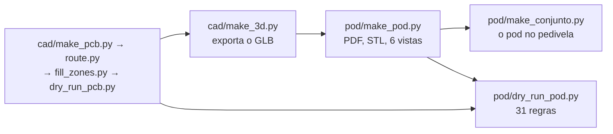
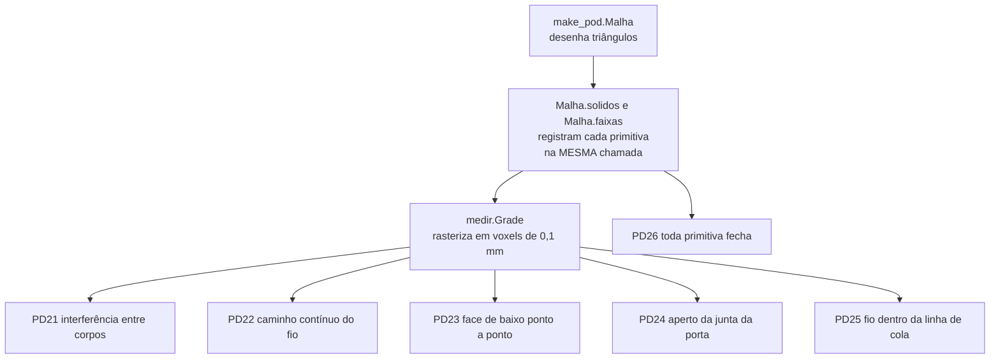

# Pod

O invólucro do módulo, colado na face interna do braço esquerdo do
pedivela. É desenhado **em volta da placa real** (`cad/pmeter.kicad_pcb`,
lida com o contorno de ocupação, a altura e a face de cada peça) e da
célula, pela mesma ideia do case do ciclocomputador: um gerador e um dry
run próprio. O que ele é e o que decide está em [07-pod.md](../07-pod.md).

**74,5 × 21,0 × 7,2 mm, 14,2 g estimados.** Nada foi impresso nem montado.

| Arquivo | O que faz |
|---|---|
| `make_pod.py` | desenha o pod: concha e tampa em STL, `pmeter-pod.pdf` com planta, cortes e a página das decisões, e **seis vistas** em `docs/img/hardware/`: `pod-3d-aberta`, `pod-3d-fechada`, `pod-3d-explodida`, `pod-3d-tampa-por-dentro`, `pod-3d-celula-no-berco` e `pod-3d-por-baixo` |
| `dry_run_pod.py` | mede o pod contra a placa: **31 regras** (`PD1` a `PD31`), cada uma com a fonte, e **uma regra que não acha o que medir falha dizendo isso** |
| `medir.py` | rasteriza em voxels as primitivas que a `Malha` registrou ao desenhar, e lê as arestas dos STL: é o que permite medir o sólido em vez da constante |
| `regras_medidas.py` | as onze regras que medem o sólido (`PD21` a `PD31`) |
| `make_conjunto.py` | o pod no braço do pedivela: `conjunto-3d-montado`, `conjunto-3d-aberto`, `conjunto-3d-extensometros`, `conjunto-3d-produto` e `conjunto-3d-produto-lateral` |
| `pod-concha.stl`, `pod-tampa.stl` | união de sólidos fechados para o fatiador, não sólido de CAD |
| `pmeter-pod.pdf` | 3 páginas: planta, cortes, decisões e lugares reservados |
| `11-revisao-2026-10-01.md` | a revisão de dez revisores que motivou o desenho de hoje |

## Ordem



`dry_run_pod.py` lê a placa colocada (roda logo depois do `make_pcb.py`) e,
desde 2026-10-01, também os **STL**, que `make_pod.py` grava: rode o gerador
antes dele. `make_pod.py` precisa do GLB, que o `dry_run_pcb.py` e o
`make_3d.py` exportam — e o `make_3d.py` **o reexporta sozinho** quando ele
está mais velho que a placa, para os corpos de agora nunca aparecerem sobre a
placa de antes. Os três rodam com o Python do sistema, da raiz do repositório:

```
python hardware_powermeter/pod/make_pod.py
python hardware_powermeter/pod/dry_run_pod.py
python hardware_powermeter/pod/make_conjunto.py
```

## Medir o sólido, não a constante

Em 2026-10-01 dez revisores mediram este pod e acharam sete interferências
que o impediam de fechar. No mesmo commit, o dry run dizia que **18 das 20
regras estavam cumpridas**. A causa era uma só: o desenho é uma sopa de
triângulos, a classe `Malha` não sabia subtrair e não dava para perguntar a
ela "este ponto está dentro?", então sete regras liam a **constante** que
deveria ter gerado a geometria. Uma regra assim passa com a peça desenhada
ou sem ela — `PARAF_PESCOCO_D = 2,00` estava declarado desde sempre, o
ressalto saía em diâmetro cheio de 3,40 por um furo de 2,20, e nenhuma regra
viu.

O que mudou:



Como o registro é feito pela mesma chamada que emite os triângulos, ele não
pode divergir da malha. Cada regra nova foi **testada por mutação**: o
defeito volta ao gerador e a regra tem de reprovar.

| Regra | Reprova quando | Mutação conferida em 2026-10-01 |
|---|---|---|
| `PD21` | dois corpos ocupam o mesmo espaço | aba fechada: 2 pares, 2,97 mm³ |
| `PD22` | o fio da célula não tem caminho contínuo | corte da passagem removido: "não passa fio de 0,90" |
| `PD23` | a face de baixo toca fora da base de colagem | relevo acrescentado em vez de cavado: 302,7 mm² |
| `PD24` | a junta da porta não é comprimida | ressalto removido: "comprimida 0,0 %" |
| `PD25` | fio ou matriz dentro da linha de cola | canaleta de 0,2: 96,7 mm² sem cola; canaleta nenhuma: "não mede nada" |
| `PD14` | o que atravessa a placa não cabe no furo | pescoço em diâmetro cheio: 3,40 contra 2,20; sem pescoço: "não há sólido nenhum" |
| `PD9` | o furo de luz não é redondo | furo quadrado: 6,25 mm² contra 4,91 |
| `PD27` | uma constante de geometria não é usada | constante nova sem uso: pega pelo nome |
| `PD31` | a anilha não veda a cabeça | anilha de 3,0 sob cabeça de 3,2: "ela não veda" |

## O que é decisão deste desenho

Tudo em `make_pod.py`, em constantes com o motivo ao lado.

| O quê | Valor | Por quê |
|---|---|---|
| Paredes | **2,0 mm** | eram 1,2; o sulco do anel O precisa de 0,5 mm de parede de cada lado além do próprio sulco de 1,05 (`PD13`) |
| Fundo | **1,2 mm**, tampa 1,0, raio 3 | o fundo subiu de 1,0 em 2026-10-01: fora da base de colagem a face de baixo está em `RELEVO`, e com 1,0 o piso ali daria 0,5 mm |
| Célula | **15 × 14 × 5,0 mm**, **ao lado** da placa, em baía **cavada no piso** | ≥ 81 mAh (1.050 mm³ a 0,077 mAh/mm³). Decisão do dono em 2026-09-30: ao lado, a célula sai da pilha. A baía é cavada 0,5 mm para a reserva de inchaço não levantar o teto da cavidade |
| Reserva de inchaço | **0,5 mm** (10 % da espessura) | uma bolsa de lítio engorda com ciclo e temperatura; era 0,000 mm, com igualdade exata, enquanto a `PD2` cobrava 0,30 de toda peça rígida |
| Passagem dos fios | **3,4 mm** cortados nas nervuras e no piso | `CELULA_FIO_PASSO + CELULA_FIO_D`; até 2026-10-01 as nervuras iam do piso ao teto e a saída real era **0,000 mm** |
| Vedação da caixa | anel O de cordão **0,80 mm** em sulco de 1,05 × 0,58 | **25 % de compressão medidos no sólido**, dentro da faixa de 20 a 30 % |
| Vedação da porta | junta plana de **0,65 mm** no **ombro do conector**, comprimida 0,20 de 0,70 (28,6 %) por um ressalto da tampa | `docs/02`: "junta na face do conector". O lábio e o dreno saíram: o lábio ficava 0,40 acima da junta e o dreno 0,50 **acima** do fundo do poço |
| Fechamento | **dois parafusos M1,6** autoatarraxantes, ressalto de 3,40, furo-guia de 1,35, cabeça **cilíndrica saliente sobre anilha vedante** de 4,0 comprimida 30 % | um deles passa **pelo furo da placa** por um pescoço de 2,00, que segue acima dela até passar o nível do envase. O tampão de resina sobre cabeça escareada não cabia: 0,96 de cabeça mais 0,80 de tampão contra 1,00 de tampa, e um escareado de 3,20 não entra num furo de 1,90 |
| Assento da placa | **0,5 mm** por borda (`RESSALTO = FOLGA_PLACA + ASSENTO_MIN`) | eram 0,100 mm, a mesma medida da folga radial do pino: a placa saía do ressalto só deslizando |
| Teto sobre a placa | 2,7 mm | `cad/make_dxf.TETO_TAMPA`; quem o fixa é o módulo, com 2,40 mais 0,3 de ar |
| Base de colagem | **14 mm** de largura, com relevo de **0,5 mm** cavado em volta | a face do braço só é plana em 15 dos 20 mm, e a base guarda 0,5 de margem por lado. O relevo era **acrescentado** onde queria cavar: 100 % das tiras externas era face maciça em z = 0 |
| Bolso e canaleta | sobre a matriz do extensômetro e sobre o feixe dos cinco fios | na linha de cola de 0,5 não cabe nem o fio (0,5 com isolação) nem a matriz; o maior percurso media **44,83 mm sob fundo colado** |
| Nível do envase | **0,4 mm abaixo do teto** | não existia número nenhum: o menisco ficava rasante à boca dos furos cegos dos parafusos, e um M1,6 autoatarraxante não atarraxa em resina curada |
| Rasgo dos fios | no fundo, sob os cinco furos da ponte, com colar de altura **por barra** | cada barra para 0,1 mm abaixo do que passa sobre ela; a barra y+ esmagava o R302 e o C304 |
| Furo de luz | 2,5 mm sobre o LED | |

As medidas do braço são **lugares reservados** até serem medidas no
pedivela do dono.

## O que ainda reprova, e é decisão do dono

| Regra | O que ela mede | Estado |
|---|---|---|
| `PD6` | todo metal contra a área da antena, nos três eixos | o braço de alumínio fica **4,0 mm** abaixo da antena. A ficha do ME54BS13 pede 3 a 5: está na faixa de risco, **a medir na bancada** |
| `PD10` | o envelope contra `docs/02` | **74,5 × 21,0** contra **38 × 20**. O comprimento vem da placa de 50 mm mais a célula ao lado |
| `PD17` | o pod contra a face interna do braço | **21,0** de largura contra os 20,0 do pior caso da classe |

## Massa

Estimada por volume e densidade (página 3 do PDF e regra `PD11`), nada
pesado: pod impresso 1,15 g/cm³, envase 1,0, FR-4 1,85, célula 2,0, peças
2,5 sobre 70 % do contorno de ocupação vezes a altura. Dá **14,2 g** contra
os 20 do alvo: concha 4,4, tampa 1,8, placa 1,2, peças 1,1, célula 2,1,
envase 3,6.
