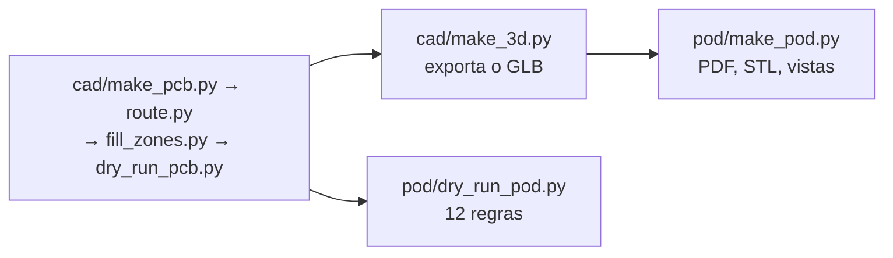

# Pod

O invólucro do módulo, colado na face interna do braço esquerdo do
pedivela. É desenhado **em volta da placa real** (`cad/pmeter.kicad_pcb`,
lida com o contorno de ocupação, a altura e a face de cada peça) e da
célula, pela mesma ideia do case do ciclocomputador: um gerador e um dry
run próprio. O que ele é e o que decide está em [07-pod.md](../07-pod.md).

| Arquivo | O que faz |
|---|---|
| `make_pod.py` | desenha o pod: concha e tampa em STL, `pmeter-pod.pdf` com planta, cortes e a página das decisões, e as vistas `pod-3d-aberta.png`, `pod-3d-fechada.png` e `pod-3d-explodida.png` em `docs/img/hardware/` |
| `dry_run_pod.py` | mede o pod contra a placa: 12 regras (`PD1` a `PD12`), cada uma com a fonte, e **uma regra que não acha o que medir falha dizendo isso** |
| `pod-concha.stl`, `pod-tampa.stl` | sopa de triângulos para o fatiador, não sólido de CAD |
| `pmeter-pod.pdf` | 3 páginas: planta, cortes, decisões e lugares reservados |

## Ordem



`dry_run_pod.py` lê a placa colocada (roda logo depois do `make_pcb.py`);
`make_pod.py` precisa do GLB, que o `dry_run_pcb.py` e o `make_3d.py`
exportam. Os dois se rodam com o Python do sistema, da raiz do
repositório:

```
python hardware_powermeter/pod/dry_run_pod.py
python hardware_powermeter/pod/make_pod.py
```

## O que é decisão deste desenho

Tudo em `make_pod.py`, em constantes com o motivo ao lado: paredes de
1,2 mm, fundo e tampa de 1,0, raio 3; a célula **sob** a placa, num
envelope de 25 × 15 × 4 mm; 0,5 mm de folga da placa às paredes e um
canal de 2,5 mm na ponta esquerda para os fios da célula; o teto de
2,7 mm sobre a placa (`cad/make_dxf.TETO_TAMPA`); o conector magnético
atravessando a tampa, com a face num poço e uma junta plana em volta; o
rasgo do fundo sob os furos da ponte; o furo de luz sobre o LED; a
cavidade envasada e a tampa colada pela aba. As medidas do braço são
**lugares reservados** até serem medidas no pedivela do dono.

## Massa

Estimada por volume e densidade (página 3 do PDF e regra `PD11`), nada
pesado: pod impresso 1,15 g/cm³, envase 1,0, FR-4 1,85, célula 2,0, peças
2,5 sobre 70 % do contorno de ocupação vezes a altura.

Nada foi impresso nem montado.
